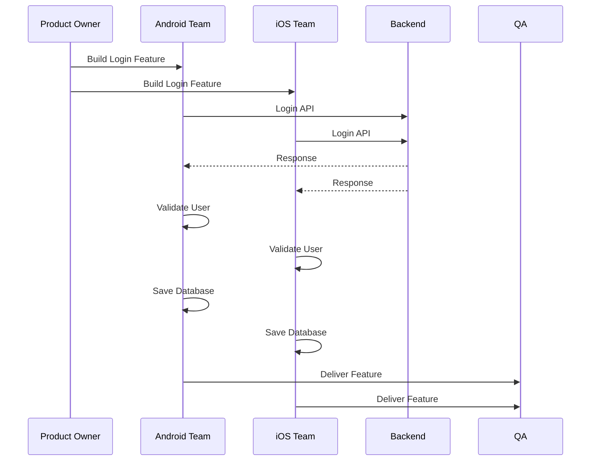
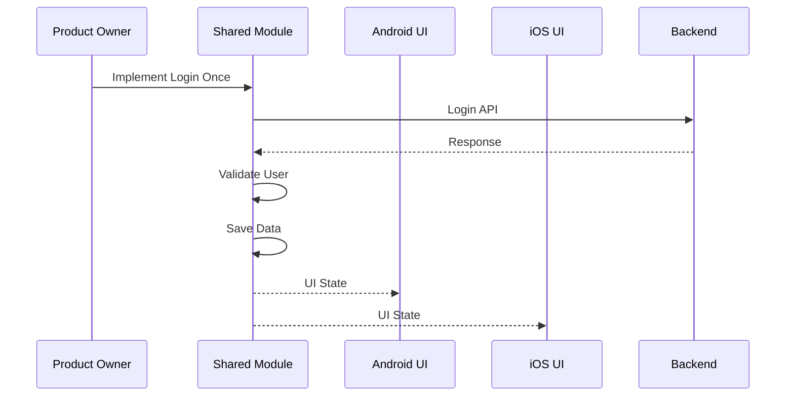

````markdown
# Why Kotlin Multiplatform (KMP)?

> **Part 1 of The Complete Kotlin Multiplatform Series**
>
> Before writing the first line of KMP code, it's important to understand **why Kotlin Multiplatform exists**, **what problem it solves**, and **when you should choose it over a traditional Android application.**

---

# Table of Contents

1. The Current Mobile Development Landscape
2. Traditional Mobile Development
3. The Real Problems
4. What Actually Needs to be Shared?
5. Why Kotlin Multiplatform Exists
6. Android vs Kotlin Multiplatform
7. What KMP Shares
8. How Much Code Can Be Shared?
9. Business Impact
10. When KMP Is the Best Choice
11. When Android Alone Is Enough
12. When NOT to Choose KMP
13. Decision Framework
14. Key Takeaways

---

# 1. The Current Mobile Development Landscape

For years, Android developers have been building amazing applications using Kotlin, Jetpack Compose, Coroutines, Retrofit, Room, and other modern Android technologies.

        Mobile Development

          ┌───────────────┐
          │   Android     │
          └───────────────┘
              Kotlin
          Jetpack Compose
              Room
            Retrofit
           Coroutines

Everything works perfectly...

Until the business says:

> **"We also need an iPhone application."**

This is where the real challenge begins.

---

# 2. Traditional Mobile Development

In a traditional mobile development environment, Android and iOS teams build the same business functionality independently.

```
                     Company

                Build Mobile App

          ┌─────────────────────────┐
          │      Business Logic      │
          └─────────────────────────┘

        Android Team      iOS Team

              │              │

          Kotlin         Swift

              │              │

      Implement Login  Implement Login

              │              │

      Implement API    Implement API

              │              │

      Implement Cache  Implement Cache

              │              │

      Implement Database   Implement Database
                      
              │              │

         Fix Bugs       Fix Bugs
```

The same functionality is implemented twice.

---

## Sequence Diagram – Traditional Development



Although both teams are solving the same business problem, they maintain two completely separate implementations.

---

# 3. The Real Problems

Traditional development introduces several challenges.

```
❌ Duplicate business logic

❌ Duplicate API layer

❌ Duplicate validation

❌ Duplicate repositories

❌ Duplicate database logic

❌ Duplicate unit tests

❌ Duplicate bug fixes

❌ Longer release cycles

❌ Higher maintenance cost

❌ Two development teams maintaining identical features
```

As applications become larger, these problems become even more expensive.

---

# 4. What Actually Needs to Be Shared?

A mobile application consists of much more than user interfaces.

```
                Mobile Application

          ┌─────────────────────────┐
          │        UI Layer          │
          └─────────────────────────┘

          ┌─────────────────────────┐
          │    Business Logic        │
          └─────────────────────────┘

          ┌─────────────────────────┐
          │      Repository          │
          └─────────────────────────┘

          ┌─────────────────────────┐
          │      API Layer           │
          └─────────────────────────┘

          ┌─────────────────────────┐
          │    Validation Rules      │
          └─────────────────────────┘

          ┌─────────────────────────┐
          │    Serialization         │
          └─────────────────────────┘
```

Notice something?

Almost everything except the UI behaves the same on every platform.

That raises an important question:

> **Why are we writing it twice?**

---

# 5. Why Kotlin Multiplatform Exists

JetBrains introduced Kotlin Multiplatform to solve one simple problem:

> **Share business logic without sacrificing native user experiences.**

Instead of sharing everything, Kotlin Multiplatform shares only the layers that are platform-independent.

```
Android UI            iOS UI

     │                  │
     │                  │

     └────────┬─────────┘

       Shared Kotlin Code

        Repository

        Networking

        Database

        Use Cases

        Validation

        Business Rules
```

Each platform keeps its own native UI while sharing the underlying logic.

---

## Sequence Diagram – Kotlin Multiplatform



One implementation powers multiple native applications.

---

# 6. Android vs Kotlin Multiplatform

| Android Development           |     Kotlin Multiplatform |
|-------------------------------|---------------------------------|
| Android only                  | Android + iOS + Desktop + Web   |
| Kotlin                        | Kotlin                          |
| One platform                  | Multiple platforms              |
| Business logic inside Android | Shared business logic           |
| One codebase                  | Shared + platform-specific code |
| Native Android UI             | Native UI on every platform     |
| Android ViewModel             | Shared ViewModels possible      |
------------------------------------------------------------------

# 7. What KMP Shares

```
Mobile Application

UI Layer
❌ Usually Platform Specific

Business Logic
✅ Shared

Repositories
✅ Shared

Networking
✅ Shared

Validation
✅ Shared

Serialization
✅ Shared

Domain Models
✅ Shared

Utilities
✅ Shared
```

---

# 8. How Much Code Can Be Shared?

The amount of shared code depends on your project.

| Layer          | Shareable |
|----------------|-----------|
| UI             | 0–100%    |
| Business Logic | 100%      |
| Repository     | 100%      |
| Networking     | 100%      |
| Models         | 100%      |
| Validation     | 100%      |
| Database       | 90–100%   |
| Use Cases      | 100%      |
| Utilities      | 100%      |

Most enterprise applications can share between **60% and 90%** of their codebase.

---

# 9. Business Impact

## Without Kotlin Multiplatform

```
Android Team
      +
iOS Team
   ↓
Two implementations
   ↓
Two bugs
   ↓
Two fixes
   ↓
Two test suites
   ↓

Higher maintenance cost
```

---

## With Kotlin Multiplatform

```
Android UI
   │
iOS UI
   │
Desktop UI
   │
 Web UI
   │
Shared Kotlin Module
   ↓
One implementation
   ↓
One bug fix
   ↓
One test suite
   ↓
Lower maintenance cost
```

---

# 10. When KMP Is the Best Choice

Kotlin Multiplatform is an excellent choice when:

- You already have an Android application and need an iOS version.
- Business rules are complex and must remain consistent.
- Android and iOS teams repeatedly implement identical features.
- You want to keep native UI on every platform.
- Your team already has Kotlin expertise.
- Long-term maintenance costs matter.

---

# 11. When Android Alone Is Enough

Stay with native Android when:

- Your application only targets Android devices.
- There are no plans to support iOS.
- The project is a short-term prototype.
- Platform-specific Android APIs dominate the application.
- The application is relatively small.

---

# 12. When NOT to Choose Kotlin Multiplatform

Avoid Kotlin Multiplatform if:

- Your team has no Kotlin experience.
- You need a fully shared UI immediately.
- The application depends almost entirely on platform-specific APIs.
- You're building a quick MVP with a very short lifespan.

---

# 13. Decision Framework

```
                     Start

                       │

         Is Android the only target?

             ┌─────────┴─────────┐

            Yes                 No

             │                   │

     Native Android      Need Native UI?

                               │

                  ┌────────────┴────────────┐

                 Yes                       No

                  │                         │

                 KMP          Flutter / React Native
```

---

# 14. Important Points

- Android and Kotlin Multiplatform are **not competitors**.
- Kotlin Multiplatform extends Android development instead of replacing it.
- Native Android remains the best option for Android-only applications.
- Kotlin Multiplatform shines when multiple platforms need to share business logic while preserving native user experiences.
- The decision is not **Android vs KMP**.
- The real decision is **Android-only** versus **Android with shared multiplatform architecture**.

---


