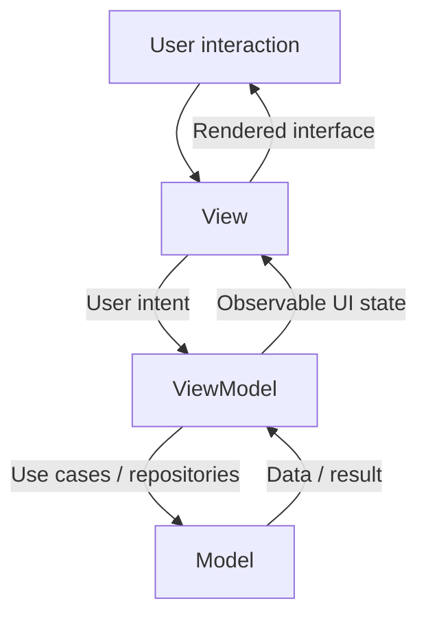
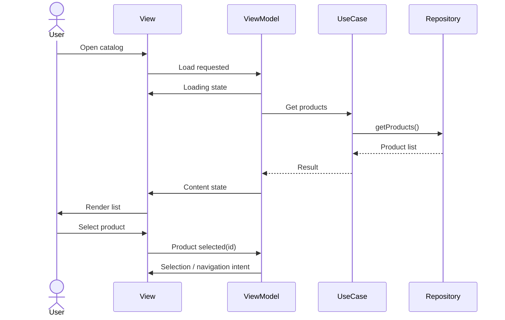

# Chapter 12 — MVVM
## Part 1: Parts

> **MVVM is not three folders named Model, View, and ViewModel. It is a way to assign clear ownership to application data, presentation state, and the interface that renders it.**

---

## Chapter map

This part establishes the three building blocks of Model–View–ViewModel (MVVM), their responsibilities, and the boundaries that keep the pattern useful in Kotlin Multiplatform (KMP).

- **Model** — application data and domain capabilities.
- **View** — the user-facing presentation and interaction surface.
- **ViewModel** — the presentation state holder that coordinates intent, application logic, and observable state.

The names are familiar. The hard part is deciding what belongs in each part—and what must stay out.

---

## 1. Why MVVM exists

A modern screen responds to many kinds of change: requests begin and finish, users edit fields, content becomes empty or unavailable, and platforms recreate or resize interfaces. When rendering, networking, business decisions, and state transitions are mixed together, the screen becomes difficult to test and change.

MVVM separates these responsibilities:



The View displays state and communicates intent. The ViewModel translates intent into application operations and exposes state the View can render. The Model provides the data and domain behavior the feature needs.

This does not remove complexity. It gives complexity an owner and makes the boundaries visible.

## 2. The three parts at a glance

| Part | Primary responsibility | Knows about | Does not own |
|---|---|---|---|
| **Model** | Provide application data and domain capabilities | Domain rules, repositories, data sources, persistence contracts | Compose widgets, screen navigation, view lifecycle |
| **View** | Render state and forward user actions | UI state, visual components, accessibility, presentation | Business rules, repository calls, durable application decisions |
| **ViewModel** | Coordinate presentation behavior and expose screen state | User intent, use cases, state transitions, coroutine scope | UI toolkit rendering, direct View references, platform widgets |

These are conceptual responsibilities, not mandatory package names. Organize code by feature, layer, or module while preserving the boundaries.

---

## 3. Model: the application's knowledge

In MVVM, *Model* is best understood as the application capabilities and information the ViewModel relies on—not necessarily one class called `Model`.

In a layered KMP application, these capabilities may include:

- Domain entities and value objects.
- Use cases expressing application actions.
- Repository interfaces defining how the domain obtains or changes information.
- Repository implementations coordinating remote and local sources.
- Data sources for APIs, databases, files, or platform services.
- Mappers translating representations when a boundary requires it.

A DTO describes a transport contract. A domain model describes a business concept. A database entity describes a persistence representation. They may share fields, but they serve different purposes.

### Example: product catalog

```kotlin
data class Product(
    val id: String,
    val name: String,
    val price: Money,
)

interface ProductRepository {
    suspend fun getProducts(): List<Product>
}

class GetProducts(
    private val repository: ProductRepository,
) {
    suspend operator fun invoke(): List<Product> =
        repository.getProducts()
}
```

The ViewModel does not need to know whether products came from a REST endpoint, database, cache, or combination of sources. That decision belongs behind the repository boundary.

**The Model should:**
- Preserve domain meaning and own business rules at the appropriate layer.
- Hide infrastructure details behind stable contracts.
- Make data operations independently testable.
- Represent failures and absence in ways the application can interpret.

**The Model should not:**
- Import Compose UI types.
- Hold references to an Activity or screen.
- Decide how a loading indicator is drawn.
- Contain navigation commands tied to a UI framework.

> **Boundary test:** If the UI toolkit changed, would this code still make sense? If not, it may be presentation code rather than Model code.

---

## 4. View: the presentation surface

The View is what users see and interact with. In Android it may be Jetpack Compose, traditional Views, or another UI surface. In KMP, it may be implemented separately for Android, iOS, desktop, or web—or shared where the chosen UI technology supports it.

The View has two essential jobs:

1. Render the state it receives.
2. Forward user actions as intent.

It should not need to know how products are fetched, how business policy is validated, or how repositories are coordinated. It should know how to present the current state and report what the user did.

### A declarative View

```kotlin
@Composable
fun ProductScreen(
    state: ProductUiState,
    onRefresh: () -> Unit,
    onProductSelected: (String) -> Unit,
) {
    when {
        state.isLoading -> LoadingContent()

        state.errorMessage != null -> ErrorContent(
            message = state.errorMessage,
            onRetry = onRefresh,
        )

        else -> ProductList(
            products = state.products,
            onProductSelected = onProductSelected,
        )
    }
}
```

This function receives state and callbacks. It does not construct a repository, launch a network request, or decide how products are loaded.

The UI can still own local presentation behavior: animation state, focus, scroll position, temporary input state, and other details genuinely owned by the interface. The goal is not to move every variable into a ViewModel; it is to keep state with the narrowest sensible owner.

**View responsibilities**
- Render loading, content, empty, and error states.
- Forward user actions through callbacks or event handlers.
- Handle accessibility, focus, layout, and visual behavior.
- Keep ephemeral UI concerns local when appropriate.
- Collect observable state using lifecycle-aware mechanisms where available.

**Avoid:** placing application orchestration directly in composables. UI effects have valid uses, but they should not become a substitute for an application state holder.

> **Boundary test:** Can the screen be previewed or tested with fixed state and fake callbacks? If so, the View is likely separated from application orchestration.

---

## 5. ViewModel: the presentation state holder

The ViewModel accepts user intent, invokes application capabilities, coordinates presentation behavior, and exposes state the View can observe. It is not simply a place to move code out of a composable; it defines a clear contract for the screen.

Typical responsibilities:
- Hold screen-level state.
- Respond to user actions.
- Invoke use cases or application services.
- Manage asynchronous work and cancellation.
- Translate results into presentation state.
- Coordinate related operations.
- Expose one-way state updates.

A ViewModel should describe *what the screen state is*, not *how pixels are drawn*.

### State and intent

```kotlin
data class ProductUiState(
    val isLoading: Boolean = false,
    val products: List<Product> = emptyList(),
    val errorMessage: String? = null,
)
```

The ViewModel owns mutable state and exposes a read-only stream:

```kotlin
class ProductViewModel(
    private val getProducts: GetProducts,
) {
    private val _uiState = MutableStateFlow(ProductUiState())
    val uiState: StateFlow<ProductUiState> = _uiState.asStateFlow()

    suspend fun loadProducts() {
        _uiState.update {
            it.copy(isLoading = true, errorMessage = null)
        }

        try {
            val products = getProducts()
            _uiState.update {
                it.copy(
                    isLoading = false,
                    products = products,
                    errorMessage = null,
                )
            }
        } catch (cause: Exception) {
            _uiState.update {
                it.copy(
                    isLoading = false,
                    errorMessage = "Unable to load products.",
                )
            }
        }
    }
}
```

This snippet illustrates the state contract, not a complete lifecycle integration. In production, run work in an owned coroutine scope, handle cancellation deliberately, and represent expected domain failures explicitly rather than treating every exception as a user-facing error.

A sealed hierarchy is another option when screen modes are mutually exclusive:

```kotlin
sealed interface ProductUiState {
    data object Loading : ProductUiState
    data class Content(val products: List<Product>) : ProductUiState
    data object Empty : ProductUiState
    data class Error(val message: String) : ProductUiState
}
```

Neither a data class nor a sealed hierarchy is universally superior. Choose based on whether meaningful state combinations are possible or the screen has mutually exclusive modes.

---

## 6. How the parts collaborate



The important point is the direction of responsibility:

- The View does not decide how data is retrieved.
- The Model does not decide how a screen is rendered.
- The ViewModel coordinates the screen without becoming coupled to visual implementation.

Navigation needs care. A ViewModel can express a navigation intent, while the navigation framework and actual route transition remain in the UI layer. Keep the contract independent of a specific navigation library unless the application deliberately accepts that coupling.

---

## 7. MVVM in Kotlin Multiplatform

KMP adds an architectural question: **which parts should be shared, and which should remain platform-specific?**

MVVM describes responsibilities; KMP determines where implementations can live. It does not require every part to be shared.

```text
composeApp/
  src/
    commonMain/
      kotlin/
        feature/catalog/
          ProductViewModel.kt
          ProductUiState.kt
    androidMain/
      kotlin/
        feature/catalog/
          AndroidCatalogScreen.kt
    iosMain/
      kotlin/
        feature/catalog/
          IOSCatalogScreen.kt

shared/
  src/
    commonMain/
      kotlin/
        domain/product/
          Product.kt
          GetProducts.kt
        data/product/
          ProductRepositoryImpl.kt
```

This is an illustrative structure, not a universal prescription. A project using shared Compose UI may place the View in `commonMain`. A project with native SwiftUI screens may share domain and application logic while implementing the View in SwiftUI.

### What can be shared?

| Concern | Often shareable? | Considerations |
|---|---|---|
| Domain entities and use cases | Yes | Keep platform-neutral |
| Repository contracts | Yes | Express capabilities, not platform APIs |
| Repository implementations | Often | Depends on database, networking, and platform integrations |
| ViewModel state and coordination | Often | Requires a deliberate coroutine and lifecycle strategy |
| UI state models | Yes | Avoid toolkit-specific types |
| View implementation | Depends | Share when technology and product needs support it |
| Navigation integration | Often platform-specific | Keep framework adapters at the right boundary |

### Shared ViewModel is a choice, not a rule

A shared ViewModel can reduce duplicated presentation logic when platforms share the same user flow and state transitions. It can introduce friction when screens have different interaction patterns, lifecycle expectations, or navigation behavior.

Share stable behavior; allow platform-specific presentation when it creates clarity. Avoid sharing code merely to maximize the percentage of `commonMain`.

---

## 8. State ownership: the question beneath MVVM

Many MVVM problems are really state ownership problems. For every piece of state, ask:

1. Who creates it?
2. Who may modify it?
3. How long should it live?
4. Who observes it?
5. What happens when its owner is destroyed or recreated?

| State | Typical owner |
|---|---|
| Products loaded for a screen | ViewModel or repository/cache, depending on lifetime |
| Text being typed into a search field | View or ViewModel, depending on restoration and coordination needs |
| Scroll position | View |
| Authentication session | Application/domain-level session service |
| Filter that must survive navigation | ViewModel, saved state, or persistence depending on requirements |
| Animation progress | View |
| Cached server response | Repository/data layer |

Not every state variable belongs in a ViewModel. Elevating short-lived visual state into a long-lived holder can make the system harder to maintain.

The right owner is the narrowest component that satisfies lifetime, sharing, restoration, and consistency requirements.

---

## 9. Common mistakes

### 1. Treating the ViewModel as a dumping ground
A ViewModel containing networking, database queries, business policy, formatting, navigation, and UI state is not well-separated simply because it sits outside a composable.

**Correction:** Keep application rules in the domain/application layer, infrastructure in data implementations, and screen coordination in the ViewModel.

### 2. Making the ViewModel depend on the View
Passing an Activity, Fragment, composable, or visual widget into a ViewModel creates lifecycle and testability problems.

**Correction:** Expose state and intent-oriented operations. Let the View own rendering and platform interactions.

### 3. Exposing mutable state
If callers can mutate the ViewModel's `MutableStateFlow`, the state holder no longer controls its contract.

**Correction:** Keep mutable state private and expose `StateFlow` or another read-only observable interface.

### 4. Putting every UI detail in the ViewModel
Not every animation, scroll offset, or transient focus value needs to become screen-level state.

**Correction:** Keep purely visual state local unless it must survive recreation, coordinate components, or be shared.

### 5. Treating every failure as a string
Converting all exceptions immediately into display text loses distinctions between network failures, validation errors, authentication issues, and unexpected defects.

**Correction:** Preserve meaningful error types at the appropriate boundary, then map expected failures to presentation messages.

### 6. Sharing platform behavior without a reason
A shared ViewModel that constantly branches on platform differences may indicate an unstable abstraction.

**Correction:** Share domain behavior and common presentation policy; isolate platform-specific behavior behind interfaces or platform-owned implementations where appropriate.

### 7. Assuming MVVM automatically means testable
A class named `ViewModel` can still be coupled to global state, concrete repositories, dispatchers, or platform frameworks.

**Correction:** Make dependencies explicit, control coroutine execution in tests, and test state transitions independently of rendering.

---

## 10. Responsibility checklist

### Model
- [ ] Represents application data, domain rules, or data access.
- [ ] Remains independent of UI toolkit types.
- [ ] Isolates external contracts where change is likely.
- [ ] Handles failures and consistency at the correct boundary.

### View
- [ ] Renders the state it receives.
- [ ] Forwards user actions clearly.
- [ ] Keeps visual-only state local when practical.
- [ ] Can be previewed or tested with fixed state and fake callbacks.
- [ ] Considers lifecycle-aware collection and accessibility.

### ViewModel
- [ ] Owns only state and coordination appropriate to the screen.
- [ ] Hides mutable state and implementation details.
- [ ] Scopes and cancels asynchronous operations deliberately.
- [ ] Delegates business rules to the appropriate layer.
- [ ] Keeps state transitions deterministic and testable.
- [ ] Avoids direct references to Views and platform widgets.

### KMP boundary
- [ ] Sharing is driven by stable behavior, not a percentage target.
- [ ] Platform APIs are isolated behind appropriate boundaries.
- [ ] Each platform retains needed presentation flexibility.
- [ ] ViewModel lifecycle strategy is explicit for each target.

---

## 11. The mental model

```text
                 USER
                   |
                   v
          +-----------------+
          |      VIEW       |
          | Render state    |
          | Forward intent  |
          +--------+--------+
                   |
             Intent / State
                   |
                   v
          +-----------------+
          |    VIEWMODEL    |
          | Coordinate work |
          | Own screen state|
          | Expose outcomes |
          +--------+--------+
                   |
                   v
          +-----------------+
          |      MODEL      |
          | Domain behavior |
          | Data capability |
          | Business rules  |
          +-----------------+
```

- **View:** What should the user see, and what did the user do?
- **ViewModel:** What does that action mean for this screen, and what state should be exposed?
- **Model:** What application data or business capability is needed to fulfill that intent?

The pattern is useful when these responsibilities remain distinct and collaborate through clear contracts. It becomes ceremony when classes are split without a reason, or when the ViewModel absorbs every concern simply because it is convenient.

> **The measure of a good MVVM design is not how many classes it contains. It is how confidently each part can change without forcing unrelated parts of the application to change with it.**

---

## Key takeaways

1. MVVM separates rendering, presentation coordination, and application capabilities.
2. The Model is a set of responsibilities and contracts—not necessarily one class.
3. The View renders state and forwards intent rather than orchestrating application workflows.
4. The ViewModel owns screen-level state and coordinates operations, but should not become a dumping ground.
5. State belongs to the narrowest owner that satisfies its lifetime and sharing requirements.
6. KMP allows selective sharing; sharing is an architectural choice, not a goal in itself.
7. Clear boundaries matter more than folder names or the number of abstractions.

---

*End of Chapter 12 — Part 1: Parts*
