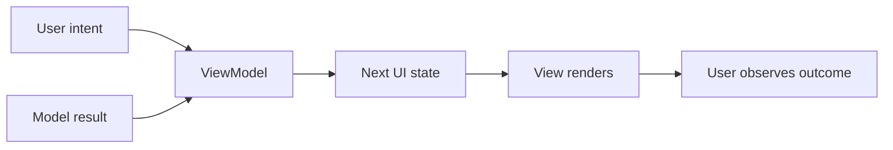
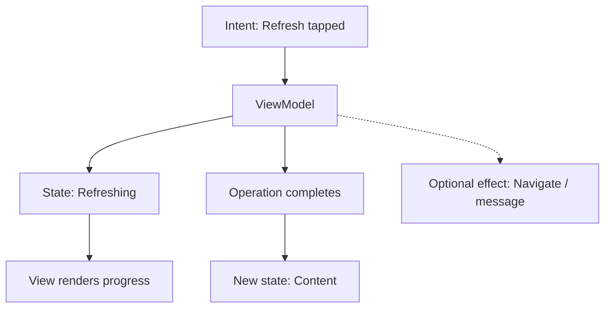
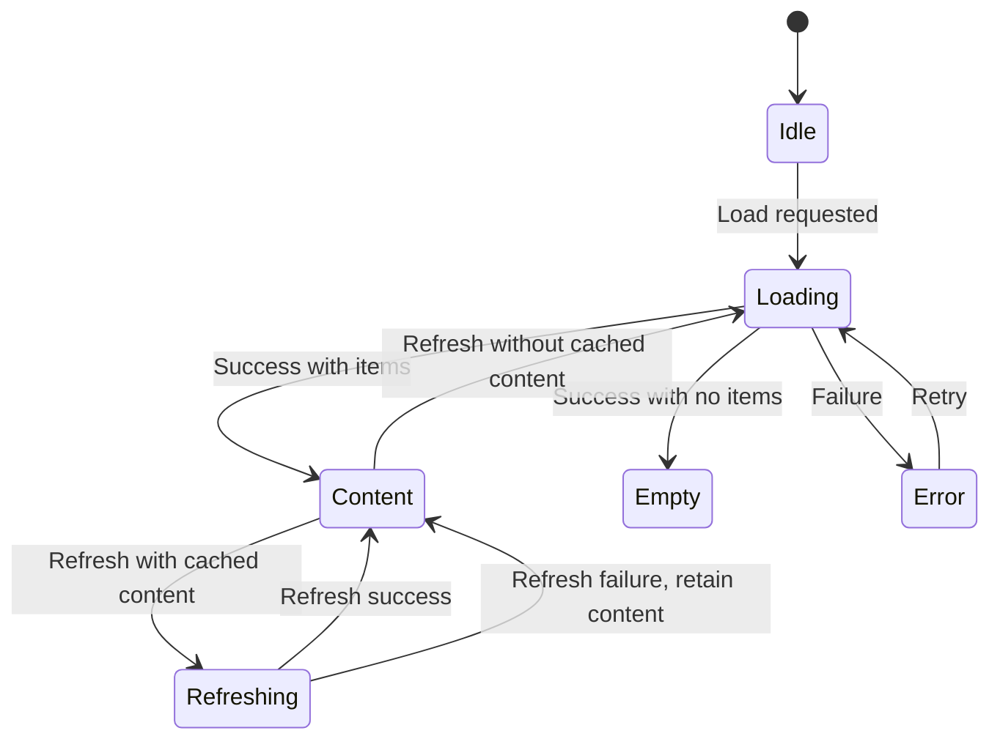

# Chapter 12 — MVVM
## Part 2: State

> **State is the contract between a ViewModel and its View. When that contract is explicit, the interface becomes easier to reason about, test, restore, and evolve.**

---

## 1. State is more than a collection of variables

In an MVVM application, state describes what the user can currently observe about a feature. It may include loaded content, progress, validation feedback, selected filters, or the result of an operation.

A useful state model answers three questions:

1. **What is true about the screen right now?**
2. **What can the user do next?**
3. **How should the View represent the current situation?**

State is not simply a mirror of the backend response. A server may return a list of products, but the screen may also need to know whether a refresh is in progress, whether the list is empty, and whether a recoverable error should be displayed.



The ViewModel combines relevant inputs and produces a state that is meaningful to the presentation layer.

---

## 2. The state contract

A screen should expose a deliberate contract rather than a collection of unrelated mutable properties.

Consider a catalog screen:

```kotlin
data class CatalogUiState(
    val isLoading: Boolean = false,
    val products: List<ProductUiModel> = emptyList(),
    val searchQuery: String = "",
    val selectedCategory: String? = null,
    val error: CatalogError? = null,
)
```

This model is convenient when several properties can be true at the same time. For example, the screen may retain previously loaded products while a refresh is running.

However, a data class does not automatically guarantee valid combinations. It permits states such as `isLoading = true` and `error != null`. If those combinations are invalid for the feature, the model should prevent them or define their meaning explicitly.

A state contract should be:

- **Observable:** the View can receive updates.
- **Read-only to consumers:** only the owner changes it.
- **Meaningful:** properties represent presentation facts, not implementation details.
- **Consistent:** impossible combinations are avoided or intentionally defined.
- **Stable:** small implementation changes do not force unnecessary changes in the View.

---

## 3. Choosing a state representation

Two common approaches are a data class with properties and a sealed hierarchy. Neither is universally correct.

### Option A: Data class

```kotlin
data class ProfileUiState(
    val isLoading: Boolean = false,
    val profile: ProfileUiModel? = null,
    val errorMessage: String? = null,
)
```

**Useful when:**
- Several state dimensions can coexist.
- Existing content should remain visible during refresh.
- The View needs independent flags such as `isRefreshing`, `isSaving`, or `isOffline`.
- Partial updates are common and meaningful.

**Risk:** unrelated Boolean flags can create ambiguous combinations.

### Option B: Sealed hierarchy

```kotlin
sealed interface ProfileUiState {
    data object Loading : ProfileUiState
    data class Content(val profile: ProfileUiModel) : ProfileUiState
    data object Empty : ProfileUiState
    data class Error(val message: String) : ProfileUiState
}
```

**Useful when:**
- The screen has mutually exclusive modes.
- Each mode requires different data.
- Exhaustive handling in `when` expressions is valuable.
- Invalid combinations should be unrepresentable.

**Risk:** a strict hierarchy can be awkward when the UI must preserve content while showing a refresh indicator or a non-blocking error.

### A practical rule

Use a sealed hierarchy when the states are genuinely exclusive. Use a data class when the screen has independent dimensions that can coexist. For complex screens, a combination is often appropriate:

```kotlin
data class CatalogUiState(
    val content: CatalogContentState = CatalogContentState.Loading,
    val isRefreshing: Boolean = false,
    val searchQuery: String = "",
    val message: String? = null,
)

sealed interface CatalogContentState {
    data object Loading : CatalogContentState
    data object Empty : CatalogContentState
    data class Loaded(
        val products: List<ProductUiModel>,
    ) : CatalogContentState
    data class Failed(
        val error: CatalogError,
    ) : CatalogContentState
}
```

The outer state captures concurrent presentation concerns; the sealed content state captures mutually exclusive content modes.

---

## 4. State, events, and effects are not the same thing

These terms are often mixed together, but they describe different concepts.

| Concept | Meaning | Example |
|---|---|---|
| **State** | A fact that remains true until changed | Search query is `kotlin`; form is invalid |
| **Event / intent** | An action requested by a user or another component | Refresh tapped; query submitted |
| **Effect** | A one-time action the UI may need to perform | Navigate; show a transient message; request permission |

A useful mental model:



State should be the source of truth for what the screen currently represents. Effects are for actions that should not be replayed as persistent screen facts.

For example, “the form is invalid” is state. “Show a toast now” is an effect. If the same validation message must remain visible until corrected, it belongs in state rather than being emitted only as a transient event.

---

## 5. Modeling user intent

A ViewModel API should communicate what the user is trying to do, not expose low-level state mutation.

```kotlin
sealed interface CatalogAction {
    data object Refresh : CatalogAction
    data class QueryChanged(val value: String) : CatalogAction
    data class CategorySelected(val id: String?) : CatalogAction
    data class ProductSelected(val id: String) : CatalogAction
}
```

The View can forward actions through a single entry point:

```kotlin
@Composable
fun CatalogScreen(
    state: CatalogUiState,
    onAction: (CatalogAction) -> Unit,
) {
    SearchField(
        value = state.searchQuery,
        onValueChange = {
            onAction(CatalogAction.QueryChanged(it))
        },
    )

    RefreshButton(
        onClick = {
            onAction(CatalogAction.Refresh)
        },
    )
}
```

A single action type can be useful for complex screens, analytics, and testing. For small screens, explicit callbacks such as `onRefresh` and `onQueryChanged` may be clearer. Choose the API that makes the screen's behavior easiest to understand.

Avoid exposing generic setters such as `setLoading(true)` to the View. The View should communicate intent; the ViewModel should determine the resulting state transition.

---

## 6. State transitions should be deliberate

A state transition is the movement from one valid screen state to another in response to an intent or result.

For a simple load operation:



The last transition is an important product decision: if cached content exists, a refresh failure may leave the content visible and show a non-blocking message. The state model should make that behavior explicit rather than accidentally clearing the screen.

### Reducer-style thinking

Even without adopting a formal reducer architecture, thinking in terms of `current state + action/result = next state` improves predictability.

```kotlin
fun CatalogUiState.withQuery(query: String): CatalogUiState =
    copy(searchQuery = query, message = null)
```

For more complex state, a reducer can centralize transitions:

```kotlin
private fun reduce(
    current: CatalogUiState,
    result: CatalogResult,
): CatalogUiState =
    when (result) {
        is CatalogResult.Loaded -> current.copy(
            content = if (result.products.isEmpty()) {
                CatalogContentState.Empty
            } else {
                CatalogContentState.Loaded(result.products)
            },
            isRefreshing = false,
            message = null,
        )

        is CatalogResult.Failed -> current.copy(
            isRefreshing = false,
            message = result.message,
        )
    }
```

The reducer is a function, not a requirement to introduce a framework. It is valuable when it makes state transitions easier to inspect and test.

---

## 7. Immutable state and controlled updates

Prefer immutable state objects. A ViewModel creates a new value when something changes instead of mutating an object that the View may already be observing.

```kotlin
private val _uiState = MutableStateFlow(CatalogUiState())
val uiState: StateFlow<CatalogUiState> = _uiState.asStateFlow()

private fun updateQuery(query: String) {
    _uiState.update { current ->
        current.copy(searchQuery = query)
    }
}
```

This provides several benefits:

- State changes are explicit.
- Observers can compare previous and current values.
- Tests can assert complete snapshots.
- Consumers cannot mutate the ViewModel's state stream.
- State transitions are easier to review.

Be careful with mutable collections inside otherwise immutable data classes. This is unsafe:

```kotlin
// Avoid mutating a list that is already part of published state.
_uiState.value.products as MutableList<ProductUiModel>
```

Instead, create a new collection:

```kotlin
_uiState.update { current ->
    current.copy(products = current.products + newProduct)
}
```

Kotlin's `List` is a read-only interface, not a guarantee that the underlying collection is deeply immutable. Avoid leaking mutable references across state boundaries.

---

## 8. StateFlow and observable state

`StateFlow` is a natural fit for state that has a current value and emits updates to observers.

```kotlin
private val _uiState = MutableStateFlow(CatalogUiState())
val uiState: StateFlow<CatalogUiState> = _uiState.asStateFlow()
```

Key characteristics:

- It always has a current value.
- A new collector receives the latest value.
- Updates are conflated; collectors observe the latest state rather than a guaranteed history of every intermediate value.
- It is hot and exists independently of an individual collector.
- It is well suited to representing current UI state.

This is different from a stream of one-time events. If every occurrence must be processed, a state holder with conflated updates may not be the right abstraction.

### Collecting in Compose

On Android, use lifecycle-aware collection where applicable:

```kotlin
@Composable
fun CatalogRoute(
    viewModel: CatalogViewModel,
) {
    val state by viewModel.uiState.collectAsStateWithLifecycle()

    CatalogScreen(
        state = state,
        onAction = viewModel::onAction,
    )
}
```

The lifecycle-aware API helps avoid collecting UI state when the screen is not in an appropriate lifecycle state. In multiplatform projects, collection strategy may differ by target and UI framework. Keep that platform integration at the presentation boundary.

---

## 9. State lifetime and ownership

A state value should live as long as its responsibility requires—no longer by default.

| Lifetime | Examples | Possible owner |
|---|---|---|
| Composition / view lifetime | Animation progress, focus, scroll position | View |
| Screen lifetime | Selected tab, loaded screen state, form workflow | ViewModel |
| Navigation or process restoration | Draft form, selected item, search query | Saved-state mechanism or persistence |
| Application session | Signed-in user, active account | Session/application service |
| Durable business data | Orders, preferences, cached records | Repository and persistent storage |

A ViewModel is not a database. It can retain state across certain UI lifecycle events, but process death, app restarts, and device changes require explicit restoration or persistence strategies.

### State ownership questions

For each value, ask:

1. Who creates it?
2. Who can change it?
3. Who observes it?
4. How long must it survive?
5. Does it need to be restored after process death?
6. Is it authoritative, cached, or merely a presentation projection?

These questions prevent both under-scoping and over-engineering.

---

## 10. Derived state versus duplicated state

Store the minimum state needed to represent the feature. Values that can be reliably derived should usually be computed rather than stored independently.

Suppose a list and a selected category are already available:

```kotlin
val visibleProducts: List<ProductUiModel>
    get() = products.filter { product ->
        selectedCategory == null ||
            product.categoryId == selectedCategory
    }
```

Storing `products`, `selectedCategory`, and a separately mutable `visibleProducts` creates synchronization work. One update can leave the derived list stale.

However, expensive transformations may need caching or controlled computation. The principle is not “never store derived data”; it is “avoid duplicated sources of truth without a performance or lifecycle reason.”

In Compose, `derivedStateOf` can help when a derived value changes less frequently than its inputs and recomposition cost matters. It is not necessary for every simple expression.

---

## 11. Loading, empty, error, and content are product states

These states are not merely technical details. They communicate what the user can expect and what action is available.

| State | Meaning | Typical UI behavior |
|---|---|---|
| Loading | Work is in progress and content is not yet available | Progress indicator or skeleton |
| Empty | Request succeeded, but there is no content | Helpful empty state and next step |
| Content | Data is available | Render content and actions |
| Error | Required operation failed | Explain the issue and offer recovery |
| Refreshing | Existing content is being updated | Preserve content and show subtle progress |
| Offline / stale | Data is available but may not be current | Show content with an appropriate freshness indicator |

Avoid treating an empty list as an error. An empty result may be a valid business outcome. Likewise, avoid replacing useful cached content with a full-screen error when the product can safely preserve it.

The correct states depend on the product's behavior, data guarantees, and user expectations.

---

## 12. Form state: a practical example

Forms reveal why state modeling matters. A form may need to represent current input, validation, submission progress, and server feedback.

```kotlin
data class SignInUiState(
    val email: String = "",
    val password: String = "",
    val isSubmitting: Boolean = false,
    val emailError: String? = null,
    val passwordError: String? = null,
    val generalError: String? = null,
) {
    val canSubmit: Boolean
        get() = email.isNotBlank() &&
            password.isNotBlank() &&
            !isSubmitting
}
```

The ViewModel can validate input and control submission. The View renders the values and messages. Whether every keystroke triggers validation or validation occurs on submit is a UX decision, not a rule imposed by MVVM.

Sensitive values such as passwords require additional care: avoid logging them, avoid unnecessary persistence, and clear them when the workflow no longer needs them.

---

## 13. Testing state behavior

State-oriented ViewModels are straightforward to test because tests can drive an action and assert the resulting state without rendering the UI.

A useful test suite covers:

- Initial state.
- Successful load.
- Empty result.
- Expected failure.
- Retry behavior.
- Refresh while content is already visible.
- Multiple actions in sequence.
- Cancellation and concurrency where relevant.
- Validation boundaries.
- State restoration where required.

Example using a fake use case or repository:

```kotlin
@Test
fun `successful load publishes products`() = runTest {
    val expected = listOf(
        ProductUiModel(id = "p-1", name = "Keyboard"),
    )
    val viewModel = createViewModel(
        getProducts = FakeGetProducts(Result.success(expected)),
    )

    viewModel.loadProducts()

    assertEquals(expected, viewModel.uiState.value.products)
    assertFalse(viewModel.uiState.value.isLoading)
    assertNull(viewModel.uiState.value.errorMessage)
}
```

The factory and fake are illustrative. In a real test, control dispatchers and coroutine execution explicitly, and ensure the test waits for the operation's completion. Prefer asserting observable outcomes over private implementation details.

---

## 14. Common state design mistakes

### Boolean explosion
Many independent flags permit combinations the screen cannot meaningfully represent.

**Improve it:** use sealed sub-states for mutually exclusive modes and reserve Booleans for genuinely independent dimensions.

### Multiple sources of truth
The same fact is stored in a repository, ViewModel, and View with no clear authority.

**Improve it:** identify the authoritative owner and treat other representations as projections or caches.

### Mutable state escaping
Consumers can modify state or mutate collections after publication.

**Improve it:** expose read-only streams and publish new immutable snapshots.

### Events masquerading as state
A one-time navigation or toast command is stored as a persistent Boolean that can replay after recreation.

**Improve it:** distinguish durable screen facts from one-time effects and define delivery semantics deliberately.

### State that is too technical
The UI receives raw exceptions, HTTP status codes, or database entities and must interpret them.

**Improve it:** translate technical results into a stable presentation contract at the appropriate boundary.

### State that is too presentation-specific
Domain models contain strings, colors, or widget-specific values.

**Improve it:** keep domain meaning in domain types and create UI representations where presentation genuinely requires them.

### Unclear concurrency
Two requests complete out of order and an older result overwrites newer state.

**Improve it:** define cancellation, request identity, and latest-wins or merge semantics according to the feature's requirements.

---

## 15. State design checklist

### Modeling
- [ ] Does the state describe what the user needs to know?
- [ ] Are mutually exclusive modes represented safely?
- [ ] Are valid concurrent conditions modeled intentionally?
- [ ] Are derived values computed rather than duplicated when practical?
- [ ] Are technical errors translated into meaningful outcomes?

### Ownership
- [ ] Is each state value owned by the narrowest suitable component?
- [ ] Is its lifetime explicit?
- [ ] Is restoration required, and if so, where is it handled?
- [ ] Is there one authoritative source of truth?

### Updates
- [ ] Is mutable state private?
- [ ] Are published snapshots treated as immutable?
- [ ] Are asynchronous operations cancellable?
- [ ] Are race conditions and stale results considered?
- [ ] Are state transitions deterministic enough to test?

### Presentation
- [ ] Can the View render each state clearly?
- [ ] Are loading, empty, error, and content distinct where needed?
- [ ] Are one-time effects distinguished from persistent state?
- [ ] Does each platform collect state with appropriate lifecycle behavior?

---

## The mental model

```text
             INTENT / RESULT
                    |
                    v
          +--------------------+
          |     VIEWMODEL      |
          |                    |
          | Current state      |
          | Transition rules   |
          | State ownership    |
          +----------+---------+
                     |
                     | Read-only observable state
                     v
          +--------------------+
          |        VIEW        |
          |                    |
          | Render snapshot    |
          | Forward intent     |
          +--------------------+
```

A state model is the language through which the ViewModel and View collaborate. A strong contract makes valid situations clear, invalid situations difficult to express, and changes easier to test.

> **Do not model every implementation detail. Model the facts the interface needs to represent—and make their ownership, lifetime, and transitions explicit.**

---

## Key takeaways

1. UI state is a presentation contract, not a raw copy of backend data.
2. Use data classes for meaningful combinations and sealed hierarchies for mutually exclusive modes.
3. Keep state, user intent, and one-time effects conceptually distinct.
4. Publish immutable snapshots and keep mutation inside the state owner.
5. `StateFlow` is suited to current state; it is not a guaranteed event-history mechanism.
6. Assign state to the narrowest owner that satisfies its lifetime and restoration needs.
7. Avoid duplicated sources of truth and define concurrency behavior deliberately.
8. Test state transitions independently from UI rendering.

---

*End of Chapter 12 — Part 2: State*
