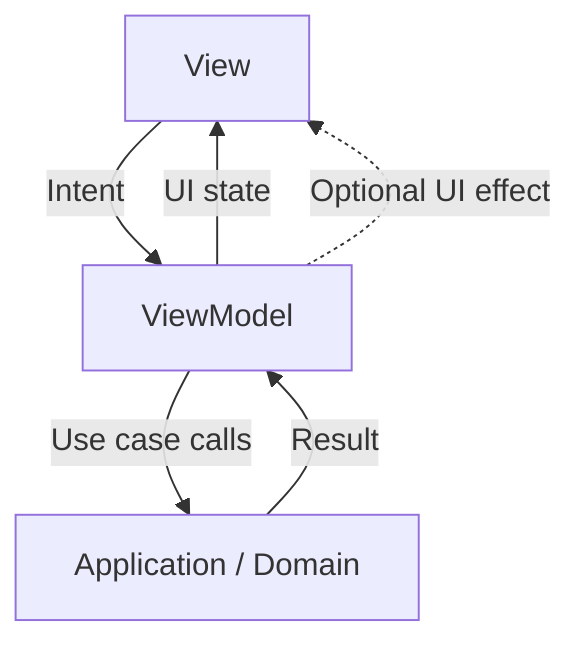
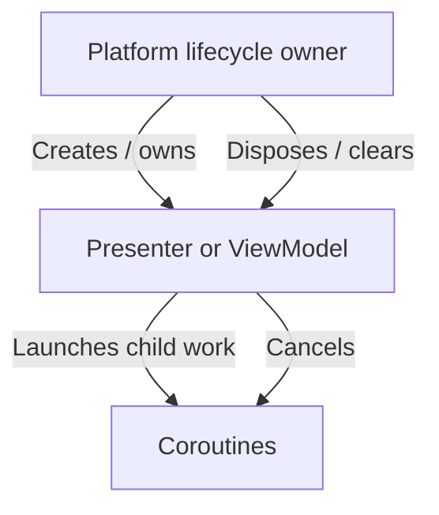

# Chapter 12 — MVVM
## Part 3: ViewModel

> **A ViewModel is not a place to hide UI code. It is the owner of presentation state and the coordinator that turns user intent into meaningful outcomes.**

---

## 1. The ViewModel's responsibility

The ViewModel sits between the View and the application's capabilities. Its responsibility is to coordinate the screen's behavior while keeping the UI independent from data-access and business implementation details.

A well-designed ViewModel typically:

- Accepts user intent through clear methods or action types.
- Invokes use cases or application services.
- Owns screen-level state.
- Coordinates asynchronous operations.
- Converts domain outcomes into presentation state.
- Defines cancellation and concurrency behavior.
- Exposes a read-only state contract to the View.
- Remains testable without rendering a screen.

It should not become a second repository, a navigation framework, or a dumping ground for every function that does not fit in a composable.



The ViewModel coordinates. It does not own the visual implementation, and it should not duplicate business rules already owned by the domain.

---

## 2. A ViewModel is a state holder, not merely a class

Consider a catalog screen. Its ViewModel may own:

- Whether the initial load is running.
- Which products are currently displayed.
- The selected category.
- The search query.
- Whether a refresh is active.
- A recoverable presentation error.

It should not necessarily own:

- The scroll offset of a list.
- The progress of a visual animation.
- A composable's focus state.
- The actual HTTP request implementation.
- A database schema or persistence policy.

The distinction is ownership, not whether a value can technically be stored in a ViewModel.

A useful test is: **Would this state still matter if the screen were rendered using a different UI toolkit?** If yes, it may belong in the ViewModel. If it exists only to control a visual detail, the View may be the better owner.

---

## 3. Define the contract before the implementation

A ViewModel is easier to maintain when its public API communicates intent and exposes a stable state stream.

```kotlin
data class CatalogUiState(
    val isLoading: Boolean = false,
    val products: List<ProductUiModel> = emptyList(),
    val query: String = "",
    val errorMessage: String? = null,
)

sealed interface CatalogAction {
    data object Refresh : CatalogAction
    data class QueryChanged(val value: String) : CatalogAction
    data class ProductSelected(val id: String) : CatalogAction
}
```

The ViewModel's public surface might be:

```kotlin
interface CatalogPresenter {
    val uiState: StateFlow<CatalogUiState>
    fun onAction(action: CatalogAction)
}
```

An interface is useful when it creates a real substitution or module boundary. It is not mandatory for every ViewModel. Avoid adding an interface solely to increase the number of types.

---

## 4. A focused implementation

The following example shows a ViewModel that owns state, accepts actions, and delegates retrieval to a use case. It is illustrative; lifecycle integration, error modeling, and dispatchers should be adapted to the application and target platforms.

```kotlin
class CatalogViewModel(
    private val getProducts: GetProducts,
    private val coroutineScope: CoroutineScope,
) : CatalogPresenter {

    private val _uiState = MutableStateFlow(CatalogUiState())
    override val uiState: StateFlow<CatalogUiState> =
        _uiState.asStateFlow()

    override fun onAction(action: CatalogAction) {
        when (action) {
            CatalogAction.Refresh -> refresh()
            is CatalogAction.QueryChanged -> updateQuery(action.value)
            is CatalogAction.ProductSelected -> selectProduct(action.id)
        }
    }

    private fun refresh() {
        coroutineScope.launch {
            _uiState.update {
                it.copy(isLoading = true, errorMessage = null)
            }

            val result = runCatching { getProducts() }

            result.fold(
                onSuccess = { products ->
                    _uiState.update {
                        it.copy(
                            isLoading = false,
                            products = products.map(Product::toUiModel),
                        )
                    }
                },
                onFailure = { cause ->
                    if (cause is CancellationException) throw cause

                    _uiState.update {
                        it.copy(
                            isLoading = false,
                            errorMessage = "Unable to load products.",
                        )
                    }
                },
            )
        }
    }

    private fun updateQuery(query: String) {
        _uiState.update {
            it.copy(query = query)
        }
    }

    private fun selectProduct(id: String) {
        // Selection behavior or a navigation intent is handled here.
    }
}
```

A few design choices matter:

1. The mutable flow is private.
2. The public API exposes read-only state.
3. The ViewModel receives its dependencies rather than constructing them.
4. User actions are expressed in feature language.
5. Data retrieval is delegated to a use case.
6. Cancellation is not converted into an ordinary failure.

In production, prefer typed domain failures over generic exception handling. The sample's string error is a presentation simplification, not a recommendation to discard error semantics throughout the application.

---

## 5. Coroutine ownership and lifecycle

Asynchronous work must have an owner. A coroutine launched from an unbounded or unmanaged scope can outlive the screen, update stale state, or leak resources.

On Android, the platform `ViewModel` provides `viewModelScope`. A common implementation is:

```kotlin
class AndroidCatalogViewModel(
    private val getProducts: GetProducts,
) : ViewModel() {

    private val _uiState = MutableStateFlow(CatalogUiState())
    val uiState: StateFlow<CatalogUiState> = _uiState.asStateFlow()

    fun refresh() {
        viewModelScope.launch {
            // Perform operation and publish state.
        }
    }
}
```

In shared KMP code, the Android `ViewModel` class is not automatically available in `commonMain`. There are several valid designs:

- Keep a platform ViewModel and share use cases and domain logic.
- Use a multiplatform ViewModel library with an explicit lifecycle integration.
- Build a small presenter/state-holder abstraction whose coroutine scope is owned and cancelled by the platform layer.

Do not create a global scope just to make shared code compile. Scope ownership and cancellation must remain explicit.

### Scope ownership



A scope passed into a shared presenter should have a documented owner and cancellation point. If the screen disappears, decide whether work should stop, continue in a longer-lived owner, or be persisted as a background task. That is a product and lifecycle decision—not something to solve with an arbitrary scope.

---

## 6. Dispatchers and testability

Avoid hard-coding dispatchers throughout business-facing code. Inject dispatchers where the ViewModel itself performs dispatcher-sensitive work, or keep dispatcher selection inside the data layer that owns the blocking operation.

```kotlin
interface DispatcherProvider {
    val main: CoroutineDispatcher
    val io: CoroutineDispatcher
    val default: CoroutineDispatcher
}
```

A shared implementation can provide platform-appropriate dispatchers. For many suspend APIs, the repository should be responsible for moving blocking work to the correct dispatcher, allowing the ViewModel to focus on state coordination.

Injecting a dispatcher into every class is not automatically beneficial. Add the abstraction where it improves control, portability, or test determinism.

---

## 7. Concurrency: what happens when actions overlap?

A ViewModel often receives repeated or overlapping actions:

- A user taps Refresh twice.
- A search query changes rapidly.
- A screen is opened while a previous request is still running.
- A user changes filters before an earlier request completes.

Without an explicit policy, an older request may finish last and overwrite newer state.

### Latest request wins

For search, the latest query usually matters more than earlier queries. A Flow pipeline can express that:

```kotlin
private val query = MutableStateFlow("")

val searchResults: Flow<List<Product>> =
    query
        .debounce(300)
        .distinctUntilChanged()
        .flatMapLatest { value ->
            searchProducts(value)
        }
```

`flatMapLatest` cancels the previous inner flow when a new query arrives. This is useful when the operation supports cancellation and the product behavior is “latest query wins.”

### Other concurrency policies

| Policy | Meaning | Example |
|---|---|---|
| Latest wins | New work supersedes old work | Search-as-you-type |
| Ignore while active | Reject duplicate work until completion | Prevent repeated form submission |
| Queue | Process every action in order | Ordered commands |
| Merge | Combine independent results | Loading separate dashboard panels |
| Cancel on owner disposal | Stop work when its owner ends | Screen-scoped request |
| Continue in background | Work outlives the screen under a dedicated owner | Upload or durable sync |

The ViewModel should implement the policy the feature needs, not apply one policy to every operation.

---

## 8. Mapping results into presentation state

The ViewModel often translates domain outcomes into UI state. This is a presentation transformation, not a reason to duplicate every domain model.

```kotlin
data class ProductUiModel(
    val id: String,
    val title: String,
    val formattedPrice: String,
)

fun Product.toUiModel(): ProductUiModel =
    ProductUiModel(
        id = id,
        title = name,
        formattedPrice = price.formatForDisplay(),
    )
```

This mapping is justified because the UI needs a display-oriented representation. If the domain type already serves the View without leaking presentation concerns, an additional model may not be necessary.

Keep formatting rules that depend on locale, currency display, or platform conventions at a suitable presentation boundary. Do not place UI strings or Compose types in domain entities.

---

## 9. Side effects and navigation

A ViewModel may need to communicate a one-time action such as navigation, opening a system permission prompt, or showing a transient message. These are not the same as durable screen state.

A possible effect contract:

```kotlin
sealed interface CatalogEffect {
    data class OpenProduct(val id: String) : CatalogEffect
    data class ShowMessage(val text: String) : CatalogEffect
}
```

The implementation must define delivery semantics. A buffered channel, shared flow, or state-backed effect queue each has different behavior when no collector is active or a collector restarts.

Do not assume that a one-time event is delivered exactly once merely because it is emitted from a Flow. Decide whether losing, replaying, or persisting the effect is acceptable. For critical actions, prefer representing the required condition as durable state and letting the UI acknowledge completion.

For navigation, keep the ViewModel's intent independent of concrete routes where possible. The UI or navigation adapter can translate `OpenProduct(id)` into the framework-specific operation.

---

## 10. Error handling belongs in the contract

A ViewModel should not expose raw infrastructure exceptions as its UI API. Convert known outcomes into stable, meaningful presentation state.

For example:

```kotlin
sealed interface CatalogError {
    data object NetworkUnavailable : CatalogError
    data object Unauthorized : CatalogError
    data object ServiceUnavailable : CatalogError
    data object Unexpected : CatalogError
}
```

The View can map these values to localized text and recovery actions. This keeps technical details out of the UI while preserving enough meaning for the product to respond appropriately.

Do not swallow cancellation:

```kotlin
catch (cause: CancellationException) {
    throw cause
} catch (cause: Exception) {
    // Map an expected failure or report an unexpected defect.
}
```

Also avoid catching `Throwable` for ordinary application errors. Fatal runtime conditions should not be silently converted into a generic screen message.

---

## 11. Keep the ViewModel focused

A ViewModel becomes difficult to maintain when it owns too many unrelated responsibilities. Warning signs include:

- Hundreds of lines of unrelated screen logic.
- Multiple repositories injected directly with no clear orchestration.
- Business rules duplicated from use cases.
- Platform checks scattered through shared presentation code.
- Complex formatting and validation mixed with request coordination.
- Many mutable flows representing overlapping versions of the same state.
- Private helper classes that are effectively separate services trapped inside the ViewModel.

A large ViewModel is not automatically wrong; complexity should be measured by cohesion and change frequency, not line count alone.

When responsibilities diverge, extract a collaborator with a meaningful role: a form validator, screen coordinator, mapper, or feature-specific operation handler. Avoid splitting every method into a class. Extraction should improve ownership and testability, not create indirection for its own sake.

---

## 12. Testing a ViewModel

A ViewModel's public state and actions form a natural test boundary.

Test:
- Initial state.
- State after each user action.
- Successful and failed operations.
- Empty results.
- Repeated actions and concurrency behavior.
- Cancellation.
- Validation and error mapping.
- Whether stale results can overwrite newer state.

A test should assert observable behavior rather than private fields or helper method calls.

```kotlin
@Test
fun `refresh publishes loaded products`() = runTest {
    val viewModel = createCatalogViewModel(
        getProducts = FakeGetProducts(
            Result.success(listOf(sampleProduct)),
        ),
        coroutineScope = backgroundScope,
    )

    viewModel.onAction(CatalogAction.Refresh)
    advanceUntilIdle()

    assertEquals(
        listOf(sampleProduct.toUiModel()),
        viewModel.uiState.value.products,
    )
    assertFalse(viewModel.uiState.value.isLoading)
}
```

This example assumes the test factory and fake use case are configured to use the test scheduler. In a real suite, share the same `TestCoroutineScheduler` across test dispatchers and scopes, and avoid relying on arbitrary delays.

---

## 13. Common ViewModel anti-patterns

| Anti-pattern | Why it hurts | Better direction |
|---|---|---|
| ViewModel constructs repositories | Hides dependencies and complicates tests | Inject collaborators |
| ViewModel holds Activity or View | Couples state to UI lifecycle | Communicate through state and intent |
| One method handles every screen concern | Low cohesion and hard-to-test behavior | Extract cohesive collaborators |
| Global coroutine scope | Unclear ownership and cancellation | Use a lifecycle- or task-owned scope |
| Mutable state exposed publicly | Consumers can bypass transitions | Expose read-only state |
| Every exception becomes a string | Loses failure meaning | Map typed outcomes to presentation state |
| No overlap policy | Stale results and duplicate work | Define latest, queue, ignore, or merge semantics |
| Navigation library types in shared domain | Platform and framework coupling | Express navigation intent at presentation boundary |
| Every value moved into ViewModel | Over-scoped visual state | Keep local UI state local |
| Abstraction for every method | More indirection without clear value | Extract only meaningful responsibilities |

---

## 14. ViewModel review checklist

### API and state
- [ ] Does the public API express user intent?
- [ ] Is state read-only to consumers?
- [ ] Are state transitions explicit and coherent?
- [ ] Are UI models introduced only when they add presentation value?

### Dependencies
- [ ] Are dependencies injected?
- [ ] Does the ViewModel delegate domain rules?
- [ ] Are platform-specific APIs kept out of shared code where appropriate?
- [ ] Are collaborators cohesive rather than merely numerous?

### Coroutines
- [ ] Is the coroutine scope owned and cancelled deliberately?
- [ ] Is cancellation propagated correctly?
- [ ] Are dispatchers chosen at the right boundary?
- [ ] Is overlapping work governed by an explicit policy?

### Outcomes
- [ ] Are expected failures represented meaningfully?
- [ ] Are one-time effects distinguished from state?
- [ ] Are navigation intents independent of UI framework details?
- [ ] Can the behavior be tested without rendering the View?

---

## The mental model

```text
              USER INTENT
                   |
                   v
        +----------------------+
        |       VIEWMODEL      |
        |                      |
        | Accept intent        |
        | Coordinate operation |
        | Own screen state     |
        | Define transitions   |
        | Handle cancellation  |
        +----------+-----------+
                   |
          +--------+--------+
          |                 |
          v                 v
     APPLICATION         UI STATE
     CAPABILITIES            |
          |                  v
          v                 VIEW
       RESULTS            Renders
```

A ViewModel is valuable because it gives presentation behavior a clear owner. It should make the screen's state transitions understandable, not hide them behind layers of indirection.

> **A good ViewModel makes the next state predictable, the dependencies visible, and the behavior testable—without knowing how the interface is drawn.**

---

## Key takeaways

1. The ViewModel coordinates presentation behavior and owns screen-level state.
2. Its public API should express intent and expose a read-only state contract.
3. Coroutine scope, cancellation, and concurrency policies must be explicit.
4. Shared KMP ViewModels require deliberate lifecycle integration; Android's `viewModelScope` is not automatically available in `commonMain`.
5. Translate domain outcomes into presentation state without duplicating models unnecessarily.
6. Keep navigation and transient effects separate from durable screen state, with defined delivery semantics.
7. Delegate business rules and infrastructure rather than turning the ViewModel into a dumping ground.
8. Test observable state transitions, including failure, cancellation, and overlapping work.

---

*End of Chapter 12 — Part 3: ViewModel*
