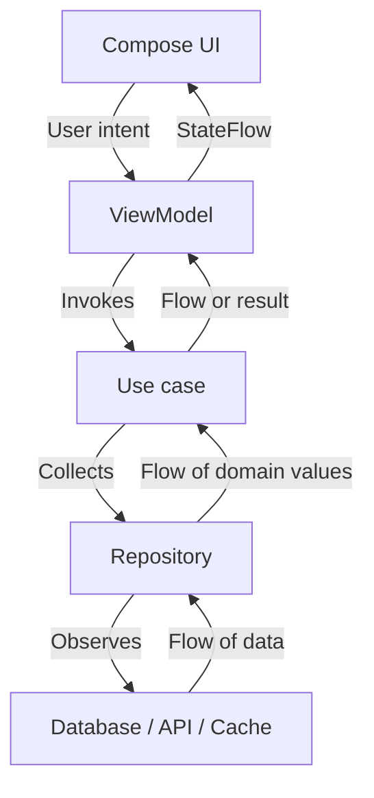

# Chapter 12 — MVVM
## Part 4 — Flow

> **The role of Flow in MVVM is not simply to deliver values. It is to make time, change, and ownership explicit.**

---

## 1. Why Flow Belongs in the MVVM Conversation

A ViewModel rarely works with a world that stays still.

A screen may observe a database while a background sync updates it. A search field may produce a new query every few hundred milliseconds. A network request may succeed, fail, or be cancelled. A user can leave a screen while work is still running.

A one-time function call is not enough to describe all of these situations. We need a way to represent values that can change over time.

Kotlin Flow provides that model.

In an MVVM application, Flow commonly connects:

- **Data sources** to repositories.
- **Repositories** to use cases.
- **Use cases** to ViewModels.
- **ViewModels** to UI state collectors.

The important design decision is not whether a function returns `Flow<T>`. It is whether the value is genuinely a stream and who owns its lifetime.



A repository can expose a stream of domain data, while the ViewModel converts that stream into a stable UI contract. This separation keeps persistence details out of the View and prevents UI-specific state from leaking into the domain layer.

---

## 2. Flow Is a Type; Streaming Is a Behaviour

Consider these signatures:

```kotlin
suspend fun loadProducts(): List<Product>

fun observeProducts(): Flow<List<Product>>
```

They communicate different contracts.

| Contract | Meaning |
|---|---|
| `suspend fun` | A caller requests an operation and receives a result when it completes. |
| `Flow<T>` | A caller can collect a sequence of values over time. |
| `StateFlow<T>` | A hot state holder with a current value and updates. |
| `SharedFlow<T>` | A configurable hot stream for broadcasting values to collectors. |

A `Flow` is generally **cold**: its upstream work starts when it is collected, and each collector can trigger a separate execution. Operators such as `map`, `filter`, and `onEach` build a pipeline; they do not execute it until collection begins.

```kotlin
val productFlow: Flow<List<Product>> =
    repository.observeProducts()
        .map { products -> products.sortedBy(Product::name) }
```

No values are processed merely because `productFlow` was declared. A collector activates the pipeline:

```kotlin
productFlow.collect { products ->
    // Handle each emitted list.
}
```

This distinction matters when designing repositories. A function named `observeProducts()` should communicate an ongoing observation, not hide a one-shot network request behind a stream-shaped return type without a reason.

---

## 3. Flow in the Data Layer

A database is a natural source of observable state. For example, a Room DAO can emit whenever its query result changes.

```kotlin
@Dao
interface ProductDao {
    @Query("SELECT * FROM products ORDER BY name")
    fun observeProducts(): Flow<List<ProductEntity>>
}
```

The repository translates persistence models into domain models:

```kotlin
class DefaultProductRepository(
    private val productDao: ProductDao,
) : ProductRepository {

    override fun observeProducts(): Flow<List<Product>> =
        productDao.observeProducts()
            .map { entities ->
                entities.map(ProductEntity::toDomain)
            }
}
```

The repository contract stays independent of Room:

```kotlin
interface ProductRepository {
    fun observeProducts(): Flow<List<Product>>
}
```

This is a useful boundary because the domain consumer cares that product data changes, not which database or cache produces those changes.

### Keep one-shot work honest

A remote request that returns one response does not automatically become a meaningful stream just because it is wrapped in `flow {}`.

```kotlin
// Appropriate when the operation is a one-time request.
suspend fun refreshProducts(): Result<Unit>

// Appropriate when callers observe changing data.
fun observeProducts(): Flow<List<Product>>
```

These functions can coexist. Refreshing changes the source; observing reports the resulting state.

---

## 4. From Flow to StateFlow in the ViewModel

The UI generally needs a durable representation of what the screen should display—not direct access to repository streams.

A ViewModel can transform a domain stream into `StateFlow<UiState>`:

```kotlin
data class CatalogUiState(
    val products: List<ProductUiModel> = emptyList(),
    val isLoading: Boolean = true,
    val message: String? = null,
)

class CatalogViewModel(
    observeProducts: ObserveProducts,
) : ViewModel() {

    val uiState: StateFlow<CatalogUiState> =
        observeProducts()
            .map { products ->
                CatalogUiState(
                    products = products.map(Product::toUiModel),
                    isLoading = false,
                )
            }
            .catch { throwable ->
                if (throwable is CancellationException) throw throwable

                emit(
                    CatalogUiState(
                        isLoading = false,
                        message = throwable.message ?: "Unable to load products",
                    )
                )
            }
            .stateIn(
                scope = viewModelScope,
                started = SharingStarted.WhileSubscribed(5_000),
                initialValue = CatalogUiState(),
            )
}
```

This example illustrates several important choices:

1. **The ViewModel owns the UI state.** The UI observes a screen-level contract.
2. **Mapping occurs at the presentation boundary.** The ViewModel exposes UI models rather than database entities.
3. **The state has an initial value.** Collectors can render immediately.
4. **The sharing policy is explicit.** `WhileSubscribed` controls when upstream collection is active.
5. **Cancellation is not treated as a user-facing failure.** A cancelled coroutine should normally remain cancelled.

`stateIn` converts a Flow into a hot `StateFlow` within a supplied coroutine scope. It does not make the upstream source globally permanent; the `SharingStarted` policy determines when collection starts and stops.

> **Design note:** `WhileSubscribed(5_000)` is a common choice for UI observation, but it is not a universal default. Select the policy based on whether upstream work should stop when the screen has no subscribers, remain active, or start eagerly.

---

## 5. Understanding SharingStarted

The `SharingStarted` policy defines when a `stateIn` or `shareIn` upstream flow is collected.

| Policy | Behaviour | Typical consideration |
|---|---|---|
| `Eagerly` | Starts immediately and remains active for the scope's lifetime. | Useful when work must begin without a subscriber. |
| `Lazily` | Starts on the first subscriber and continues for the scope's lifetime. | Avoids starting unused work but does not stop after subscribers leave. |
| `WhileSubscribed()` | Starts with subscribers and stops after the configured stop timeout. | Often suitable for screen-bound observation. |

For example:

```kotlin
.stateIn(
    scope = viewModelScope,
    started = SharingStarted.WhileSubscribed(
        stopTimeoutMillis = 5_000,
    ),
    initialValue = CatalogUiState(),
)
```

The timeout can smooth over short subscription gaps, such as brief configuration or navigation transitions. It should not be selected mechanically. Consider the cost of upstream work, freshness requirements, and whether the source itself maintains resources.

---

## 6. Combining Multiple Streams

A screen often depends on more than one changing value. A catalog might need product data and the selected category.

```kotlin
data class CatalogInputs(
    val products: List<Product>,
    val selectedCategory: Category?,
)

val inputs: Flow<CatalogInputs> =
    combine(
        productRepository.observeProducts(),
        categoryRepository.observeSelectedCategory(),
    ) { products, category ->
        CatalogInputs(
            products = products,
            selectedCategory = category,
        )
    }
```

The `combine` operator emits when either upstream stream emits, using the latest value from each.

A ViewModel can then derive the visible list:

```kotlin
val uiState: StateFlow<CatalogUiState> =
    inputs
        .map { input ->
            val visibleProducts = input.products
                .filter { product ->
                    input.selectedCategory == null ||
                        product.categoryId == input.selectedCategory.id
                }

            CatalogUiState(
                products = visibleProducts.map(Product::toUiModel),
                isLoading = false,
            )
        }
        .stateIn(
            scope = viewModelScope,
            started = SharingStarted.WhileSubscribed(5_000),
            initialValue = CatalogUiState(),
        )
```

Use `combine` when the output depends on the latest values from multiple streams. If the second stream should only be consulted when the first emits, operators such as `flatMapLatest` or `withLatestFrom`-style patterns may better express the intended relationship.

---

## 7. Search: Debounce, Distinctness, and Latest-Wins

Search is a classic example of a stream of user intent.

A user may type:

```text
c → ca → cat → cata → catalog
```

Issuing a network request for every character can waste bandwidth and produce stale results. A common pipeline is:

1. Receive query changes.
2. Normalize the query.
3. Ignore repeated values.
4. Wait briefly for typing to pause.
5. Cancel the previous search when a new query arrives.
6. Publish the latest result.

```kotlin
class SearchViewModel(
    private val searchProducts: SearchProducts,
) : ViewModel() {

    private val query = MutableStateFlow("")

    val uiState: StateFlow<SearchUiState> =
        query
            .map(String::trim)
            .debounce(300)
            .distinctUntilChanged()
            .flatMapLatest { value ->
                if (value.isBlank()) {
                    flowOf(SearchUiState())
                } else {
                    flow {
                        emit(SearchUiState(isLoading = true))
                        val results = searchProducts(value)
                        emit(
                            SearchUiState(
                                query = value,
                                results = results.map(Product::toUiModel),
                            )
                        )
                    }.catch { throwable ->
                        if (throwable is CancellationException) throw throwable
                        emit(
                            SearchUiState(
                                query = value,
                                error = throwable.message ?: "Search failed",
                            )
                        )
                    }
                }
            }
            .stateIn(
                scope = viewModelScope,
                started = SharingStarted.WhileSubscribed(5_000),
                initialValue = SearchUiState(),
            )

    fun onQueryChanged(value: String) {
        query.value = value
    }
}
```

`flatMapLatest` cancels the previous inner flow when a new query arrives. This is a **latest-wins** policy. It is appropriate for search results, where an older query should not overwrite a newer one.

Cancellation only works as intended when the underlying operation is cooperative. Blocking calls or APIs that ignore cancellation can continue consuming resources even after the coroutine is cancelled.

---

## 8. Flow Operators as Design Vocabulary

Operators are not just utilities; they describe how data should move through a feature.

| Operator | Meaning | Common use |
|---|---|---|
| `map` | Transform each value. | Domain model to UI model. |
| `filter` | Keep values that satisfy a condition. | Ignore invalid or irrelevant values. |
| `onEach` | Perform an action for each value without changing it. | Logging or instrumentation. |
| `distinctUntilChanged` | Suppress consecutive equal values. | Avoid redundant rendering or work. |
| `debounce` | Emit after a quiet interval. | Search input. |
| `combine` | Use the latest value from each source. | Build state from multiple inputs. |
| `flatMapLatest` | Switch to the newest inner flow. | Search or selection-driven requests. |
| `flatMapConcat` | Process inner flows sequentially. | Ordered asynchronous work. |
| `flatMapMerge` | Collect inner flows concurrently. | Independent concurrent operations. |
| `catch` | Handle upstream exceptions. | Convert expected failures into state. |
| `retry` / `retryWhen` | Re-collect after qualifying failures. | Controlled transient recovery. |
| `flowOn` | Change the context of upstream operators. | Move CPU-heavy upstream work. |
| `buffer` | Decouple upstream and downstream processing. | Throughput tuning when justified. |

Avoid adding operators by habit. Every operator should express a requirement that can be explained in plain language.

---

## 9. Exception Handling and Cancellation

A `catch` operator handles exceptions from upstream of its position. It does not catch exceptions thrown downstream by a collector.

```kotlin
repository.observeProducts()
    .catch { error ->
        // Handles upstream failure.
    }
    .collect { products ->
        // Exceptions here are downstream of catch.
    }
```

Cancellation deserves special care. `CancellationException` is part of structured concurrency and should generally be rethrown rather than converted into an error state.

```kotlin
.catch { throwable ->
    if (throwable is CancellationException) throw throwable

    emit(UiResult.Error(throwable.toUserMessage()))
}
```

Also avoid swallowing exceptions with broad handlers that turn every failure into an empty list. An empty result and a failed request are different states with different meanings for the user and for diagnostics.

### Prefer typed outcomes at meaningful boundaries

For expected business failures, a domain-level result can be more expressive than throwing arbitrary exceptions:

```kotlin
sealed interface CatalogResult {
    data class Success(val products: List<Product>) : CatalogResult
    data object Offline : CatalogResult
    data object Unauthorized : CatalogResult
}
```

The ViewModel can map these outcomes into presentation state. Unexpected programming errors should not be silently disguised as ordinary business outcomes.

---

## 10. StateFlow, SharedFlow, and Flow: Choose by Meaning

These types are related, but they are not interchangeable.

| Type | Has current value? | Replay | Best understood as |
|---|---:|---|---|
| `Flow<T>` | No | Per collection, depending on upstream | A stream description, commonly cold. |
| `StateFlow<T>` | Yes | Always exposes latest state to new collectors | A state holder. |
| `SharedFlow<T>` | No required current value | Configurable replay and buffer | A broadcast stream. |

### StateFlow for durable screen state

```kotlin
private val _uiState = MutableStateFlow(ProfileUiState())
val uiState: StateFlow<ProfileUiState> = _uiState.asStateFlow()
```

A new collector immediately receives the current state. This makes it suitable for rendering after recomposition or lifecycle restart.

### SharedFlow for broadcasts

```kotlin
private val _announcements = MutableSharedFlow<String>(
    extraBufferCapacity = 1,
)
val announcements: SharedFlow<String> = _announcements.asSharedFlow()
```

A `SharedFlow` is useful when multiple active collectors may need to observe a broadcast. But it does not automatically guarantee that a one-time UI effect will be delivered exactly once across lifecycle changes. Replay, buffering, collector presence, and acknowledgement semantics must be designed deliberately.

For navigation, snackbars, and other transient UI effects, choose a contract that matches the product requirement. If losing an effect is unacceptable, model it as state with an explicit acknowledgement rather than assuming a stream will provide exactly-once delivery.

---

## 11. Flow Collection in Compose

A Compose screen should collect state in a lifecycle-aware way on Android:

```kotlin
@Composable
fun CatalogRoute(
    viewModel: CatalogViewModel,
) {
    val state by viewModel.uiState.collectAsStateWithLifecycle()

    CatalogScreen(
        state = state,
        onProductSelected = viewModel::onProductSelected,
    )
}
```

`collectAsStateWithLifecycle()` ties collection to the appropriate lifecycle state, reducing unnecessary work when the UI is not visible.

For multiplatform Compose, lifecycle-aware collection APIs and lifecycle integration may differ by target and dependency setup. Keep the presentation contract portable, and isolate platform-specific lifecycle wiring where required.

Avoid launching unmanaged collectors directly from composable bodies. Compose can recompose many times; side effects should use the appropriate effect APIs or, preferably for durable screen state, the established state-collection integration.

---

## 12. Flow and Kotlin Multiplatform

`kotlinx.coroutines` and Flow are available across Kotlin Multiplatform targets, making Flow a useful shared contract for repositories and presentation logic.

A common shared architecture looks like this:

```text
shared/
└── src/
    └── commonMain/
        └── kotlin/
            ├── domain/
            │   ├── model/
            │   ├── repository/
            │   └── usecase/
            └── presentation/
                ├── CatalogUiState.kt
                └── CatalogPresenter.kt
```

The shared layer can define:

- Repository interfaces returning `Flow<DomainModel>`.
- Use cases that transform or combine streams.
- UI state models.
- Presentation logic that is not tied to Android lifecycle classes.

Platform-specific layers can provide:

- Database and network implementations.
- Lifecycle integration.
- Platform dispatchers and resource access.
- UI collection and navigation.

### Be deliberate about ViewModel portability

AndroidX ViewModel has multiplatform support in current ecosystems, but the exact dependency versions and lifecycle integration should be verified for the project's target matrix. A shared presenter or state-holder abstraction can also be used when a project needs tighter control over platform dependencies.

The key principle is stable: share the business and state-transition logic that benefits from sharing, while keeping platform lifecycle and UI concerns explicit.

---

## 13. Testing Flow-Based ViewModels

Flow tests should verify observable behaviour rather than implementation details.

Useful test cases include:

- The initial state is correct.
- Repository emissions update UI state.
- Multiple emissions are handled in order.
- Errors become the intended UI state.
- Cancellation is propagated.
- Search uses the latest query.
- A new subscriber receives the current `StateFlow` value.
- Upstream collection starts and stops according to the configured sharing policy.

Example using `runTest` and a controllable `MutableSharedFlow`:

```kotlin
@Test
fun `repository emissions update catalog state`() = runTest {
    val source = MutableSharedFlow<List<Product>>(replay = 1)
    val viewModel = createCatalogViewModel(
        observeProducts = { source },
        scope = backgroundScope,
    )

    source.emit(listOf(Product(id = "1", name = "Notebook")))

    viewModel.uiState.test {
        val state = awaitItem()
        assertEquals("Notebook", state.products.single().name)
    }
}
```

This sketch assumes a test helper such as Turbine and a factory that injects a test scope. In production code, ensure the collector is active before emitting when the source has no replay, or use a test source whose semantics match the scenario.

### Test time deliberately

Operators such as `debounce` depend on virtual time under `runTest`. Advance the test scheduler rather than sleeping:

```kotlin
advanceTimeBy(300)
runCurrent()
```

This keeps tests deterministic and fast.

---

## 14. Common Flow Mistakes

| Mistake | Why it causes trouble | Better approach |
|---|---|---|
| Exposing every internal stream directly to the UI | Leaks data-layer details and fragments screen state. | Publish a cohesive UI state contract. |
| Using `StateFlow` for every event | State conflation can collapse repeated equal values. | Choose a stream contract based on delivery semantics. |
| Assuming cold Flow runs immediately | Work does not begin until collection. | Make collection ownership explicit. |
| Creating a new collector for every recomposition | Can duplicate work and leak subscriptions. | Use lifecycle-aware state collection and effect APIs. |
| Catching all errors and returning empty data | Hides failures as valid empty content. | Represent loading, empty, and failure separately. |
| Swallowing cancellation | Breaks structured concurrency. | Rethrow `CancellationException`. |
| Using `flowOn` without understanding its boundary | Can move more or less work than intended. | Remember it affects upstream operators only. |
| Applying `buffer` or concurrency operators without a requirement | Adds complexity and changes timing. | Optimize only after defining expected semantics. |
| Treating `SharedFlow` as guaranteed one-time delivery | Events may be missed or replayed depending on configuration. | Define replay, acknowledgement, and lifecycle behaviour. |
| Sharing a stream without considering scope lifetime | Work may outlive the screen or stop too early. | Align sharing scope and policy with ownership. |

---

## 15. Review Checklist

Use this checklist when reviewing a Flow-based MVVM feature:

- [ ] Does the function signature communicate one-shot work versus ongoing observation?
- [ ] Is the stream cold or hot for a deliberate reason?
- [ ] Is the owner of collection and cancellation clear?
- [ ] Are repository emissions mapped at the correct architectural boundary?
- [ ] Does the ViewModel expose a cohesive state contract?
- [ ] Is the `stateIn` or `shareIn` scope appropriate?
- [ ] Is the `SharingStarted` policy selected intentionally?
- [ ] Are loading, empty, success, and failure distinguishable?
- [ ] Is cancellation propagated rather than displayed as an error?
- [ ] Are `combine`, `flatMapLatest`, and other operators expressing actual product behaviour?
- [ ] Are UI collectors lifecycle-aware?
- [ ] Are event delivery and replay semantics documented?
- [ ] Do tests cover multiple emissions, failures, cancellation, and virtual time?
- [ ] Are platform-specific lifecycle concerns kept out of portable domain contracts?

---

## 16. The Mental Model

Think of Flow as a contract about change over time.

- **Flow** describes a stream that a consumer can collect.
- **StateFlow** represents a current value that can change.
- **SharedFlow** broadcasts values according to explicit replay and buffering rules.
- **Operators** describe how streams are transformed, combined, filtered, or switched.
- **Scopes** define the lifetime of coroutine work.
- **Lifecycle-aware collection** aligns UI observation with visibility.
- **The ViewModel** turns changing domain inputs into a stable presentation contract.

The goal is not to make every function return Flow. The goal is to make asynchronous behaviour understandable: what changes, who observes it, when work starts, when it stops, and what the UI should display.

---

## Key Takeaways

1. Use `Flow` for values that genuinely evolve over time; keep one-shot operations as one-shot operations.
2. Use `StateFlow` for durable UI state with a well-defined owner and initial value.
3. Use `SharedFlow` only when broadcast semantics, replay, and buffering are intentional.
4. Treat `stateIn` and `shareIn` as lifecycle and resource decisions, not just conversion helpers.
5. Use operators such as `combine`, `debounce`, and `flatMapLatest` to encode product behaviour explicitly.
6. Preserve cancellation and distinguish empty data from failure.
7. Collect UI state with lifecycle awareness and test time-dependent behaviour deterministically.
8. In KMP, share portable stream and state logic while keeping platform lifecycle integration explicit.

> **A well-designed Flow pipeline makes change predictable. A poorly designed one merely makes asynchronous code harder to follow.**
