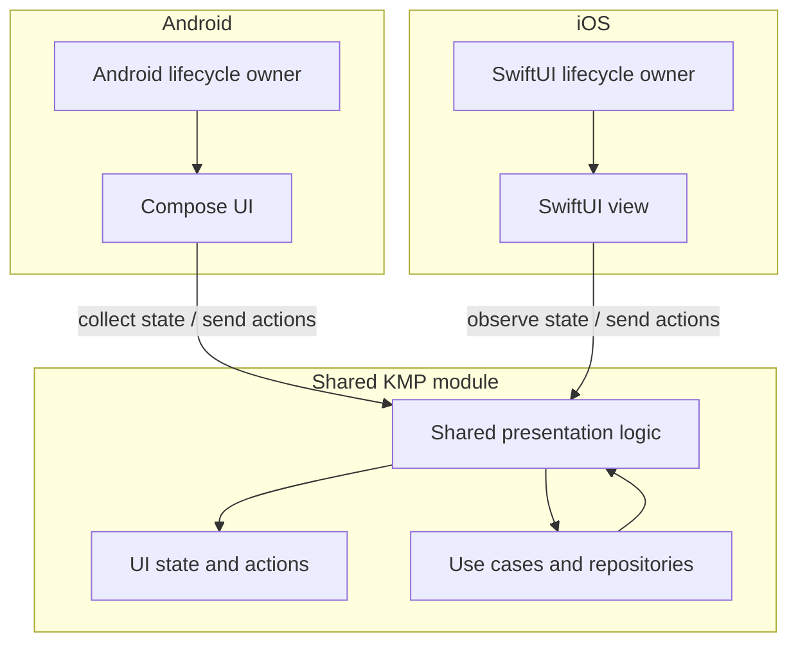

# Chapter 12 — MVVM
## Part 5 — Shared ViewModels

> **Sharing a ViewModel is not the same as sharing a screen. The objective is to reuse presentation decisions while keeping lifecycle, platform behaviour, and user experience explicit.**

---

## 1. What Does “Shared ViewModel” Actually Mean?

In a Kotlin Multiplatform application, *shared ViewModel* can refer to several different arrangements:

1. A ViewModel implementation compiled into `commonMain` and used by multiple platform UIs.
2. A shared presenter or state holder that behaves like a ViewModel but does not inherit from a platform-specific class.
3. A common state and action contract implemented by platform-specific ViewModels.
4. A shared ViewModel instance consumed by more than one screen or platform.

These approaches solve different problems. They should not be treated as interchangeable.

The central responsibility remains familiar: coordinate presentation logic, react to user intent, observe domain data, and expose state that a UI can render. What changes in KMP is the boundary between portable logic and platform lifecycle integration.



A shared ViewModel can reduce duplicated state transitions and business-facing presentation rules. It does not remove the need to design each platform's navigation, lifecycle, accessibility, or UI conventions.

---

## 2. Decide What Is Worth Sharing

A useful test is to ask whether two platforms need the same *decision*, not whether their screens look alike.

| Concern | Often shareable? | Reason |
|---|---|---|
| Loading and content state transitions | Yes | Usually represent the same feature rules. |
| Validation rules | Yes | Business constraints should remain consistent. |
| Combining repository streams | Yes | Data orchestration is usually platform-neutral. |
| Mapping domain outcomes to semantic UI state | Often | Share when the meaning is consistent across platforms. |
| Android navigation APIs | No | Navigation is tied to Android UI and lifecycle. |
| SwiftUI view composition | No | Belongs to the iOS presentation layer. |
| Platform permissions and system dialogs | Usually no | OS APIs and user expectations differ. |
| Formatting dates, currency, or names | Depends | Share domain meaning; keep locale and platform policy explicit. |
| Animation and interaction details | Usually no | Often differ by platform and design system. |

Avoid sharing code simply to increase a percentage in a dashboard. A small amount of deliberate platform-specific code is often cheaper than a shared abstraction that obscures platform behaviour.

---

## 3. Three Common Architectures

### Option A — A common ViewModel

The shared source set contains a ViewModel class and its state logic. Both platform UIs consume it.

```text
shared/
└── src/
    └── commonMain/
        └── kotlin/
            └── catalog/
                ├── CatalogViewModel.kt
                ├── CatalogUiState.kt
                └── CatalogAction.kt
```

**Advantages**
- One implementation of presentation transitions.
- Shared tests can exercise the same logic used by both platforms.
- State and action contracts live close to their implementation.

**Trade-offs**
- Lifecycle integration must be supported and configured for every target.
- Platform-specific dependencies can reduce portability.
- Swift interoperability and coroutine collection need deliberate design.

This approach can work well when the project has a compatible multiplatform ViewModel stack and the team is comfortable maintaining its lifecycle integration.

### Option B — A shared presenter or state holder

The common module owns the presentation logic but does not inherit from Android's `ViewModel` or require a platform ViewModel base class.

```text
shared/
└── src/commonMain/kotlin/catalog/
    ├── CatalogPresenter.kt
    ├── CatalogUiState.kt
    └── CatalogAction.kt

androidApp/
└── CatalogAndroidViewModel.kt

iosApp/
└── CatalogObservableAdapter.swift
```

The platform layer owns lifecycle and adapts the shared state to its UI framework.

**Advantages**
- Clear separation between portable logic and platform lifecycle.
- Easier to integrate with different UI frameworks.
- The shared component can be tested without Android lifecycle machinery.

**Trade-offs**
- Each platform needs a thin adapter.
- The team must define a consistent way to start, stop, and dispose of the shared component.

This is often a useful compromise when the presentation logic is shared but platform lifecycle needs are meaningfully different.

### Option C — Shared contract, platform-specific ViewModels

The common module defines state and actions, while each platform implements its own ViewModel.

```text
shared/
└── src/commonMain/kotlin/catalog/
    ├── CatalogUiState.kt
    ├── CatalogAction.kt
    └── CatalogUseCases.kt

androidApp/
└── CatalogViewModel.kt

iosApp/
└── CatalogViewModel.swift
```

This works when platforms share domain rules and state shapes but have different presentation workflows. It is not a failure of KMP: sharing contracts can be more valuable than forcing a single implementation.

---

## 4. Design a Platform-Neutral Contract

Start with a state model that describes what the user can see, rather than exposing implementation details.

```kotlin
data class CatalogUiState(
    val products: List<ProductUiModel> = emptyList(),
    val isLoading: Boolean = true,
    val error: CatalogError? = null,
)

data class ProductUiModel(
    val id: String,
    val title: String,
    val formattedPrice: String,
)

enum class CatalogError {
    NETWORK,
    UNAUTHORIZED,
    UNKNOWN,
}
```

Use semantic values where possible. For example, `CatalogError.NETWORK` communicates meaning without embedding an English sentence in shared code. The platform can map it to localized resources and platform-specific presentation.

Actions should represent user intent:

```kotlin
sealed interface CatalogAction {
    data object Refresh : CatalogAction
    data class SelectProduct(val id: String) : CatalogAction
    data object Retry : CatalogAction
}
```

A shared contract can then expose state and accept actions:

```kotlin
interface CatalogPresenter {
    val state: StateFlow<CatalogUiState>

    fun dispatch(action: CatalogAction)
}
```

The contract is deliberately small. It does not expose navigation controllers, Android `Context`, UIKit objects, or Compose-specific types.

---

## 5. Implementing a Shared Presenter

The following example uses `StateFlow` and an injected coroutine scope. The scope is supplied by the owner, which makes lifetime explicit and keeps the presenter independent of a particular UI framework.

```kotlin
class DefaultCatalogPresenter(
    private val observeProducts: ObserveProducts,
    private val refreshProducts: RefreshProducts,
    private val scope: CoroutineScope,
) : CatalogPresenter {

    private val _state = MutableStateFlow(CatalogUiState())
    override val state: StateFlow<CatalogUiState> = _state.asStateFlow()

    private var observationJob: Job? = null
    private var refreshJob: Job? = null

    init {
        startObserving()
    }

    override fun dispatch(action: CatalogAction) {
        when (action) {
            CatalogAction.Refresh,
            CatalogAction.Retry -> refresh()

            is CatalogAction.SelectProduct -> {
                // Selection can be handled by a navigation adapter
                // or represented in state if it is durable UI state.
            }
        }
    }

    private fun startObserving() {
        observationJob?.cancel()
        observationJob = scope.launch {
            observeProducts()
                .catch { throwable ->
                    if (throwable is CancellationException) throw throwable
                    _state.update {
                        it.copy(
                            isLoading = false,
                            error = throwable.toCatalogError(),
                        )
                    }
                }
                .collect { products ->
                    _state.update {
                        it.copy(
                            products = products.map(Product::toUiModel),
                            isLoading = false,
                            error = null,
                        )
                    }
                }
        }
    }

    private fun refresh() {
        if (refreshJob?.isActive == true) return

        refreshJob = scope.launch {
            _state.update { it.copy(isLoading = true, error = null) }

            when (val result = refreshProducts()) {
                is RefreshResult.Success -> {
                    // The observed stream publishes the refreshed data.
                }

                is RefreshResult.Failure -> {
                    _state.update {
                        it.copy(
                            isLoading = false,
                            error = result.reason.toCatalogError(),
                        )
                    }
                }
            }
        }
    }
}
```

This is an illustrative implementation; the concrete result and mapping types belong to the project's domain layer. Notice the ownership decisions:

- The presenter does not create an unbounded global scope.
- The owner supplies the scope and must cancel it when the presenter is no longer needed.
- The observation job is retained so it can be cancelled or replaced.
- Refresh work has an explicit concurrency policy: repeated refresh requests are ignored while one is active.
- The UI state is immutable and updated atomically.
- Cancellation is propagated instead of being converted into a display error.

### Give the presenter an explicit lifetime

A presenter should not outlive the feature that owns it unless that is an intentional product requirement.

```kotlin
class CatalogPresenterOwner(
    private val parentScope: CoroutineScope,
    private val createPresenter: (CoroutineScope) -> CatalogPresenter,
) {
    private val presenterScope =
        CoroutineScope(parentScope.coroutineContext + SupervisorJob())

    val presenter: CatalogPresenter = createPresenter(presenterScope)

    fun clear() {
        presenterScope.cancel()
    }
}
```

In real applications, avoid accidentally replacing a parent's `Job` without understanding the resulting cancellation relationship. The example shows the ownership concept; production code should preserve the intended parent-child job hierarchy and define whether child failures cancel siblings.

---

## 6. Android Integration

On Android, a thin `ViewModel` can own the shared presenter and expose its state to Compose.

```kotlin
class CatalogAndroidViewModel(
    private val presenter: CatalogPresenter,
) : ViewModel() {

    val state: StateFlow<CatalogUiState> = presenter.state

    fun dispatch(action: CatalogAction) {
        presenter.dispatch(action)
    }
}
```

The UI remains declarative:

```kotlin
@Composable
fun CatalogRoute(
    viewModel: CatalogAndroidViewModel,
) {
    val state by viewModel.state.collectAsStateWithLifecycle()

    CatalogScreen(
        state = state,
        onRefresh = { viewModel.dispatch(CatalogAction.Refresh) },
        onRetry = { viewModel.dispatch(CatalogAction.Retry) },
    )
}
```

The Android ViewModel should also own or coordinate the presenter's lifetime. If the presenter uses a scope created elsewhere, define who cancels it and when. Do not assume that wrapping a presenter in a ViewModel automatically gives the presenter's jobs the correct lifecycle.

For Android-only code, `viewModelScope` is often appropriate. For a portable presenter, an injected scope or an explicit start/stop API can make ownership easier to reason about.

---

## 7. SwiftUI Integration

SwiftUI expects observable objects and state changes that participate in its rendering system. A Kotlin `StateFlow` can be adapted for Swift, but the bridging mechanism depends on the project's interop approach and library versions.

Conceptually, the adapter performs three tasks:

1. Retain the shared presenter for the feature's lifetime.
2. Collect its state while the SwiftUI owner is active.
3. Publish state changes through a Swift-observable property.

A simplified Swift-side shape might look like this:

```swift
@MainActor
final class CatalogObservable: ObservableObject {
    @Published private(set) var state: CatalogUiState

    private let presenter: CatalogPresenter
    private var observationTask: Task<Void, Never>?

    init(presenter: CatalogPresenter) {
        self.presenter = presenter
        self.state = presenter.state.value
        // Start collection using the project's chosen
        // Kotlin Flow-to-Swift bridging mechanism.
    }

    func send(_ action: CatalogAction) {
        presenter.dispatch(action: action)
    }

    func stopObserving() {
        observationTask?.cancel()
        observationTask = nil
    }
}
```

The collection code is intentionally omitted because Kotlin Flow is not directly an `AsyncSequence` in every interop setup. Teams may use a library that exposes Flow to Swift concurrency, generated wrappers, or a carefully managed callback bridge. Choose one approach and standardize it rather than scattering ad hoc bridging code across screens.

In SwiftUI, the observable adapter can be owned by a view or a navigation-level coordinator, depending on the intended state lifetime. Make sure the adapter cancels its collection task when it is no longer needed.

---

## 8. State Lifetime Is an Architectural Decision

A shared ViewModel does not automatically imply shared lifetime.

| Lifetime | Example | Owner |
|---|---|---|
| Composition/view | Temporary animation or local input focus | UI framework |
| Screen | Catalog filter or screen loading state | Screen ViewModel/presenter |
| Navigation flow | Multi-step checkout draft | Flow coordinator or scoped state holder |
| Application | Signed-in account snapshot | Application-level state owner |
| Persistent | User preference or saved cart | Repository/database |

A frequent source of bugs is placing state in a scope that is either too short or too long.

- Too short: returning to a screen loses state unexpectedly.
- Too long: stale data and retained resources survive after the user leaves.
- Unclear: no one knows who should cancel jobs or reset the state.

Before sharing a presenter instance across screens, decide whether those screens truly represent the same stateful feature. Two screens that use the same class do not necessarily need the same instance.

---

## 9. Navigation and One-Time Effects

Navigation is usually best kept at the platform boundary because Android Navigation and SwiftUI navigation have different APIs and lifecycle semantics.

Instead of injecting a platform navigator into shared code, the presenter can expose a semantic outcome:

```kotlin
sealed interface CatalogEffect {
    data class OpenProduct(val productId: String) : CatalogEffect
}
```

The platform adapter translates that outcome into its native navigation action.

However, transient effects require a delivery contract. A replay-free stream can lose an effect when no collector is active; replay can cause an effect to be handled again after a collector restarts. If the action must survive lifecycle changes, consider representing it as pending state with an acknowledgement identifier.

Do not claim exactly-once delivery unless the implementation actually provides it.

---

## 10. Dependency Injection and Construction

Shared presentation logic should receive dependencies through its constructor:

```kotlin
class DefaultCatalogPresenter(
    private val observeProducts: ObserveProducts,
    private val refreshProducts: RefreshProducts,
    private val scope: CoroutineScope,
) : CatalogPresenter
```

This makes dependencies visible and supports deterministic tests. The platform composition root can construct the presenter using the shared dependency graph and supply the appropriate scope.

Keep platform objects out of shared constructors unless the shared feature genuinely requires a portable abstraction for them. For example, rather than passing Android `Context` into common code, define an interface for the required capability and provide platform implementations.

A practical rule:

> Share the capability contract; inject the platform implementation at the edge.

---

## 11. Testing Shared Presentation Logic

The main benefit of a shared presenter is that its state transitions can be tested once and exercised by every platform using it.

Test cases should cover:

- Initial state and initial loading behaviour.
- Repository emissions and state updates.
- Refresh success and failure.
- Duplicate refresh actions under the chosen concurrency policy.
- Cancellation when the owner is cleared.
- Multiple collectors observing the same state.
- Error mapping and recovery.
- Action handling that must remain consistent across platforms.

A simplified test can use a test scope and a controllable stream:

```kotlin
@Test
fun `observed products are reflected in state`() = runTest {
    val products = MutableSharedFlow<List<Product>>(replay = 1)
    val presenter = DefaultCatalogPresenter(
        observeProducts = ObserveProducts { products },
        refreshProducts = FakeRefreshProducts(),
        scope = backgroundScope,
    )

    products.emit(listOf(Product(id = "p1", name = "Notebook")))

    runCurrent()

    assertEquals(
        "Notebook",
        presenter.state.value.products.single().title,
    )
}
```

The exact constructors and fake implementations will vary. Ensure the test controls the scheduler used by launched coroutines; otherwise, emissions and assertions can race.

Also test platform adapters separately. Shared tests cannot verify SwiftUI observation, Android lifecycle collection, navigation integration, or native resource handling.

---

## 12. Common Mistakes

| Mistake | Consequence | Better practice |
|---|---|---|
| Sharing a ViewModel only to maximize code reuse | Platform differences become awkward conditionals. | Share decisions that are genuinely common. |
| Putting Android lifecycle types in `commonMain` without a supported multiplatform setup | Restricts targets or complicates builds. | Verify dependencies and target support, or use a portable presenter. |
| Giving a presenter an unmanaged global scope | Work can outlive the feature indefinitely. | Inject a scope with an explicit owner. |
| Sharing one presenter instance across unrelated screens | State and actions can interfere. | Scope instances to the feature or navigation flow. |
| Exposing platform-specific navigation from shared code | Couples common logic to UI frameworks. | Emit semantic outcomes and adapt them at the edge. |
| Treating a Swift bridge as automatic | Lifecycle and cancellation bugs become hard to diagnose. | Standardize and test the Flow-to-Swift integration. |
| Mapping localized strings in common code | Makes localization and platform conventions inflexible. | Expose semantic errors and localize at the UI boundary. |
| Using shared state for ephemeral UI details | Adds unnecessary cross-platform complexity. | Keep local view concerns local. |
| Forgetting to cancel collection tasks | Retains objects and wastes resources. | Tie collectors to an explicit lifecycle owner. |
| Testing only shared logic | Platform integration defects remain hidden. | Add focused adapter and lifecycle tests. |

---

## 13. Architecture Review Checklist

- [ ] Is the shared responsibility a real presentation rule rather than a visual detail?
- [ ] Is the chosen architecture (common ViewModel, presenter, or shared contract) justified by platform needs?
- [ ] Are state and actions platform-neutral?
- [ ] Are domain models and UI models separated where that separation provides value?
- [ ] Is the presenter's lifetime explicit?
- [ ] Is every coroutine launched in an owned scope?
- [ ] Are jobs cancelled when the feature is cleared?
- [ ] Are navigation and native UI effects adapted at platform boundaries?
- [ ] Are replay and acknowledgement semantics clear for transient effects?
- [ ] Does each platform collect state in a lifecycle-aware manner?
- [ ] Are Swift interop and cancellation tested with the selected bridge?
- [ ] Are shared state transitions covered by common tests?
- [ ] Are platform-specific behaviours covered by platform tests?
- [ ] Can a developer understand where to add a new rule, state field, or platform behaviour?

---

## 14. The Mental Model

A shared ViewModel is best understood as a **shared presentation decision-maker**, not a universal UI controller.

- Share state transitions when they mean the same thing on every platform.
- Keep lifecycle ownership close to the platform or feature that controls it.
- Keep navigation and native interactions at the edge.
- Make state lifetime, coroutine scope, and cancellation explicit.
- Use a presenter when it provides a cleaner portable boundary than forcing a platform ViewModel abstraction.
- Prefer a shared contract over artificial implementation reuse when platform workflows genuinely differ.

The right amount of sharing is the amount that makes behaviour more consistent and change easier—not the amount that produces the fewest platform-specific lines.

---

## Key Takeaways

1. “Shared ViewModel” can mean a common ViewModel, a portable presenter, or a shared state/action contract; choose deliberately.
2. Share presentation decisions and domain-facing orchestration, not platform UI mechanics.
3. Keep state, actions, and effects semantic and platform-neutral.
4. Treat coroutine scope and presenter lifetime as first-class design decisions.
5. Let Android and iOS own their lifecycle integration, collection, navigation, and native presentation.
6. Use explicit Flow bridging for Swift and test its cancellation behaviour.
7. Test shared transitions once, then test each platform adapter at its integration boundary.
8. Avoid reuse that adds more indirection than value.

> **Good multiplatform architecture shares intent and behaviour while respecting the platforms that bring the experience to life.**
