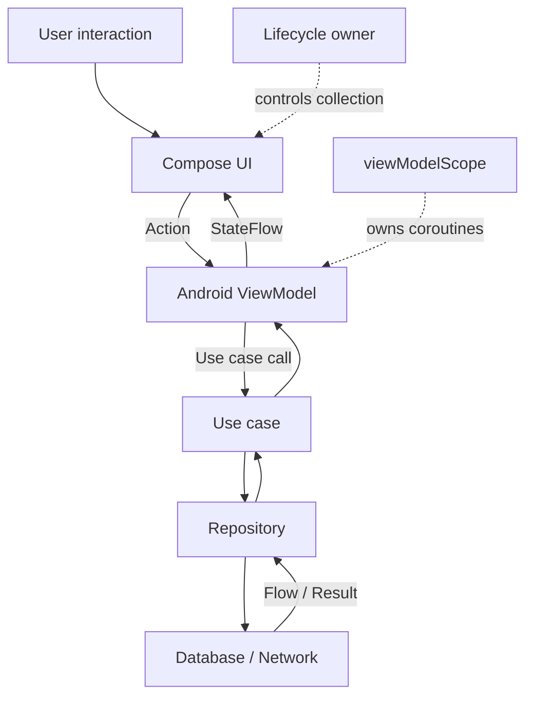

# Chapter 12 — MVVM
## Part 6 — Android

> **On Android, MVVM becomes effective when state ownership, lifecycle, and UI rendering work together—not when a ViewModel merely becomes a place to put code.**

---

## 1. Android's MVVM Runtime

Android provides a lifecycle-aware environment for MVVM. A typical feature connects:

- A **Composable or View-based screen** that renders state and forwards user intent.
- An **AndroidX ViewModel** that owns screen-level state and coordinates work.
- **Use cases and repositories** that provide domain operations and data access.
- **Lifecycle-aware collection** that observes state only while the UI is active.



The ViewModel is not a replacement for the domain layer. Its job is to coordinate the screen's needs and translate domain outcomes into presentation state.

---

## 2. AndroidX ViewModel and Its Lifetime

An AndroidX `ViewModel` is scoped to a `ViewModelStoreOwner`, such as an Activity, Fragment, or navigation destination. It survives configuration changes while that owner retains the ViewModel store. It is cleared when the owner permanently removes it.

This makes it suitable for state that should survive events such as device rotation, but it does not make the state persistent across process death.

| Event | Typical ViewModel behaviour |
|---|---|
| Recomposition | Same ViewModel instance remains. |
| Configuration change | Instance is retained by the ViewModel store. |
| Navigate away and destination is removed | ViewModel is cleared when its store is cleared. |
| Process death | In-memory ViewModel is lost. |
| App relaunch | A new ViewModel is created; state must be restored or reloaded. |

Use `SavedStateHandle` for small pieces of restorable UI state, such as a selected tab, item ID, or search query. Use a repository or persistent storage for durable application data. Do not treat a ViewModel as a database.

---

## 3. Define the Screen Contract

A well-designed Android ViewModel exposes state and accepts actions. The UI should not need to know how data is loaded or where it is stored.

```kotlin
data class OrdersUiState(
    val orders: List<OrderUiModel> = emptyList(),
    val isLoading: Boolean = true,
    val isRefreshing: Boolean = false,
    val error: OrdersError? = null,
)

data class OrderUiModel(
    val id: String,
    val title: String,
    val status: String,
)

enum class OrdersError {
    NETWORK,
    UNAUTHORIZED,
    UNKNOWN,
}

sealed interface OrdersAction {
    data object Refresh : OrdersAction
    data object Retry : OrdersAction
    data class SelectOrder(val orderId: String) : OrdersAction
}
```

The state is immutable. A new state value represents a meaningful update, which makes rendering, testing, and debugging easier.

Avoid exposing mutable collections or internal repository entities directly to the UI. Use presentation models when they clarify the screen contract or protect the UI from data-layer changes.

---

## 4. Implementing a ViewModel with StateFlow

The following example observes orders and exposes a single state stream.

```kotlin
class OrdersViewModel(
    private val observeOrders: ObserveOrders,
    private val refreshOrders: RefreshOrders,
    private val savedStateHandle: SavedStateHandle,
) : ViewModel() {

    private val _uiState = MutableStateFlow(OrdersUiState())
    val uiState: StateFlow<OrdersUiState> = _uiState.asStateFlow()

    private var refreshJob: Job? = null

    init {
        observeOrders()
    }

    fun onAction(action: OrdersAction) {
        when (action) {
            OrdersAction.Refresh,
            OrdersAction.Retry -> refresh()

            is OrdersAction.SelectOrder -> {
                savedStateHandle["selected_order_id"] = action.orderId
            }
        }
    }

    private fun observeOrders() {
        viewModelScope.launch {
            observeOrders()
                .catch { throwable ->
                    if (throwable is CancellationException) throw throwable

                    _uiState.update {
                        it.copy(
                            isLoading = false,
                            isRefreshing = false,
                            error = throwable.toOrdersError(),
                        )
                    }
                }
                .collect { orders ->
                    _uiState.update {
                        it.copy(
                            orders = orders.map(Order::toUiModel),
                            isLoading = false,
                            isRefreshing = false,
                            error = null,
                        )
                    }
                }
        }
    }

    private fun refresh() {
        if (refreshJob?.isActive == true) return

        refreshJob = viewModelScope.launch {
            _uiState.update {
                it.copy(
                    isLoading = it.orders.isEmpty(),
                    isRefreshing = it.orders.isNotEmpty(),
                    error = null,
                )
            }

            when (val result = refreshOrders()) {
                RefreshOrdersResult.Success -> Unit
                is RefreshOrdersResult.Failure -> {
                    _uiState.update {
                        it.copy(
                            isLoading = false,
                            isRefreshing = false,
                            error = result.reason.toOrdersError(),
                        )
                    }
                }
            }
        }
    }
}
```

The use-case and result types are illustrative and should match the application's domain contracts.

### What this implementation establishes

- `viewModelScope` owns the observation and refresh coroutines.
- The repository stream updates the screen whenever orders change.
- Refresh and initial loading are represented separately.
- Repeated refresh actions are ignored while one is active.
- Cancellation is rethrown rather than converted into a UI error.
- The UI observes one cohesive state object.
- A selected order ID can be restored through `SavedStateHandle`.

If the repository stream already emits cached data immediately, the screen can render content while a refresh happens in the background. This is often a better experience than replacing existing content with a full-screen spinner.

---

## 5. Collect State in Jetpack Compose

Compose should render the state it receives and report user intent through callbacks.

```kotlin
@Composable
fun OrdersRoute(
    viewModel: OrdersViewModel,
) {
    val state by viewModel.uiState.collectAsStateWithLifecycle()

    OrdersScreen(
        state = state,
        onRefresh = {
            viewModel.onAction(OrdersAction.Refresh)
        },
        onRetry = {
            viewModel.onAction(OrdersAction.Retry)
        },
        onOrderSelected = { orderId ->
            viewModel.onAction(OrdersAction.SelectOrder(orderId))
        },
    )
}
```

`collectAsStateWithLifecycle()` is the recommended Android Compose integration for lifecycle-aware collection. It prevents the UI from continuously collecting a stream while the associated lifecycle is not in an active state.

Keep the route and screen responsibilities distinct:

```kotlin
@Composable
fun OrdersScreen(
    state: OrdersUiState,
    onRefresh: () -> Unit,
    onRetry: () -> Unit,
    onOrderSelected: (String) -> Unit,
) {
    when {
        state.isLoading && state.orders.isEmpty() -> {
            FullScreenLoading()
        }

        state.error != null && state.orders.isEmpty() -> {
            FullScreenError(
                onRetry = onRetry,
            )
        }

        state.orders.isEmpty() -> {
            EmptyOrders()
        }

        else -> {
            OrdersList(
                orders = state.orders,
                isRefreshing = state.isRefreshing,
                onRefresh = onRefresh,
                onOrderSelected = onOrderSelected,
            )
        }
    }
}
```

The route connects the ViewModel to the UI. The screen remains a function of state and callbacks, making previews and UI tests easier.

---

## 6. Keep Composables Free of Business Decisions

A composable can derive visual details from state, but business rules should have a clear owner.

**Good UI derivation:**

```kotlin
val showProgress = state.isLoading && state.orders.isEmpty()
```

**A decision better owned by the ViewModel or domain layer:**

```kotlin
// Avoid putting pricing or eligibility policy inside a composable.
val discount = if (user.isPremium && cart.total > threshold) ...
```

Compose is allowed to contain presentation logic—layout, visual formatting, animation, and local interaction state. The goal is not to remove all logic from the UI; it is to keep business decisions testable and independent of rendering.

---

## 7. One-Time Effects and Navigation

Navigation, snackbars, and permission prompts are not ordinary durable screen state. They are effects that require a delivery policy.

A `SharedFlow` with no replay may lose an event when no collector is active. A replaying stream may deliver the same event again after collection restarts. Neither choice automatically guarantees exactly-once handling.

For an effect that can safely be transient, a ViewModel may expose a flow:

```kotlin
sealed interface OrdersEffect {
    data class OpenOrder(val orderId: String) : OrdersEffect
    data class ShowMessage(val message: String) : OrdersEffect
}

private val _effects = Channel<OrdersEffect>(Channel.BUFFERED)
val effects = _effects.receiveAsFlow()

private suspend fun openOrder(orderId: String) {
    _effects.send(OrdersEffect.OpenOrder(orderId))
}
```

A Compose route can collect effects inside a lifecycle-aware effect:

```kotlin
@Composable
fun OrdersEffects(
    viewModel: OrdersViewModel,
    onOpenOrder: (String) -> Unit,
    onShowMessage: (String) -> Unit,
) {
    val lifecycleOwner = LocalLifecycleOwner.current

    LaunchedEffect(viewModel, lifecycleOwner) {
        lifecycleOwner.lifecycle.repeatOnLifecycle(
            Lifecycle.State.STARTED,
        ) {
            viewModel.effects.collect { effect ->
                when (effect) {
                    is OrdersEffect.OpenOrder ->
                        onOpenOrder(effect.orderId)

                    is OrdersEffect.ShowMessage ->
                        onShowMessage(effect.message)
                }
            }
        }
    }
}
```

A channel can queue an effect until a receiver is ready, but it still does not provide a universal exactly-once guarantee across process death, multiple consumers, or failures during handling. For critical workflows, model pending work durably and acknowledge completion explicitly.

Keep navigation APIs out of the ViewModel. The ViewModel reports *what happened*; the UI or navigation layer decides *how to perform the transition*.

---

## 8. SavedStateHandle: Restore Small UI Inputs

`SavedStateHandle` is useful for restoring lightweight state after process recreation.

```kotlin
class SearchViewModel(
    private val searchProducts: SearchProducts,
    private val savedStateHandle: SavedStateHandle,
) : ViewModel() {

    private val query =
        savedStateHandle.getStateFlow("query", "")

    val uiState: StateFlow<SearchUiState> =
        query
            .debounce(300)
            .distinctUntilChanged()
            .flatMapLatest { value ->
                if (value.isBlank()) {
                    flowOf(SearchUiState())
                } else {
                    searchProducts(value)
                        .map { products ->
                            SearchUiState(
                                query = value,
                                products = products.map(Product::toUiModel),
                            )
                        }
                }
            }
            .stateIn(
                scope = viewModelScope,
                started = SharingStarted.WhileSubscribed(5_000),
                initialValue = SearchUiState(query = query.value),
            )

    fun onQueryChanged(value: String) {
        savedStateHandle["query"] = value
    }
}
```

This example assumes `searchProducts` returns a `Flow` and that errors are handled by the feature's chosen error policy.

Use `SavedStateHandle` for small, serializable values. Avoid placing large lists, bitmaps, or complex object graphs in saved state. Restore identifiers and reload durable data from the repository instead.

---

## 9. Dependency Injection and ViewModel Construction

A ViewModel should receive its dependencies rather than constructing repositories or networking clients itself.

With a dependency injection framework, use the framework's supported ViewModel integration and ensure `SavedStateHandle` is supplied by the lifecycle-aware factory.

A simplified manual factory illustrates the principle:

```kotlin
class OrdersViewModelFactory(
    private val observeOrders: ObserveOrders,
    private val refreshOrders: RefreshOrders,
) : ViewModelProvider.Factory {

    @Suppress("UNCHECKED_CAST")
    override fun <T : ViewModel> create(
        modelClass: Class<T>,
        extras: CreationExtras,
    ): T {
        if (modelClass.isAssignableFrom(OrdersViewModel::class.java)) {
            val savedStateHandle = extras.createSavedStateHandle()

            return OrdersViewModel(
                observeOrders = observeOrders,
                refreshOrders = refreshOrders,
                savedStateHandle = savedStateHandle,
            ) as T
        }

        error("Unknown ViewModel class: ${modelClass.name}")
    }
}
```

Factories should be kept at the composition root or in the DI setup—not embedded in composables. This keeps object construction separate from rendering and makes dependencies easier to replace in tests.

---

## 10. Dispatchers and Main-Safety

A ViewModel normally launches UI-coordinating work in `viewModelScope`, which uses the main dispatcher. That is appropriate for updating state, but blocking or CPU-intensive work must not run on the main thread.

Make lower layers main-safe:

```kotlin
class DefaultImportRepository(
    private val ioDispatcher: CoroutineDispatcher,
) {
    suspend fun importFile(path: String): ImportResult =
        withContext(ioDispatcher) {
            // Blocking file I/O or parsing.
            performImport(path)
        }
}
```

Inject dispatchers where they are needed, especially when code must be tested with a test dispatcher. Avoid scattering `Dispatchers.IO` throughout business logic, which makes scheduling harder to control in tests.

A ViewModel should coordinate work; repositories and dedicated workers should own the details of I/O and computation.

---

## 11. Avoid the God ViewModel

A ViewModel becomes difficult to maintain when it owns unrelated responsibilities:

- Fetching data from multiple unrelated features.
- Parsing large files.
- Managing complex form validation and navigation.
- Owning application-wide state.
- Performing analytics, persistence, and network configuration directly.
- Containing dozens of unrelated mutable fields and callbacks.

A better structure keeps the ViewModel as a coordinator and extracts cohesive collaborators:

```text
OrdersViewModel
├── ObserveOrders
├── RefreshOrders
├── OrdersUiState
├── OrdersAction
└── OrdersErrorMapper
```

Do not split every function into a new class. Extract when a responsibility has its own reason to change, can be tested independently, or is reused meaningfully.

---

## 12. Testing Android ViewModels

Test the public contract: initial state, actions, emitted state, errors, and cancellation.

A typical test setup uses `runTest` and a test dispatcher for `Dispatchers.Main`. The exact rule depends on the project's test libraries.

```kotlin
@Test
fun `refresh failure is exposed as an error state`() = runTest {
    val viewModel = OrdersViewModel(
        observeOrders = ObserveOrders { flowOf(emptyList()) },
        refreshOrders = RefreshOrders {
            RefreshOrdersResult.Failure(RefreshFailure.Network)
        },
        savedStateHandle = SavedStateHandle(),
    )

    viewModel.onAction(OrdersAction.Refresh)
    advanceUntilIdle()

    assertEquals(
        OrdersError.NETWORK,
        viewModel.uiState.value.error,
    )
}
```

This is a focused example; production tests should also verify loading transitions and the interaction between refresh results and repository emissions.

### Useful test scenarios

- Initial state is correct.
- Empty data is distinct from a failed request.
- Existing content remains visible during refresh when intended.
- A repository emission updates the state.
- Refresh failures map to the expected error.
- Duplicate actions follow the documented concurrency policy.
- Cancellation is not rendered as a user-facing failure.
- Saved state restores the expected input.
- State remains correct after multiple emissions.
- No test relies on arbitrary real-time delays.

Use fakes for domain dependencies when the goal is to test ViewModel behaviour. Use mocks sparingly, especially when they make the test more coupled to internal call order than to observable outcomes.

---

## 13. Common Android MVVM Mistakes

| Mistake | Why it hurts | Better approach |
|---|---|---|
| Treating ViewModel as a repository | Mixes presentation and data access. | Delegate to use cases and repositories. |
| Storing durable data only in memory | State disappears after process death. | Persist through a repository; restore small inputs with saved state. |
| Collecting flows directly in a composable body | Can create unmanaged or repeated collection. | Use lifecycle-aware collection and effect APIs. |
| Exposing `MutableStateFlow` publicly | UI can mutate ViewModel-owned state. | Expose `StateFlow` and keep the mutable flow private. |
| Using one `isLoading` flag for every operation | Refresh and initial loading become indistinguishable. | Model meaningful states separately. |
| Clearing content for every refresh | Causes flicker and loses useful context. | Preserve content when product requirements allow. |
| Catching `Throwable` and swallowing cancellation | Breaks structured concurrency and hides failures. | Rethrow cancellation; map expected failures deliberately. |
| Putting navigation controllers in ViewModels | Couples presentation logic to a UI framework. | Emit semantic outcomes for the UI to handle. |
| Using `SavedStateHandle` as persistent storage | Saved state is limited and not a database. | Store durable data in the data layer. |
| Launching blocking work on Main | Causes jank and possible ANRs. | Make lower-layer operations main-safe. |
| Creating dependencies inside the ViewModel | Makes testing and substitution difficult. | Inject collaborators. |
| Building a massive ViewModel | Creates unrelated reasons to change. | Extract cohesive responsibilities. |

---

## 14. Android MVVM Review Checklist

- [ ] Is the ViewModel scoped to the correct owner?
- [ ] Is the state that must survive process death restored or persisted appropriately?
- [ ] Does the ViewModel expose immutable state?
- [ ] Are user actions explicit and easy to test?
- [ ] Are use cases and repositories responsible for domain and data operations?
- [ ] Are coroutines launched in an appropriate scope?
- [ ] Is cancellation preserved?
- [ ] Are blocking operations moved off the main thread?
- [ ] Does the UI collect state lifecycle-aware?
- [ ] Are loading, refreshing, empty, and error states distinguishable?
- [ ] Are transient effects designed with clear delivery semantics?
- [ ] Is navigation kept at the UI boundary?
- [ ] Are dependencies injected through a supported factory or DI integration?
- [ ] Are state transitions tested without relying on wall-clock delays?
- [ ] Does the ViewModel have one cohesive reason to change?

---

## 15. The Mental Model

Android MVVM is a collaboration between three owners:

- **The UI owns rendering and local visual interaction.** It displays state and forwards user intent.
- **The ViewModel owns screen-level presentation state and coordination.** It survives configuration changes within its store and cancels its work when cleared.
- **The domain and data layers own business rules and data operations.** They provide results and streams without depending on Android UI classes.

Lifecycle-aware collection connects the UI to state without making the UI responsible for the underlying work. Saved state and persistence handle different kinds of survival. Explicit effects keep navigation and transient behaviour at the boundary.

When these ownership rules are clear, the ViewModel remains a focused coordinator rather than a second application framework.

---

## Key Takeaways

1. AndroidX ViewModel provides a lifecycle-aware owner for screen-level state, not permanent storage.
2. Expose immutable `StateFlow` and keep mutable state private.
3. Collect state in Compose with `collectAsStateWithLifecycle()`.
4. Use `SavedStateHandle` for small restorable inputs and repositories for durable data.
5. Keep business logic in use cases and repositories; let the ViewModel coordinate presentation.
6. Preserve cancellation and make blocking operations main-safe.
7. Design navigation and one-time effects around explicit delivery semantics.
8. Test observable state transitions, error mapping, and lifecycle-sensitive behaviour.
9. Keep ViewModels cohesive and dependency-injected.

> **A good Android ViewModel makes the screen's behaviour predictable while keeping rendering, lifecycle, and business logic in their proper places.**
