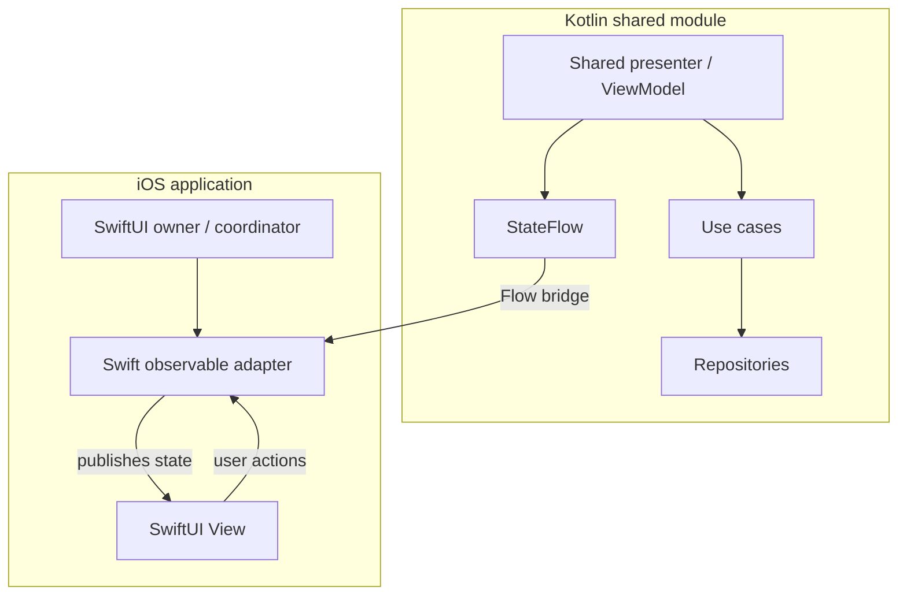

# Chapter 12 — MVVM
## Part 6 — iOS

> **On iOS, shared presentation logic must cooperate with SwiftUI's observation and lifetime model—not fight it.**

---

## 1. MVVM Across Kotlin and SwiftUI

In a Kotlin Multiplatform application, the iOS user interface is commonly written in SwiftUI while domain and presentation logic may live in shared Kotlin code.

The architectural boundary has two responsibilities:

- Shared Kotlin coordinates use cases, transforms domain outcomes, and exposes a stable state contract.
- SwiftUI owns native rendering, navigation, accessibility, and interaction details.

The bridge between them must handle observation, cancellation, and object lifetime deliberately.



A native adapter is not a second business-logic layer. It translates between Kotlin's state contract and SwiftUI's observation model.

---

## 2. Choose the Shared Boundary

There are several valid ways to structure an iOS-facing feature:

| Approach | Shared responsibility | iOS responsibility |
|---|---|---|
| Shared ViewModel | State, actions, orchestration | Observe state and render native UI |
| Shared presenter | Portable presentation logic | Own presenter and adapt its state |
| Shared contract only | State models and domain-facing interfaces | Implement presentation coordination in Swift |

The right boundary depends on the amount of shared behaviour and the project's Kotlin/Swift interop setup. Do not force a common ViewModel abstraction if native lifecycle behaviour becomes harder to understand than a small Swift adapter.

A useful default is to share decisions that must remain consistent—validation, filtering, state transitions, and orchestration—while leaving navigation and native interaction in Swift.

---

## 3. Keep the Shared Contract Swift-Friendly

A shared state model should communicate meaning rather than expose implementation details.

```kotlin
data class ProfileUiState(
    val displayName: String = "",
    val isLoading: Boolean = false,
    val error: ProfileError? = null,
)

enum class ProfileError {
    NETWORK,
    UNAUTHORIZED,
    UNKNOWN,
}
```

Actions should express intent:

```kotlin
sealed interface ProfileAction {
    data object Refresh : ProfileAction
    data class UpdateDisplayName(val value: String) : ProfileAction
}
```

For Kotlin/Swift interoperability, review how the project's compiler and export configuration represents sealed hierarchies, enums, generics, and nullable values in generated Objective-C/Swift APIs. Some Kotlin constructs are less ergonomic from Swift than they are from Kotlin.

If the generated API is awkward, expose a small interop-oriented facade rather than spreading conversion code across every SwiftUI view.

### Avoid leaking localized strings

Shared state should generally expose semantic error values, not hard-coded English messages.

```swift
func message(for error: ProfileError) -> String {
    switch error {
    case .network:
        return String(localized: "profile.error.network")
    case .unauthorized:
        return String(localized: "profile.error.unauthorized")
    case .unknown:
        return String(localized: "profile.error.unknown")
    }
}
```

This keeps localization and native presentation under iOS control while preserving consistent error meaning.

---

## 4. Why SwiftUI Needs an Observable Adapter

SwiftUI updates a view when its observed model publishes a change. Kotlin `StateFlow` is a state stream, but it does not automatically become a SwiftUI `ObservableObject` in every KMP setup.

A common arrangement is:

1. The adapter retains the shared presenter.
2. It initializes its published state from the presenter's current value.
3. It collects subsequent state emissions.
4. It publishes each new value on the main actor.
5. It cancels collection when the adapter's owner releases it.

The exact bridge depends on the interop library or wrapper used by the project. The following example shows the Swift-side shape; the `watchState` function represents a project-provided Flow-to-AsyncSequence or callback adapter, not a standard API supplied by Kotlin.

```swift
import Combine
import SwiftUI

@MainActor
final class ProfileObservable: ObservableObject {
    @Published private(set) var state: ProfileUiState

    private let presenter: ProfilePresenter
    private var observationTask: Task<Void, Never>?

    init(presenter: ProfilePresenter) {
        self.presenter = presenter
        self.state = presenter.state.value

        observationTask = Task { [weak self, presenter] in
            for await nextState in watchState(presenter.state) {
                guard !Task.isCancelled else { return }
                self?.state = nextState
            }
        }
    }

    func send(_ action: ProfileAction) {
        presenter.dispatch(action: action)
    }

    func stopObserving() {
        observationTask?.cancel()
        observationTask = nil
    }

    deinit {
        observationTask?.cancel()
    }
}
```

**Important:** `watchState` is intentionally an adapter boundary. Implement it using the Flow bridge selected by your project, and verify how cancellation propagates from the Swift task to the Kotlin collector. Do not copy this snippet expecting `watchState` to exist in the standard library.

---

## 5. Make the Flow Bridge a First-Class Component

A Flow bridge should have a small, documented contract:

- Does it deliver the current `StateFlow` value immediately?
- Does cancelling the Swift task cancel the Kotlin collection?
- On which executor or thread are callbacks delivered?
- Can it outlive the screen?
- What happens if the Kotlin scope is cancelled?
- Does it retain the Kotlin object for the duration of collection?
- Can multiple Swift consumers collect the same stream safely?

Prefer one tested bridge implementation used consistently across the application. Avoid hand-written callback conversions in individual screens; small differences in cancellation and retention can create difficult lifecycle bugs.

When using a library that exposes Kotlin Flow as Swift `AsyncSequence`, follow that library's documented lifetime and cancellation behaviour. Do not assume all bridges have identical semantics.

---

## 6. Build a Native SwiftUI View

The view should render state and forward user actions. It should not know how the repository loads data.

```swift
struct ProfileScreen: View {
    @ObservedObject var model: ProfileObservable

    var body: some View {
        VStack(spacing: 16) {
            if model.state.isLoading {
                ProgressView()
            }

            Text(model.state.displayName)
                .font(.title)

            if let error = model.state.error {
                Text(message(for: error))
                    .foregroundStyle(.red)
            }

            Button("Refresh") {
                model.send(ProfileAction.refresh)
            }
        }
        .padding()
    }
}
```

The exact generated Swift names for Kotlin declarations can differ depending on export settings and wrappers. For production code, use the names exposed by the generated framework or the interop facade.

Keep view composition native. SwiftUI should remain free to use platform conventions for navigation, animations, accessibility, and layout.

---

## 7. Own the Observable Object at the Right Level

SwiftUI property wrappers communicate ownership.

- `@StateObject` is appropriate when a view creates and owns an observable model.
- `@ObservedObject` is appropriate when a model is supplied by a parent.
- `@EnvironmentObject` can be useful for genuinely shared environment state, but it should not become a global container for unrelated feature ViewModels.

For example, a feature entry point can own its adapter:

```swift
struct ProfileRoute: View {
    @StateObject private var model: ProfileObservable

    init(presenter: ProfilePresenter) {
        _model = StateObject(
            wrappedValue: ProfileObservable(presenter: presenter)
        )
    }

    var body: some View {
        ProfileScreen(model: model)
    }
}
```

This assumes the route is the intended owner and the presenter instance is created for that route's lifetime. If the presenter is owned by a navigation coordinator or dependency scope, pass it in and make the ownership contract explicit.

Do not create a new presenter during every `body` evaluation. SwiftUI can recompute `body` frequently; object creation belongs in a stable ownership boundary.

---

## 8. Lifecycle, Cancellation, and Memory

A screen disappearing does not always mean its state should be destroyed. A tab may remain alive while another tab is visible; a navigation destination may be retained; a flow may need to preserve a draft.

Define the intended lifetime before deciding when to cancel observation.

| State lifetime | Potential owner |
|---|---|
| View-local presentation detail | SwiftUI view |
| Screen state | Feature observable adapter or presenter owner |
| Multi-screen flow | Navigation coordinator or scoped feature owner |
| Application session | App-level state owner |
| Durable data | Repository and persistent storage |

Cancellation must flow through the whole chain:

```text
SwiftUI owner released
        ↓
Swift observation task cancelled
        ↓
Flow bridge stops collection
        ↓
Kotlin collector is cancelled
        ↓
Owned work can complete or cancel appropriately
```

This chain is only as strong as the bridge implementation. Test it rather than assuming task cancellation automatically stops Kotlin work.

### Avoid retain cycles

Be careful when a long-running task captures its observable object strongly. A task stored on the object can keep that object alive, preventing `deinit` from running and therefore preventing cancellation.

Use weak captures where appropriate, provide an explicit stop method, and ensure the owner actually invokes cleanup when required.

---

## 9. Navigation Belongs to SwiftUI

Navigation is a native presentation concern. Shared Kotlin code can report a semantic outcome, but it should not hold a `NavigationStack`, `NavigationPath`, or SwiftUI view.

For example, shared code may emit:

```kotlin
sealed interface ProfileEffect {
    data class OpenOrder(val orderId: String) : ProfileEffect
}
```

The Swift adapter translates that effect into a native navigation action.

```swift
NavigationStack(path: $path) {
    ProfileScreen(model: model)
        .navigationDestination(for: String.self) { orderId in
            OrderDetailRoute(orderId: orderId)
        }
}
```

The example is schematic: the application must define how the effect reaches Swift and how the destination value is represented.

### Define delivery semantics

Transient effects are not automatically reliable across inactive collectors, view reconstruction, or process termination. Decide whether an effect may be dropped, replayed, or must be acknowledged.

If an action must survive app suspension or process death, represent it as durable state or persist the underlying operation. A transient event stream is not a substitute for a durable workflow.

---

## 10. Main-Actor and Threading Boundaries

SwiftUI-observed state should be updated on the main actor. Kotlin coroutine dispatchers and Swift actors are different concurrency systems; crossing between them requires an explicit and tested boundary.

The Swift adapter above is annotated `@MainActor`, which makes its published state updates actor-isolated. If the chosen Flow bridge invokes callbacks from another thread, hop to the main actor before mutating observable properties.

```swift
for await nextState in watchState(presenter.state) {
    await MainActor.run {
        self.state = nextState
    }
}
```

Use this pattern only when required by the bridge's execution context; redundant actor hops add noise. Confirm the bridge's threading contract and keep UI-facing mutations on the main actor.

On the Kotlin side, keep blocking I/O and expensive computation off the main dispatcher. The shared layer should be main-safe and should not assume that SwiftUI's actor isolation automatically schedules Kotlin work correctly.

---

## 11. Dependency Injection at the iOS Boundary

The iOS composition root should construct or obtain the shared dependencies and pass the feature presenter into the route.

```text
iOS App
└── Dependency container
    ├── Shared repository implementations
    ├── Shared use cases
    └── Feature presenter factory
        └── ProfileRoute
            └── ProfileObservable
                └── ProfileScreen
```

This keeps dependency construction out of SwiftUI view bodies and makes tests straightforward: a screen can receive a fake observable model, while adapter tests can receive a fake presenter.

Avoid passing UIKit objects into shared domain or presentation code. If shared logic needs a platform capability, define a narrow interface and implement it at the platform edge.

---

## 12. Testing the iOS Integration

Shared Kotlin tests and SwiftUI tests answer different questions.

### Shared Kotlin tests

Verify:
- State transitions.
- Domain outcome mapping.
- Validation and filtering.
- Flow combination and cancellation.
- Refresh and retry behaviour.
- Error semantics.

### Swift adapter tests

Verify:
- Initial state is read correctly.
- New Flow values are published to observers.
- Updates are applied on the main actor.
- Cancelling the Swift task stops observation as intended.
- The adapter does not retain itself unexpectedly.
- Errors from the bridge are handled deliberately.

### SwiftUI tests

Verify:
- Loading, empty, content, and error views render correctly.
- User actions dispatch the expected intent.
- Navigation responds to semantic outcomes.
- Accessibility labels and interaction behaviour are correct.

A fake presenter is often sufficient for view tests. This avoids coupling rendering tests to network, database, or coroutine implementation details.

---

## 13. Common iOS/KMP Mistakes

| Mistake | Why it hurts | Better approach |
|---|---|---|
| Assuming Kotlin `StateFlow` automatically drives SwiftUI | Observation may not be connected. | Use a documented, tested adapter. |
| Rebuilding the presenter in `body` | Can reset state or duplicate work. | Create it at a stable ownership boundary. |
| Ignoring Flow cancellation | Collectors and upstream work may outlive the screen. | Verify cancellation through the bridge. |
| Updating `@Published` state off the main actor | Can violate UI-thread expectations. | Isolate UI mutations to `MainActor`. |
| Capturing the adapter strongly in a long-running task | Can create a retain cycle. | Use weak captures and explicit cleanup. |
| Putting SwiftUI navigation in shared Kotlin | Couples common code to iOS UI. | Emit semantic outcomes and navigate natively. |
| Exposing awkward generated APIs everywhere | Spreads interop complexity through the UI. | Add a small Swift-friendly facade. |
| Returning localized strings from shared state | Makes localization inflexible. | Expose semantic error codes. |
| Treating every screen as a shared ViewModel | Forces reuse where behaviour differs. | Share only common presentation decisions. |
| Testing only shared Kotlin logic | Leaves adapter and lifecycle bugs undetected. | Test the Swift bridge and UI separately. |

---

## 14. iOS MVVM Review Checklist

- [ ] Is the shared boundary appropriate for the feature?
- [ ] Are state and actions understandable from Swift?
- [ ] Are generated APIs or wrappers stable and documented?
- [ ] Is there one standard Flow-to-Swift observation mechanism?
- [ ] Does the bridge deliver current state and propagate cancellation?
- [ ] Is the observable adapter owned at a stable lifecycle boundary?
- [ ] Are long-running tasks prevented from retaining the adapter indefinitely?
- [ ] Are published UI changes isolated to the main actor?
- [ ] Are navigation and native interactions kept in SwiftUI?
- [ ] Are localized messages resolved in the iOS layer?
- [ ] Are transient effect delivery semantics explicit?
- [ ] Are durable workflows backed by persistent state?
- [ ] Are shared logic, adapter behaviour, and SwiftUI rendering tested separately?

---

## 15. The Mental Model

Think of iOS MVVM in KMP as a collaboration between a portable state producer and a native state consumer.

- **Shared Kotlin** owns reusable presentation decisions and exposes a stable state/action contract.
- **The Flow bridge** translates state observation and cancellation across the language boundary.
- **The Swift observable adapter** publishes state in a way SwiftUI understands.
- **SwiftUI** owns rendering, navigation, accessibility, and native interaction.
- **The feature owner** defines how long the presenter and observation task live.

The bridge is part of the architecture, not incidental glue. When its threading, ownership, and cancellation semantics are explicit, shared presentation logic can coexist cleanly with a native iOS experience.

---

## Key Takeaways

1. Share presentation decisions, not SwiftUI mechanics.
2. Keep shared state semantic and make the generated API comfortable for Swift consumers.
3. Adapt Kotlin Flow through one documented and tested bridge.
4. Make presenter and adapter ownership explicit.
5. Tie cancellation to the correct feature lifetime and test that it reaches Kotlin collectors.
6. Publish SwiftUI-observed changes on the main actor.
7. Keep navigation, localization, accessibility, and native interaction in the iOS layer.
8. Test shared logic, the interop adapter, and SwiftUI rendering at their respective boundaries.

> **Successful KMP MVVM does not make iOS behave like Android. It lets both platforms share meaningful decisions while preserving a native experience.**
