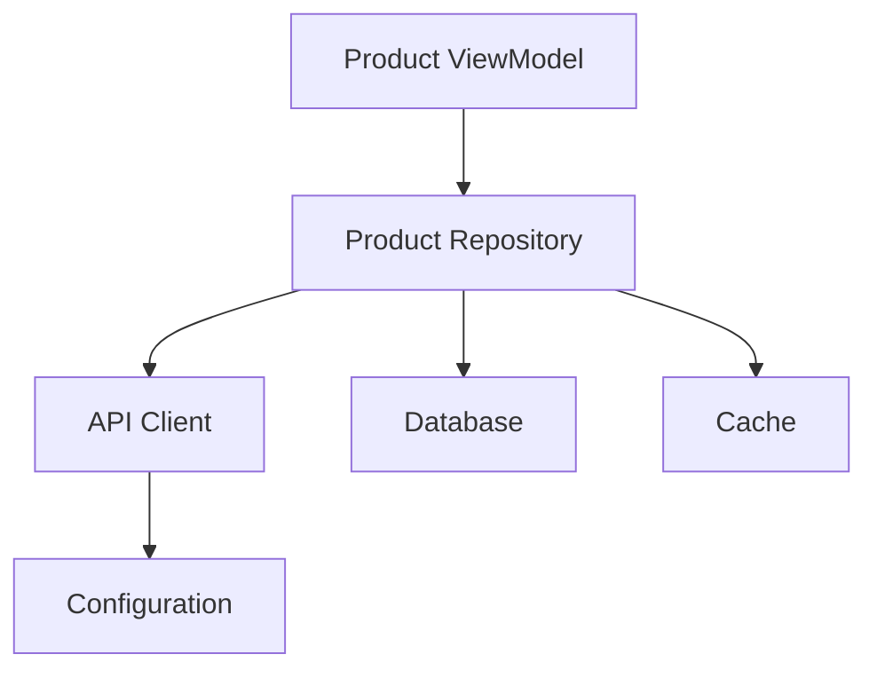
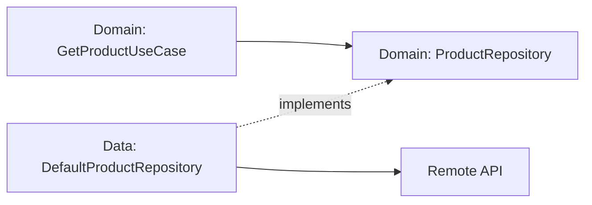
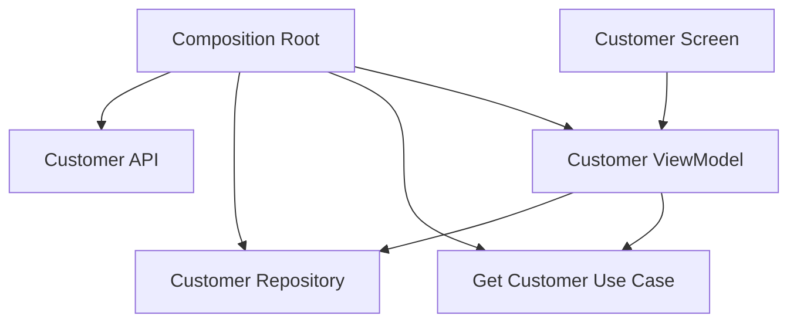

# Chapter 14 — Dependency Injection

## Part 1 — The Fundamentals and Building Blocks

> **Series:** Kotlin Multiplatform (KMP) Architecture  
> **Chapter:** 14  
> **Part:** 1  
> **Focus:** Dependency injection, dependency inversion, composition roots, object graphs, lifetimes, and testable architecture

---

## Table of Contents

- [1. Why Dependency Injection Matters](#1-why-dependency-injection-matters)
- [2. What Is a Dependency?](#2-what-is-a-dependency)
- [3. The Problem with Constructing Dependencies Everywhere](#3-the-problem-with-constructing-dependencies-everywhere)
- [4. Dependency Injection in One Sentence](#4-dependency-injection-in-one-sentence)
- [5. DI vs Dependency Inversion](#5-di-vs-dependency-inversion)
- [6. Constructor Injection](#6-constructor-injection)
- [7. A Repository Example](#7-a-repository-example)
- [8. Interfaces and Abstractions](#8-interfaces-and-abstractions)
- [9. The Composition Root](#9-the-composition-root)
- [10. Object Graphs](#10-object-graphs)
- [11. Dependency Lifetimes and Scope](#11-dependency-lifetimes-and-scope)
- [12. DI vs Service Locator](#12-di-vs-service-locator)
- [13. Manual Dependency Injection](#13-manual-dependency-injection)
- [14. DI in MVVM and MVI](#14-di-in-mvvm-and-mvi)
- [15. Dependency Injection in KMP](#15-dependency-injection-in-kmp)
- [16. Platform Boundaries](#16-platform-boundaries)
- [17. Testing with Injected Dependencies](#17-testing-with-injected-dependencies)
- [18. Common Mistakes](#18-common-mistakes)
- [19. Practical Review Checklist](#19-practical-review-checklist)
- [20. Summary](#20-summary)

---

# 1. Why Dependency Injection Matters

Most applications begin with direct object construction:

```kotlin
class ProductViewModel {
    private val repository = ProductRepository()
}
```

This looks harmless. The ViewModel needs a repository, so it creates one. As the application grows, that repository may need an HTTP client, database, cache, logger, configuration, authentication provider, and analytics client.

The object graph begins to spread across the application.



The issue is not that objects depend on other objects. That is normal. The problem appears when every class is responsible for both doing its job and deciding how its collaborators are created.

Business logic should not need to know how to configure an HTTP client or instantiate a database.

**Dependency injection (DI)** separates object creation from object usage. It makes dependencies explicit, improves testability, and gives the application a deliberate place to assemble its components.

---

# 2. What Is a Dependency?

A dependency is any collaborator a class needs to perform its work.

```kotlin
class ProductViewModel(
    private val repository: ProductRepository
)
```

Here, `ProductRepository` is a dependency of `ProductViewModel`.

A repository might depend on a data source:

```kotlin
class ProductRepository(
    private val remoteDataSource: ProductRemoteDataSource
)
```

And that data source might depend on an API service:

```kotlin
class ProductRemoteDataSource(
    private val api: ProductApi
)
```

The dependency direction is:

```text
ProductViewModel
       ↓
ProductRepository
       ↓
ProductRemoteDataSource
       ↓
ProductApi
```

Dependencies are not limited to classes. They can be interfaces, functions, clocks, dispatchers, configuration values, or any collaborator supplied to another object.

| Dependency | Why it may be needed |
|---|---|
| Repository | Loads and stores domain data |
| API client | Communicates with a remote service |
| Database | Persists local information |
| Clock | Provides current time |
| Dispatcher | Controls coroutine execution context |
| Logger | Records diagnostic information |
| Feature configuration | Controls behavior by environment |
| Analytics client | Reports product events |

A useful design question is:

> What does this class need from the outside in order to do its job?

That question helps identify the constructor dependencies.

---

# 3. The Problem with Constructing Dependencies Everywhere

Consider:

```kotlin
class OrderViewModel {

    private val apiClient = HttpClient()
    private val database = OrderDatabase()
    private val repository = OrderRepository(
        apiClient = apiClient,
        database = database
    )

    suspend fun loadOrders(): List<Order> {
        return repository.getOrders()
    }
}
```

This ViewModel is responsible for loading orders, but it also knows how to create the HTTP client, database, and repository.

That creates several forms of coupling:

- **Implementation coupling:** replacing an implementation may require changing the ViewModel.
- **Configuration coupling:** authentication, logging, timeouts, and test settings can leak into feature code.
- **Testing friction:** tests cannot easily supply a fake repository.
- **Lifecycle ambiguity:** it is unclear who owns a database or which objects should be shared.
- **Repeated setup:** multiple features may construct the same dependencies differently.

The goal is not to eliminate construction. Objects must be created somewhere. The goal is to place creation in a deliberate part of the architecture.

---

# 4. Dependency Injection in One Sentence

**Dependency injection means an object receives the collaborators it needs instead of creating or locating them itself.**

Instead of:

```kotlin
class OrderViewModel {
    private val repository = OrderRepository()
}
```

write:

```kotlin
class OrderViewModel(
    private val repository: OrderRepository
)
```

The caller assembles the object:

```kotlin
val repository = OrderRepository()
val viewModel = OrderViewModel(repository)
```

This is already dependency injection. No framework is required.

A DI framework can automate object construction and lifecycle management, but it does not define the core idea.

> **DI is an architectural technique. A DI framework is an optional tool for implementing it.**

---

# 5. DI vs Dependency Inversion

These concepts are related, but they are not interchangeable.

## Dependency Injection

A technique for supplying a dependency from outside an object.

```kotlin
class ProductService(
    private val repository: ProductRepository
)
```

## Dependency Inversion Principle

A design principle that encourages high-level policy and low-level details to depend on abstractions rather than forcing high-level policy to depend directly on implementation details.

```kotlin
interface ProductRepository {
    suspend fun getProduct(id: String): Product
}
```

A domain use case depends on the abstraction:

```kotlin
class GetProductUseCase(
    private val repository: ProductRepository
) {
    suspend operator fun invoke(id: String): Product {
        return repository.getProduct(id)
    }
}
```

A data-layer implementation supplies the details:

```kotlin
class DefaultProductRepository(
    private val api: ProductApi
) : ProductRepository {

    override suspend fun getProduct(id: String): Product {
        return api.getProduct(id)
    }
}
```



The domain defines the contract it needs. The data layer implements that contract. DI can supply the implementation; dependency inversion explains why the abstraction belongs at the boundary.

| Concept | Main question |
|---|---|
| Dependency Injection | How does an object receive collaborators? |
| Dependency Inversion | Which direction should source-level dependencies point? |
| Inversion of Control | Who controls a process previously controlled by the component? |
| Service Locator | How does a component look up dependencies from a central registry? |

---

# 6. Constructor Injection

Constructor injection supplies required dependencies through the constructor.

```kotlin
class IsSessionExpiredUseCase(
    private val clock: Clock
) {
    fun isExpired(expiresAtMillis: Long): Boolean {
        return clock.nowEpochMillis() >= expiresAtMillis
    }
}

interface Clock {
    fun nowEpochMillis(): Long
}
```

The constructor makes the class's requirements visible.

### Why it is a strong default

- **Explicit dependencies:** readers can see what the class needs.
- **Testability:** tests can provide fakes or mocks directly.
- **Valid construction:** required collaborators cannot be accidentally omitted.
- **Immutability:** `val` properties prevent casual replacement after initialization.
- **Clear ownership:** the composition root decides which implementation is supplied.

A test can provide a deterministic clock:

```kotlin
class FixedClock(
    private val timeMillis: Long
) : Clock {
    override fun nowEpochMillis(): Long = timeMillis
}
```

Constructor injection is not a reason to pass dozens of unrelated dependencies into one class. If a constructor becomes very large, investigate whether the class has too many responsibilities or whether a cohesive collaborator is missing. Do not introduce a generic “dependency bag” just to hide a design problem.

---

# 7. A Repository Example

Suppose a feature loads customer details.

## Before: dependencies created internally

```kotlin
class CustomerViewModel {
    private val api = CustomerApi()
    private val repository = CustomerRepository(api)

    suspend fun loadCustomer(id: String): Customer {
        return repository.getCustomer(id)
    }
}
```

The ViewModel decides how the data layer is assembled.

## After: dependencies supplied externally

```kotlin
interface CustomerRepository {
    suspend fun getCustomer(id: String): Customer
}

class CustomerViewModel(
    private val repository: CustomerRepository
) {
    suspend fun loadCustomer(id: String): Customer {
        return repository.getCustomer(id)
    }
}
```

Production can use a real API:

```kotlin
class DefaultCustomerRepository(
    private val api: CustomerApi
) : CustomerRepository {

    override suspend fun getCustomer(id: String): Customer {
        return api.getCustomer(id)
    }
}
```

A test can use a fake:

```kotlin
class FakeCustomerRepository : CustomerRepository {
    override suspend fun getCustomer(id: String): Customer {
        return Customer(
            id = id,
            name = "Sample Customer"
        )
    }
}
```

The same ViewModel can now be assembled with different collaborators without changing its behavior or source code.

---

# 8. Interfaces and Abstractions

DI often appears alongside interfaces, but an interface is not mandatory for every dependency.

An abstraction is useful when it provides a meaningful boundary.

For example, the domain may define:

```kotlin
interface PaymentRepository {
    suspend fun submitPayment(
        request: PaymentRequest
    ): PaymentResult
}
```

The data layer implements it:

```kotlin
class DefaultPaymentRepository(
    private val service: PaymentService
) : PaymentRepository {

    override suspend fun submitPayment(
        request: PaymentRequest
    ): PaymentResult {
        return service.submit(request)
    }
}
```

Introduce an abstraction when:

- the domain must remain independent of infrastructure details
- production and test implementations differ
- platform implementations differ
- a third-party library should be hidden behind an application-owned boundary
- multiple implementations are genuinely expected
- the interface expresses a stable capability

Avoid creating interfaces that only duplicate class names without providing a useful contract. Abstraction has a cost: every extra type adds another concept a maintainer must understand.

---

# 9. The Composition Root

If classes should not create all their dependencies, where should objects be created?

The answer is the **composition root**: the part of the application responsible for assembling the object graph.

In a small application, it can be a function:

```kotlin
fun createCustomerFeature(): CustomerViewModel {
    val api = CustomerApi()
    val repository = DefaultCustomerRepository(api)

    return CustomerViewModel(repository)
}
```

In a larger application, it may be a DI container or framework module.



The composition root knows about concrete implementations because its job is to connect them. Feature logic should not need to know how that assembly happens.

Without a composition root, construction decisions spread across screens, use cases, repositories, and utilities. With one, object assembly becomes easier to inspect and maintain.

---

# 10. Object Graphs

A dependency graph describes which objects require other objects.

```text
Application
   ├── HttpClient
   │     ├── Logger
   │     └── Auth Provider
   ├── Database
   └── Customer Feature
         ├── GetCustomerUseCase
         │      └── CustomerRepository
         │              ├── HttpClient
         │              └── Database
         └── CustomerViewModel
                └── GetCustomerUseCase
```

The dependency graph is not necessarily the same as the package structure. A package layout might be:

```text
customer/
├── domain/
│   ├── Customer.kt
│   ├── CustomerRepository.kt
│   └── GetCustomerUseCase.kt
├── data/
│   └── DefaultCustomerRepository.kt
└── presentation/
    └── CustomerViewModel.kt
```

The graph should follow the intended architectural direction, even when classes live in separate modules.

## Circular dependencies

Consider:

```text
ServiceA → ServiceB → ServiceA
```

This often signals unclear responsibilities or an abstraction placed at the wrong boundary. A DI framework may report the cycle, but the framework is not the underlying problem. Revisit the object design.

---

# 11. Dependency Lifetimes and Scope

Not every dependency should live for the same amount of time.

| Lifetime | Meaning | Example |
|---|---|---|
| Application-wide | Shared during the application's active lifetime | Configured HTTP client |
| Session-wide | Shared while a user session is active | Session coordinator |
| Feature-wide | Shared during a feature's lifetime | Feature state holder |
| Screen-wide | Exists while a screen or ViewModel is active | Screen-specific ViewModel |
| Operation-wide | Created for a single operation | Temporary request builder |

These are conceptual categories, not universal framework scope names.

For every dependency, ask:

1. Who owns this object?
2. Who can access it?
3. When should it be created?
4. When should it be released?
5. Is it safe to share across concurrent operations?

A configured HTTP client is often designed to be reused. A screen-specific state holder should not automatically become a global singleton.

## Scope is a design decision

Making every dependency a singleton can cause state leakage, difficult cleanup, excessive memory retention, concurrency problems, and test interference.

Use shared instances when the dependency's semantics support sharing. Immutable configuration and a properly configured HTTP client may be suitable. Mutable form state or an active checkout flow usually needs narrower ownership.

> **Choose a lifetime based on ownership and behavior, not convenience.**

A singleton scope also does not automatically make an object thread-safe. Shared mutable objects still need safe concurrency design.

---

# 12. DI vs Service Locator

These approaches can look similar, but their dependency visibility differs.

## Dependency injection

```kotlin
class GetCustomerUseCase(
    private val repository: CustomerRepository
)
```

The dependency is explicit in the constructor.

## Service locator

```kotlin
class GetCustomerUseCase {
    private val repository =
        ServiceLocator.get<CustomerRepository>()
}
```

The class reaches into a registry to retrieve what it needs. A reader must inspect implementation details to discover the dependency.

| Concern | Constructor injection | Service locator |
|---|---|---|
| Dependency visibility | Explicit | Often hidden |
| Unit testing | Direct substitution | Registry setup or mutation |
| Requirements | Visible in constructor | Discovered at runtime |
| Global coupling risk | Lower | Higher |

A DI framework may internally use a registry, but application classes should generally receive their dependencies rather than reaching into the container themselves.

Avoid injecting the entire container into a ViewModel and resolving arbitrary services on demand. That usually moves the service-locator problem rather than solving it.

---

# 13. Manual Dependency Injection

Before introducing a framework, understand how to assemble objects manually.

```kotlin
interface ProductRepository {
    suspend fun getProduct(id: String): Product
}

class DefaultProductRepository(
    private val api: ProductApi
) : ProductRepository {
    override suspend fun getProduct(id: String): Product {
        return api.getProduct(id)
    }
}

class GetProductUseCase(
    private val repository: ProductRepository
) {
    suspend operator fun invoke(id: String): Product {
        return repository.getProduct(id)
    }
}

class ProductViewModel(
    private val getProduct: GetProductUseCase
)
```

The composition root assembles the graph:

```kotlin
class AppContainer(
    api: ProductApi
) {
    private val productRepository: ProductRepository =
        DefaultProductRepository(api)

    private val getProductUseCase =
        GetProductUseCase(productRepository)

    fun createProductViewModel(): ProductViewModel {
        return ProductViewModel(getProductUseCase)
    }
}
```

Usage:

```kotlin
val container = AppContainer(
    api = configuredProductApi
)

val viewModel = container.createProductViewModel()
```

This is DI without reflection, annotations, generated code, or a third-party container.

Manual DI teaches several important ideas:

- dependencies form a graph
- concrete implementations are selected at the composition root
- consumers receive the collaborators they need
- instance sharing is explicit
- tests can assemble a different graph

Manual DI may be enough for a small application, a library, a simple feature, or a graph that is easy to manage. As the graph grows, repeated wiring can become cumbersome. A framework can automate the wiring while preserving the same principles.

---

# 14. DI in MVVM and MVI

DI is independent of the presentation pattern. It works with MVVM, MVI, MVP, and other architectures because each pattern contains collaborating objects.

## MVVM

```text
Compose / SwiftUI
       ↓
   ViewModel
       ↓
    Use Case
       ↓
   Repository
```

```kotlin
class ProductViewModel(
    private val getProduct: GetProductUseCase
)
```

## MVI

```text
UI
 ↓
Intent
 ↓
MVI Processor
 ↓
Use Case
 ↓
Repository
```

```kotlin
class ProductStore(
    private val getProduct: GetProductUseCase
)
```

The presentation pattern defines how state and events flow. DI defines how collaborating objects are supplied. These concerns complement one another but should not be confused.

---

# 15. Dependency Injection in KMP

Kotlin Multiplatform adds platform boundaries to the dependency graph.

A shared feature may need a repository, clock, settings abstraction, dispatcher provider, secure storage implementation, database, or network client. Not every dependency belongs in `commonMain`.

A useful starting point:

```text
commonMain
 ├── Domain
 │    ├── Models
 │    ├── Repository Contracts
 │    └── Use Cases
 └── Presentation
      ├── State
      ├── Intent
      └── ViewModel / Store

androidMain
 ├── Android Implementations
 └── Android Composition Root

iosMain
 ├── iOS Implementations
 └── iOS Composition Root
```

The shared layer defines what it needs. Platform modules provide implementations when platform APIs are required.

For example:

```kotlin
// commonMain
interface SecureTokenStore {
    suspend fun readToken(): String?
    suspend fun writeToken(token: String)
    suspend fun clear()
}
```

A shared use case depends on the contract:

```kotlin
class ReadSessionTokenUseCase(
    private val tokenStore: SecureTokenStore
) {
    suspend operator fun invoke(): String? {
        return tokenStore.readToken()
    }
}
```

Android and iOS can provide implementations appropriate to their security APIs. The use case does not need to know how each platform stores the token.

---

# 16. Platform Boundaries

A KMP project should not force every dependency into common code.

Some dependencies are naturally common:

- domain use cases
- repository contracts
- deterministic business rules
- serializers supported by the chosen stack
- common networking abstractions

Others may need platform implementations:

- secure credential storage
- operating-system APIs
- device-specific services
- platform analytics SDKs
- UI navigation
- lifecycle integration

There are several ways to supply platform implementations, including constructor parameters, factory functions, platform composition roots, and `expect`/`actual` declarations where appropriate.

For example:

```kotlin
interface PlatformServices {
    val secureTokenStore: SecureTokenStore
}
```

Each platform can construct a suitable implementation and pass it into the shared graph.

Avoid using `expect`/`actual` for every dependency automatically. It is useful for platform-specific declarations, but it is not a replacement for deliberate dependency boundaries.

---

# 17. Testing with Injected Dependencies

One of the strongest benefits of DI is that tests can control the environment.

```kotlin
interface Clock {
    fun nowEpochMillis(): Long
}

class GetGreetingUseCase(
    private val clock: Clock
) {
    fun invoke(): String {
        return if (clock.nowEpochMillis() < 12) {
            "Good morning"
        } else {
            "Good afternoon"
        }
    }
}
```

The threshold is intentionally simple; production code would normally convert a timestamp into local time before choosing a greeting.

A test can supply a fixed clock:

```kotlin
class FakeClock(
    private val value: Long
) : Clock {
    override fun nowEpochMillis(): Long = value
}
```

```kotlin
@Test
fun `returns morning greeting before threshold`() {
    val useCase = GetGreetingUseCase(
        clock = FakeClock(value = 10)
    )

    assertEquals(
        "Good morning",
        useCase.invoke()
    )
}
```

The test does not need a real clock or global mutable state.

A fake repository works the same way:

```kotlin
class FakeProductRepository : ProductRepository {

    var requestedId: String? = null

    override suspend fun getProduct(id: String): Product {
        requestedId = id
        return Product(id = id, name = "Test Product")
    }
}
```

DI makes dependencies replaceable, but injection alone does not guarantee testability. Classes still need focused responsibilities, clear contracts, deterministic behavior, and controlled concurrency.

---

# 18. Common Mistakes

## Mistake 1 — Assuming DI requires a framework

Manual constructor injection is DI.

**Better:** Understand the object graph first. Add a framework when automation provides real value.

## Mistake 2 — Creating dependencies inside consumers

```kotlin
class CheckoutViewModel {
    private val repository = CheckoutRepository()
}
```

**Better:** Pass the repository into the constructor.

## Mistake 3 — Making everything a singleton

This can extend mutable state beyond its intended lifetime.

**Better:** Decide scope based on ownership, lifecycle, and thread safety.

## Mistake 4 — Injecting the entire container

```kotlin
class ProfileViewModel(
    private val container: AppContainer
)
```

If the ViewModel resolves arbitrary services from the container, its real dependencies become hidden.

**Better:** Inject the exact collaborators it needs.

## Mistake 5 — Creating interfaces without a meaningful boundary

Excessive abstraction adds indirection without improving the design.

**Better:** Abstract real architectural, platform, or testing boundaries.

## Mistake 6 — Allowing circular dependencies

Cycles often signal unclear responsibilities.

**Better:** Revisit ownership and introduce a properly placed abstraction or coordinator where appropriate.

## Mistake 7 — Confusing scope with thread safety

A shared instance may be accessed concurrently.

**Better:** Design shared mutable objects for safe concurrent use, or avoid sharing mutable state.

## Mistake 8 — Putting platform APIs in shared code

A common module should not directly depend on an Android-only implementation.

**Better:** Define a common contract and provide platform-specific implementations.

## Mistake 9 — Using DI to hide poor class design

A class with many injected dependencies may still have too many responsibilities.

**Better:** Review cohesion and split unrelated responsibilities rather than merely reorganizing the constructor.

## Mistake 10 — Overengineering a small graph

A complex container can be harder to understand than a few explicit constructor calls.

**Better:** Choose the simplest approach that keeps object creation maintainable.

---

# 19. Practical Review Checklist

### Dependency boundaries

- [ ] Does each class declare the collaborators it requires?
- [ ] Are required dependencies passed through the constructor?
- [ ] Are abstractions placed at meaningful architectural boundaries?
- [ ] Does the domain avoid direct dependencies on platform or infrastructure details?

### Object creation

- [ ] Is there a clear composition root?
- [ ] Are concrete implementations selected intentionally?
- [ ] Is construction logic duplicated across features?
- [ ] Would manual wiring be sufficient, or is framework automation useful?

### Lifetimes

- [ ] Is each dependency's owner clear?
- [ ] Is the lifetime appropriate for its behavior?
- [ ] Could a shared object retain screen or session data too long?
- [ ] Are shared mutable dependencies safe for concurrent access?

### Testing

- [ ] Can tests provide fakes without changing production classes?
- [ ] Can use cases be tested without platform frameworks?
- [ ] Are global lookups and hidden dependencies avoided?
- [ ] Are time, dispatchers, and external services controllable where needed?

### KMP

- [ ] Are shared contracts placed in appropriate common source sets?
- [ ] Are platform APIs isolated behind suitable boundaries?
- [ ] Do Android and iOS composition roots supply their implementations?
- [ ] Is `expect`/`actual` used intentionally rather than automatically?

### Maintainability

- [ ] Are there circular dependencies?
- [ ] Are abstractions meaningful rather than ceremonial?
- [ ] Are constructors becoming too large?
- [ ] Is a DI framework solving a real scale or maintenance problem?

---

# 20. Summary

Dependency Injection is fundamentally about **separating object creation from object usage**. It helps make dependencies explicit, object graphs easier to manage, and tests more deterministic.

```text
Consumer
   ↓ receives
Dependency
```

rather than:

```text
Consumer
   ↓ creates or globally locates
Dependency
```

A maintainable DI design typically has:

1. **Constructor injection** for required collaborators.
2. **Abstractions** at meaningful architectural boundaries.
3. **A composition root** that assembles concrete implementations.
4. **Intentional lifetimes** based on ownership and behavior.
5. **Replaceable dependencies** for testing and platform differences.
6. **Clear module boundaries** in Kotlin Multiplatform.

A DI framework can automate construction and lifecycle management, but it cannot fix unclear ownership, circular dependencies, oversized classes, or misplaced abstractions.

Start with the object graph. Keep dependencies explicit. Add automation only when it improves the design.

> **Good dependency injection does not make dependencies disappear. It makes them visible, replaceable, and intentional.**

---

<div align="center">

### Chapter 14 · Part 1

**Dependency Injection — The Fundamentals and Building Blocks**

*Separate creation from usage. Make dependencies explicit.*

</div>
