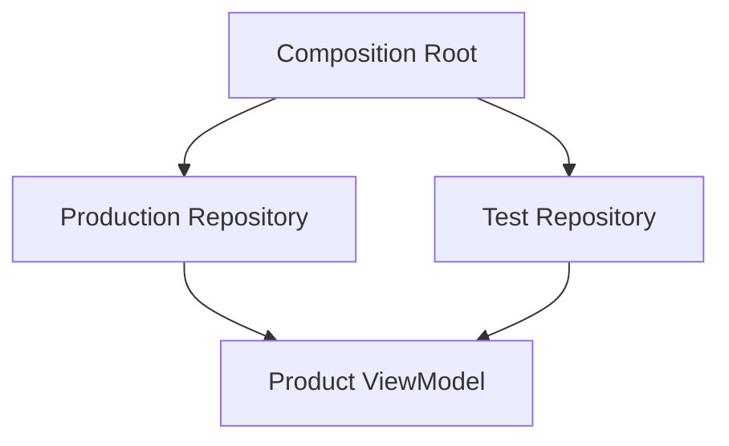
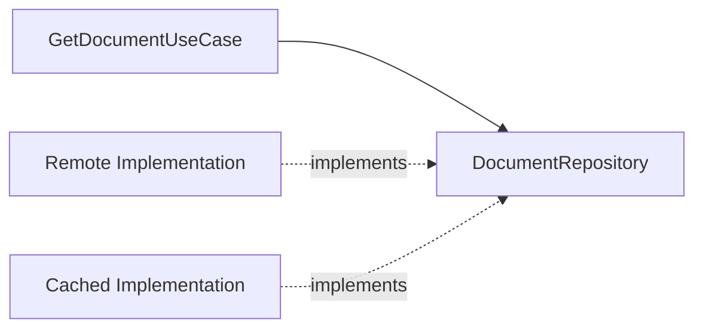
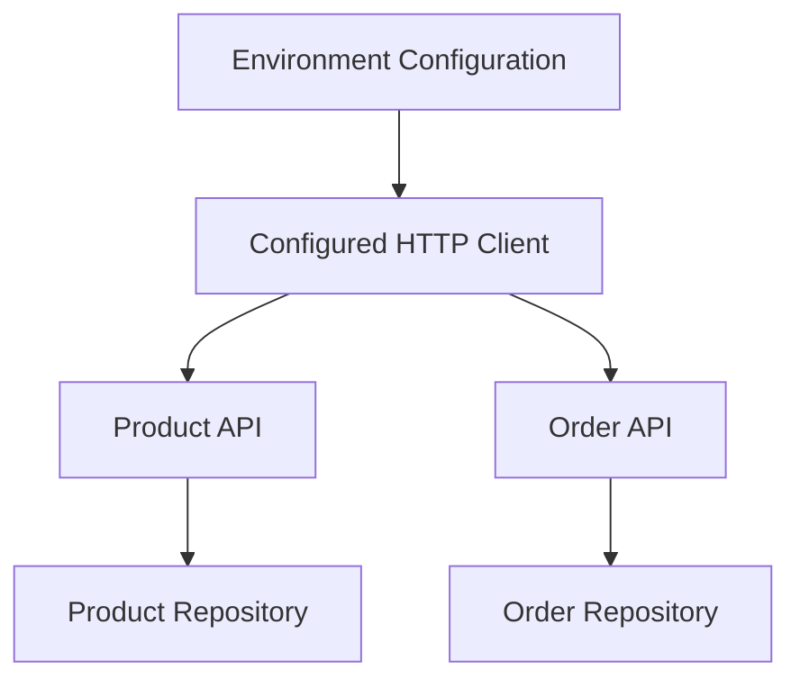
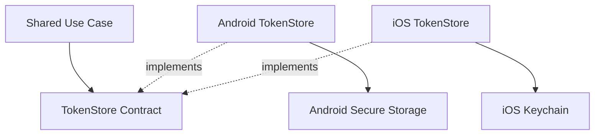

# Chapter 14 — Dependency Injection

## Part 2 — Why Dependency Injection Matters

> **Series:** Kotlin Multiplatform (KMP) Architecture  
> **Chapter:** 14  
> **Part:** 2  
> **Focus:** The engineering problems DI solves, the trade-offs it introduces, and how to decide where it adds value

---

## Table of Contents

- [1. The Real Reason to Use DI](#1-the-real-reason-to-use-di)
- [2. Reducing Construction Coupling](#2-reducing-construction-coupling)
- [3. Making Dependencies Visible](#3-making-dependencies-visible)
- [4. Improving Testability](#4-improving-testability)
- [5. Supporting Change Without Rewriting Consumers](#5-supporting-change-without-rewriting-consumers)
- [6. Controlling Object Lifetimes](#6-controlling-object-lifetimes)
- [7. Centralizing Configuration](#7-centralizing-configuration)
- [8. Supporting Platform Differences in KMP](#8-supporting-platform-differences-in-kmp)
- [9. Enabling Better Modular Architecture](#9-enabling-better-modular-architecture)
- [10. Improving Debugging and Observability](#10-improving-debugging-and-observability)
- [11. DI and SOLID Principles](#11-di-and-solid-principles)
- [12. Before and After: A Realistic Feature](#12-before-and-after-a-realistic-feature)
- [13. What DI Does Not Solve](#13-what-di-does-not-solve)
- [14. The Cost of DI](#14-the-cost-of-di)
- [15. When Manual DI Is Enough](#15-when-manual-di-is-enough)
- [16. When a DI Framework Helps](#16-when-a-di-framework-helps)
- [17. Measuring the Value of DI](#17-measuring-the-value-of-di)
- [18. Common Misconceptions](#18-common-misconceptions)
- [19. Practical Decision Checklist](#19-practical-decision-checklist)
- [20. Summary](#20-summary)

---

# 1. The Real Reason to Use DI

Dependency Injection is often introduced as a way to avoid writing `new` or calling constructors directly. That is too shallow a reason to adopt it.

The real value of DI is that it separates two concerns:

- **Using a dependency** to perform a task.
- **Choosing and constructing a dependency** for a particular environment.

Consider a product feature:

```kotlin
class ProductViewModel {
    private val repository = DefaultProductRepository(
        api = ProductApi(
            client = HttpClient()
        )
    )
}
```

The ViewModel is now tied to the repository implementation, API construction, and HTTP client configuration. If the application needs a fake repository, a different API client, or a platform-specific implementation, the feature class may need to change.

With DI:

```kotlin
class ProductViewModel(
    private val repository: ProductRepository
)
```

The ViewModel declares what it needs. A composition root decides which implementation to provide.



The diagram represents alternative application configurations: production supplies the real implementation, while tests supply a controlled substitute.

The key benefit is not fewer constructor calls. It is **less coupling between application behavior and object construction**.

---

# 2. Reducing Construction Coupling

Construction coupling appears when a class knows too much about how its collaborators are built.

## Tightly coupled implementation

```kotlin
class ReceiptViewModel {

    private val logger = FileLogger()
    private val repository = ReceiptRepository(
        api = ReceiptApi(
            client = HttpClient(
                logger = logger
            )
        )
    )

    suspend fun loadReceipt(id: String): Receipt {
        return repository.getReceipt(id)
    }
}
```

The ViewModel has knowledge of logging, networking, and repository construction. Those details are not part of its primary responsibility.

## Loosely coupled implementation

```kotlin
class ReceiptViewModel(
    private val repository: ReceiptRepository
) {
    suspend fun loadReceipt(id: String): Receipt {
        return repository.getReceipt(id)
    }
}
```

The construction logic moves to a composition root:

```kotlin
fun createReceiptViewModel(
    repository: ReceiptRepository
): ReceiptViewModel {
    return ReceiptViewModel(repository)
}
```

The composition root can create the production repository or receive one that has already been configured.

### Why this matters during change

Suppose the networking implementation changes from one HTTP library to another. If the ViewModel depends on a repository contract, its source code can remain unchanged.

The change is localized to the implementation and composition boundary.

> **DI reduces the number of places that must change when an implementation detail changes.**

It does not eliminate change. It helps contain it.

---

# 3. Making Dependencies Visible

A class's dependencies are part of its design.

Consider:

```kotlin
class CheckoutUseCase(
    private val cartRepository: CartRepository,
    private val paymentRepository: PaymentRepository,
    private val addressRepository: AddressRepository
)
```

The constructor communicates the capabilities required by checkout.

Compare this with hidden lookup:

```kotlin
class CheckoutUseCase {

    suspend fun checkout() {
        val cart = GlobalServices.get<CartRepository>()
        val payment = GlobalServices.get<PaymentRepository>()
        val address = GlobalServices.get<AddressRepository>()

        // Perform checkout.
    }
}
```

In the second example, the dependencies are not visible at construction time. A reader must inspect method bodies and understand the global registry.

Explicit dependencies improve:

- code review
- onboarding
- refactoring
- test setup
- module boundaries
- identification of excessive responsibilities

A constructor with too many dependencies is also useful feedback. It may reveal that the class is doing too much.

Do not hide that signal by injecting a generic container. Investigate whether the responsibilities belong in separate classes or whether a cohesive domain collaborator would make the design clearer.

---

# 4. Improving Testability

Tests should control the environment in which the subject runs.

A class that creates its own repository may require a database, network configuration, and environment setup even when the test only needs to verify a simple business rule.

## Without injection

```kotlin
class DiscountUseCase {

    private val repository = DefaultPriceRepository(
        api = PriceApi(
            client = HttpClient()
        )
    )

    suspend operator fun invoke(productId: String): Double {
        return repository.getPrice(productId) * 0.9
    }
}
```

The test is coupled to infrastructure that is unrelated to the discount calculation.

## With injection

```kotlin
interface PriceRepository {
    suspend fun getPrice(productId: String): Double
}

class DiscountUseCase(
    private val repository: PriceRepository
) {
    suspend operator fun invoke(productId: String): Double {
        return repository.getPrice(productId) * 0.9
    }
}
```

A fake makes the test deterministic:

```kotlin
class FakePriceRepository(
    private val price: Double
) : PriceRepository {

    override suspend fun getPrice(productId: String): Double {
        return price
    }
}
```

```kotlin
@Test
fun `applies ten percent discount`() = runTest {
    val useCase = DiscountUseCase(
        repository = FakePriceRepository(price = 100.0)
    )

    assertEquals(
        expected = 90.0,
        actual = useCase("P-100")
    )
}
```

The test focuses on the use case rather than network or database behavior.

### DI improves testability by enabling

- deterministic collaborators
- fake clocks and random sources
- fake repositories
- controlled failure responses
- isolated business logic
- tests that do not require platform frameworks

DI is not a replacement for good design. A class that receives a dependency can still be difficult to test if it has many responsibilities or if its dependency is an oversized abstraction.

---

# 5. Supporting Change Without Rewriting Consumers

Software changes constantly:

- a local database replaces an in-memory cache
- an API implementation changes
- a fake service is used for previews
- an enterprise environment requires different configuration
- Android and iOS need different platform services
- a feature switches between remote and offline-first data sources

DI allows a consumer to remain stable while its implementation is substituted.

```kotlin
interface DocumentRepository {
    suspend fun loadDocument(id: String): Document
}
```

Possible implementations:

```kotlin
class RemoteDocumentRepository(
    private val api: DocumentApi
) : DocumentRepository {
    override suspend fun loadDocument(id: String): Document {
        return api.getDocument(id)
    }
}

class CachedDocumentRepository(
    private val cache: DocumentCache,
    private val remote: DocumentRepository
) : DocumentRepository {
    override suspend fun loadDocument(id: String): Document {
        return cache.get(id) ?: remote.loadDocument(id)
    }
}
```

The use case still depends on the contract:

```kotlin
class GetDocumentUseCase(
    private val repository: DocumentRepository
) {
    suspend operator fun invoke(id: String): Document {
        return repository.loadDocument(id)
    }
}
```

The composition root selects the desired implementation.



This does not mean every dependency needs multiple implementations. It means implementation choice should be made at an appropriate boundary rather than embedded in every consumer.

---

# 6. Controlling Object Lifetimes

DI systems can help control how long objects live, but lifecycle management must begin with an ownership decision.

Imagine an application that creates a new HTTP client every time a screen opens. Depending on the client and configuration, this can waste resources and prevent effective connection reuse.

At the other extreme, making every object global can retain screen state longer than intended.

A reasonable lifetime model might be:

| Dependency | Possible lifetime | Reason |
|---|---|---|
| Configured HTTP client | Application-wide | Reuse connections and configuration |
| Immutable app configuration | Application-wide | Shared read-only values |
| Authenticated session coordinator | Session-wide | Exists while a session is active |
| Checkout state holder | Checkout flow | State belongs to that flow |
| Screen ViewModel | Screen or navigation entry | State belongs to the screen lifecycle |
| Temporary parser | Operation-wide or reusable | Depends on cost and mutability |

These are examples, not universal rules. The right scope depends on the library, platform, concurrency model, and ownership requirements.

### Why scope matters

A dependency's lifetime influences:

- memory retention
- cleanup behavior
- state isolation
- resource reuse
- concurrent access
- test independence

A singleton is not automatically efficient, correct, or thread-safe. It is only appropriate when its lifetime and sharing semantics match the responsibility.

---

# 7. Centralizing Configuration

Infrastructure dependencies often require configuration:

- base URLs
- request timeouts
- authentication providers
- logging levels
- serialization settings
- database locations
- feature flags
- retry policies

If every feature constructs its own infrastructure, configuration becomes inconsistent.

For example, two API clients might accidentally use different timeout or authentication settings.

Instead, configure infrastructure in one place:

```kotlin
data class NetworkConfig(
    val baseUrl: String,
    val requestTimeoutMillis: Long
)
```

```kotlin
class AppContainer(
    config: NetworkConfig
) {
    private val httpClient = createHttpClient(
        baseUrl = config.baseUrl,
        timeoutMillis = config.requestTimeoutMillis
    )

    val productApi: ProductApi =
        ProductApi(httpClient)

    val orderApi: OrderApi =
        OrderApi(httpClient)
}
```

The exact client implementation is project-specific; the architectural point is that related services share intentional configuration.



Centralized configuration makes differences between development, testing, staging, and production environments easier to manage. Sensitive credentials should still be handled through secure configuration mechanisms; DI is not a secrets-management system.

---

# 8. Supporting Platform Differences in KMP

Kotlin Multiplatform allows business logic to be shared while platform capabilities remain native.

A shared use case may need secure token storage:

```kotlin
interface TokenStore {
    suspend fun read(): String?
    suspend fun write(token: String)
    suspend fun clear()
}
```

The shared code depends on this contract:

```kotlin
class GetSessionTokenUseCase(
    private val tokenStore: TokenStore
) {
    suspend operator fun invoke(): String? {
        return tokenStore.read()
    }
}
```

Android and iOS can provide different implementations appropriate to their platform APIs.



The shared use case does not need to know whether the token is stored through Android-specific facilities or Apple's Keychain APIs.

DI makes it possible to provide the appropriate implementation at the platform composition root.

This is especially valuable when the shared code must remain independent of platform-specific frameworks.

---

# 9. Enabling Better Modular Architecture

A modular application should make dependencies between modules intentional.

For example:

```text
:feature:catalog
      ↓
:domain:catalog
      ↑
:data:catalog
```

A more precise dependency arrangement might be:

```text
Feature / Presentation
       ↓
Domain Contracts
       ↑
Data Implementations
```

The domain module declares contracts. The data module implements them. The composition root connects the implementation to the consumer.

DI does not automatically make an application modular. A poorly designed DI module can still create global coupling.

However, DI provides a clear assembly point where module dependencies can be inspected.

A healthy modular design aims for:

- clear ownership of contracts
- no unnecessary dependency cycles
- limited visibility of infrastructure details
- intentional feature boundaries
- explicit construction of cross-module collaborators

When the dependency graph is visible, architectural violations are easier to spot.

---

# 10. Improving Debugging and Observability

DI can make it easier to understand which implementation is being used in a given environment.

For example, a test may use:

```kotlin
FakePaymentRepository()
```

while production uses:

```kotlin
DefaultPaymentRepository(
    paymentApi
)
```

If the composition root is explicit, a developer can inspect the configuration to determine which implementation was supplied.

This is useful when debugging:

- unexpected test behavior
- incorrect environment configuration
- missing dependencies
- inconsistent API clients
- accidental duplicate instances
- incorrect scopes

DI does not automatically provide observability. Logging, tracing, and diagnostics still need to be designed.

A practical approach is to keep assembly code readable and avoid clever, hidden resolution rules that make the actual object graph difficult to inspect.

---

# 11. DI and SOLID Principles

DI works well with several SOLID principles, but it does not guarantee them.

## Single Responsibility Principle

A class should have a focused responsibility.

If a ViewModel constructs an HTTP client, configures logging, creates a repository, and manages screen state, its responsibilities may be mixed.

DI can move construction to the composition root, but the class still needs a clear responsibility.

## Open/Closed Principle

A consumer that depends on a stable contract can often work with a new implementation without changing its own code.

```kotlin
class LoadProfileUseCase(
    private val repository: ProfileRepository
)
```

A different repository implementation can be supplied through DI.

## Liskov Substitution Principle

Substitute implementations must honor the contract's expected behavior. DI can supply an implementation, but it cannot make an invalid implementation safe.

## Interface Segregation Principle

Consumers should not depend on large interfaces containing methods they do not need. DI does not justify oversized interfaces.

## Dependency Inversion Principle

High-level policy should not depend directly on low-level implementation details. Contracts at architectural boundaries help keep this direction clear.

The relationship can be summarized as:

> **DI helps wire a design together; SOLID principles help determine whether the design is worth wiring together.**

---

# 12. Before and After: A Realistic Feature

Consider an inventory feature that loads warehouse stock.

## Tightly coupled version

```kotlin
class InventoryViewModel {

    private val client = WarehouseHttpClient()
    private val api = InventoryApi(client)
    private val repository = InventoryRepository(api)

    suspend fun loadStock(sku: String): Stock {
        return repository.getStock(sku)
    }
}
```

Problems:

- The ViewModel knows infrastructure construction details.
- Tests may initialize network infrastructure.
- Replacing the repository requires modifying the ViewModel.
- Platform-specific setup may leak into the shared module.
- Resource ownership is unclear.

## Injected version

```kotlin
interface InventoryRepository {
    suspend fun getStock(sku: String): Stock
}

class InventoryViewModel(
    private val repository: InventoryRepository
) {
    suspend fun loadStock(sku: String): Stock {
        return repository.getStock(sku)
    }
}
```

Production implementation:

```kotlin
class DefaultInventoryRepository(
    private val api: InventoryApi
) : InventoryRepository {

    override suspend fun getStock(sku: String): Stock {
        return api.getStock(sku)
    }
}
```

Composition root:

```kotlin
class InventoryFeatureFactory(
    private val repository: InventoryRepository
) {
    fun createViewModel(): InventoryViewModel {
        return InventoryViewModel(repository)
    }
}
```

Test configuration:

```kotlin
class FakeInventoryRepository : InventoryRepository {
    override suspend fun getStock(sku: String): Stock {
        return Stock(
            sku = sku,
            quantity = 25
        )
    }
}
```

The ViewModel remains unchanged across production and test environments.

The improvement is not just fewer dependencies in the ViewModel. The feature now has a clear contract and the construction decision lives outside the feature behavior.

---

# 13. What DI Does Not Solve

DI is useful, but it is not a universal architecture fix.

## It does not fix poor boundaries

If a domain use case directly depends on an Android framework type, injecting that type does not make the domain platform-neutral.

## It does not make code automatically testable

A class can receive dependencies and still be too complex, stateful, or difficult to reason about.

## It does not guarantee correct lifetimes

A DI container can create a singleton that should have been screen-scoped. The container follows configuration; it does not know the business meaning of ownership.

## It does not guarantee thread safety

Sharing an instance does not make concurrent access safe.

## It does not eliminate coupling

Every collaborator creates some form of dependency. DI makes the relationship explicit and can reduce construction coupling, but contracts and module boundaries still matter.

## It does not replace domain modeling

A clean dependency graph cannot rescue unclear business rules or an incorrect state model.

## It does not automatically improve performance

A DI framework has its own runtime, build-time, or generated-code trade-offs. Performance depends on the framework, application, and usage.

The right expectation is modest and useful: DI makes dependency relationships easier to control.

---

# 14. The Cost of DI

Every architectural technique introduces trade-offs.

DI may add:

- additional interfaces and factory types
- composition code
- framework configuration
- scopes and lifecycle rules
- compile-time or runtime resolution complexity
- another layer to debug
- learning and maintenance overhead

The cost is justified when the application benefits from explicit dependency boundaries, substitution, centralized construction, or manageable object lifetimes.

It may not be justified to introduce a sophisticated container for a tiny program with three classes and no meaningful lifecycle complexity.

### The useful balance

```text
Too little structure
    ↓
Hidden dependencies, duplicated setup, difficult tests

Appropriate DI
    ↓
Explicit dependencies, controlled construction, clear ownership

Too much machinery
    ↓
Complex modules, hidden resolution, excessive abstraction
```

The goal is not maximum abstraction. It is an object graph that developers can understand and change safely.

---

# 15. When Manual DI Is Enough

Manual DI is often appropriate when:

- the application has a small object graph
- construction is straightforward
- there are few lifecycle scopes
- platform setup is simple
- explicit wiring is easy to maintain
- the team wants minimal infrastructure

For example:

```kotlin
fun createSearchFeature(
    api: SearchApi
): SearchViewModel {
    val repository = DefaultSearchRepository(api)
    val useCase = SearchUseCase(repository)

    return SearchViewModel(useCase)
}
```

This is explicit and easy to follow.

Manual DI becomes less attractive when the same graph must be assembled in many places, many scopes need management, feature modules have complex relationships, or factories become repetitive and error-prone.

A framework is not a maturity badge. The correct solution is the simplest one that remains maintainable for the application's actual complexity.

---

# 16. When a DI Framework Helps

A DI framework can be valuable when the application has:

- a large dependency graph
- many feature and infrastructure modules
- repeated construction logic
- multiple application or test configurations
- scoped dependencies with clear lifetimes
- platform-specific composition requirements
- a need for compile-time graph validation or generated wiring

A framework can automate object creation and help validate that required bindings exist.

It also introduces its own rules and constraints. Teams should understand how the chosen framework handles scopes, graph resolution, platform source sets, testing, and build integration.

A good framework setup should make the dependency graph easier to understand—not turn construction into a mystery.

---

# 17. Measuring the Value of DI

The value of DI is best judged by engineering outcomes rather than the number of annotations or modules.

Useful questions include:

- Can a feature be unit-tested without starting the network stack?
- Can the production implementation be replaced without editing the consumer?
- Can platform-specific implementations be supplied without contaminating shared code?
- Is object ownership clear?
- Are dependencies visible during code review?
- Can the team identify why a particular instance was created?
- Are dependency cycles and construction errors easier to detect?
- Has duplicated configuration been reduced?

If DI adds a lot of machinery but does not improve these outcomes, reconsider the design.

If it makes feature code simpler, tests more deterministic, and object ownership clearer, it is doing useful work.

---

# 18. Common Misconceptions

| Misconception | Reality |
|---|---|
| DI means using a DI framework | Constructor injection and manual assembly are DI too |
| Every class needs an interface | Abstractions are useful when they define meaningful boundaries |
| Every dependency should be a singleton | Scope should follow ownership and behavior |
| DI automatically makes code testable | It enables substitution; class design still matters |
| Service locator and DI are identical | Constructor injection makes dependencies more explicit |
| More DI modules mean better architecture | Clarity matters more than the number of modules |
| DI removes dependencies | It makes dependency relationships intentional and manageable |
| DI fixes dependency direction | Dependency inversion and module boundaries still need deliberate design |
| Shared KMP code must create every dependency | Platform composition roots can provide platform-specific implementations |
| A framework is always better than manual DI | The right level of machinery depends on graph complexity |

---

# 19. Practical Decision Checklist

Before introducing or expanding DI, review the following.

### Coupling

- [ ] Are consumers constructing infrastructure dependencies themselves?
- [ ] Would changing an implementation require editing many consumers?
- [ ] Are global lookups hiding required dependencies?

### Testing

- [ ] Can unit tests supply fakes or deterministic collaborators?
- [ ] Can business logic run without real network or database setup?
- [ ] Are time, dispatchers, and other external inputs controllable?

### Lifecycle

- [ ] Is each dependency's owner clear?
- [ ] Are shared instances safe to reuse?
- [ ] Could a singleton retain state beyond its intended lifetime?

### Architecture

- [ ] Are contracts located at appropriate module boundaries?
- [ ] Does the dependency graph point in the intended direction?
- [ ] Are circular dependencies present?
- [ ] Are platform details isolated in KMP?

### Complexity

- [ ] Is manual DI still easy to maintain?
- [ ] Is a framework solving a concrete problem?
- [ ] Does the setup remain understandable to the team?
- [ ] Are abstractions meaningful rather than ceremonial?

---

# 20. Summary

Dependency Injection matters because it separates the creation of collaborators from the behavior that uses them.

Its strongest benefits are:

1. **Reduced construction coupling** — consumers no longer need to know how every dependency is built.
2. **Visible requirements** — constructors document the collaborators a class needs.
3. **Improved testing** — controlled fakes and substitutes make tests more deterministic.
4. **Safer change** — implementation swaps can happen at a composition boundary.
5. **Clearer lifetimes** — ownership and reuse become deliberate design decisions.
6. **Consistent configuration** — infrastructure can be assembled in a central location.
7. **KMP platform separation** — shared contracts can be fulfilled by platform-specific implementations.
8. **More inspectable architecture** — the object graph can be reviewed and maintained intentionally.

DI is not valuable because it removes constructor calls. It is valuable when it makes the system easier to understand, test, configure, and evolve.

> **The purpose of DI is not to make construction clever. It is to make change less expensive.**

---

<div align="center">

### Chapter 14 · Part 2

**Dependency Injection — Why DI Matters**

*Reduce construction coupling. Make change easier to contain.*

</div>
