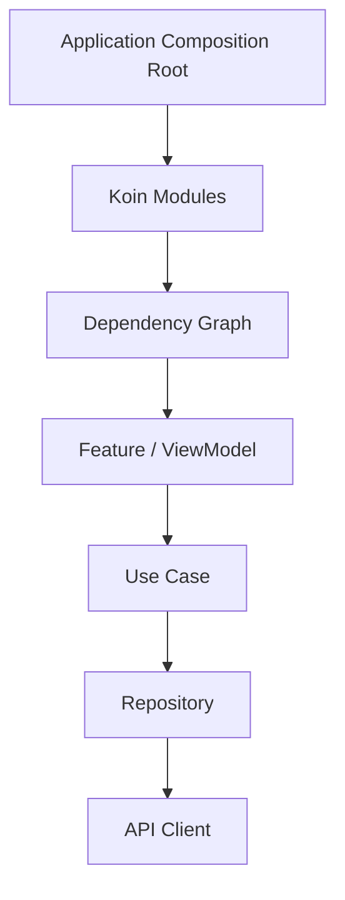
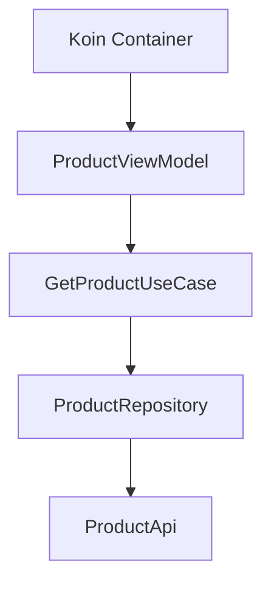
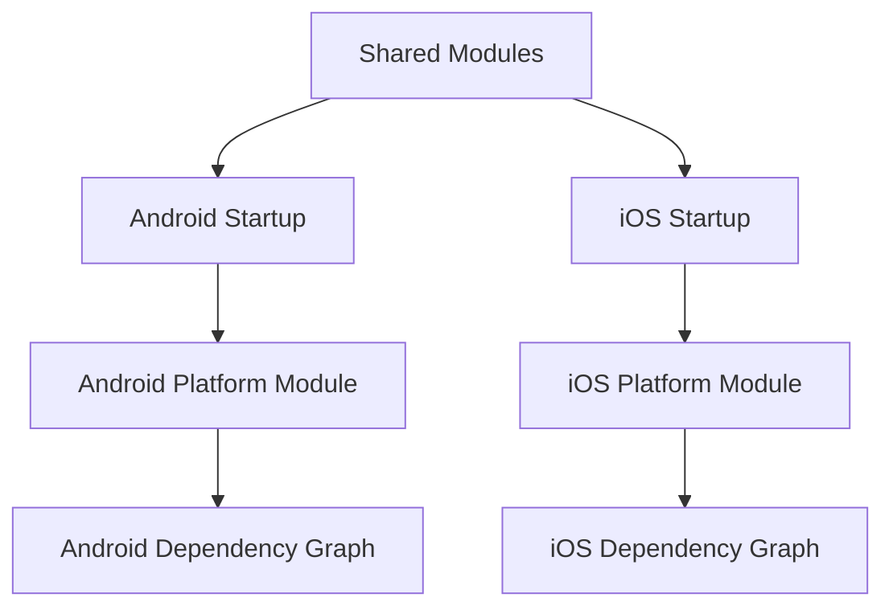

# Chapter 14 — Dependency Injection

## Part 3 — Koin: Practical Dependency Injection for Kotlin and KMP

> **Series:** Kotlin Multiplatform (KMP) Architecture  
> **Chapter:** 14  
> **Part:** 3  
> **Focus:** Koin fundamentals, modules, constructor injection, scopes, testing, Compose integration, and multiplatform setup

---

## Table of Contents

- [1. What Koin Provides](#1-what-koin-provides)
- [2. How Koin Fits into Dependency Injection](#2-how-koin-fits-into-dependency-injection)
- [3. The Dependency Graph We Will Build](#3-the-dependency-graph-we-will-build)
- [4. Add Koin to a Kotlin Project](#4-add-koin-to-a-kotlin-project)
- [5. Define Dependencies with Modules](#5-define-dependencies-with-modules)
- [6. Constructor Injection with `get()` and `singleOf`](#6-constructor-injection-with-get-and-singleof)
- [7. `single`, `factory`, and `scoped`](#7-single-factory-and-scoped)
- [8. Injecting Interfaces and Implementations](#8-injecting-interfaces-and-implementations)
- [9. Build a Complete Feature Graph](#9-build-a-complete-feature-graph)
- [10. Start Koin at the Composition Root](#10-start-koin-at-the-composition-root)
- [11. Injecting ViewModels](#11-injecting-viewmodels)
- [12. Koin with Jetpack Compose](#12-koin-with-jetpack-compose)
- [13. Koin in Kotlin Multiplatform](#13-koin-in-kotlin-multiplatform)
- [14. Android and iOS Composition Roots](#14-android-and-ios-composition-roots)
- [15. Parameters and Runtime Values](#15-parameters-and-runtime-values)
- [16. Qualifiers for Multiple Implementations](#16-qualifiers-for-multiple-implementations)
- [17. Testing Koin Modules](#17-testing-koin-modules)
- [18. Common Errors and Debugging](#18-common-errors-and-debugging)
- [19. Production Guidelines](#19-production-guidelines)
- [20. Practical Checklist](#20-practical-checklist)
- [21. Summary](#21-summary)

---

# 1. What Koin Provides

[Koin](https://insert-koin.io/) is a dependency injection framework designed for Kotlin. It lets developers declare how application objects are created and connected, then resolve those objects through a container.

Koin emphasizes Kotlin DSL declarations rather than requiring application classes to be annotated with framework-specific annotations.

A simple declaration looks like this:

```kotlin
val appModule = module {
    single { ApiClient() }
    single { ProductRepository(get()) }
    factory { ProductViewModel(get()) }
}
```

This module describes three relationships:

- `ApiClient` is registered as a shared instance.
- `ProductRepository` is created using the registered API client.
- `ProductViewModel` is created on demand using the repository.

`get()` asks Koin to resolve a dependency from the graph. The declaration is a recipe; Koin performs the construction when resolution is requested.

Koin can be used in Android applications and Kotlin Multiplatform projects. Its modules can register common business dependencies while platform-specific modules supply platform implementations.

> **Important:** Koin helps assemble a dependency graph. It does not replace sound architecture, clear ownership, or thoughtful scope design.

---

# 2. How Koin Fits into Dependency Injection

Dependency injection is the architectural technique. Koin is one tool for implementing it.

With manual DI, a composition root might create objects directly:

```kotlin
val api = ProductApi()
val repository = DefaultProductRepository(api)
val useCase = GetProductUseCase(repository)
```

With Koin, the relationships are declared in a module:

```kotlin
val productModule = module {
    single<ProductApi> { ProductApi() }
    single<ProductRepository> {
        DefaultProductRepository(get())
    }
    factory { GetProductUseCase(get()) }
}
```

The intended dependency direction stays the same:



Koin does not require every class to know about Koin. A clean feature class can still use constructor injection:

```kotlin
class GetProductUseCase(
    private val repository: ProductRepository
) {
    suspend operator fun invoke(id: String): Product {
        return repository.getProduct(id)
    }
}
```

The class does not call `get()` itself. The module describes how to construct it.

This distinction matters. Prefer framework declarations at the composition boundary, while keeping domain classes independent of the container.

---

# 3. The Dependency Graph We Will Build

Throughout this part, we will build a small product feature:

```text
ProductScreen
    ↓
ProductViewModel
    ↓
GetProductUseCase
    ↓
ProductRepository
    ↓
ProductApi
```

The domain contract is:

```kotlin
data class Product(
    val id: String,
    val name: String,
    val price: Double
)

interface ProductRepository {
    suspend fun getProduct(id: String): Product
}
```

The use case depends on the contract:

```kotlin
class GetProductUseCase(
    private val repository: ProductRepository
) {
    suspend operator fun invoke(id: String): Product {
        return repository.getProduct(id)
    }
}
```

The data layer implements the contract:

```kotlin
class DefaultProductRepository(
    private val api: ProductApi
) : ProductRepository {

    override suspend fun getProduct(id: String): Product {
        return api.getProduct(id)
    }
}
```

For illustration, `ProductApi` is a project-owned abstraction:

```kotlin
interface ProductApi {
    suspend fun getProduct(id: String): Product
}
```

A real project would implement this API using its chosen networking stack. The DI declarations remain largely the same regardless of which HTTP library is used.

---

# 4. Add Koin to a Kotlin Project

Koin artifacts and Gradle coordinates can change between releases. Use the current dependency versions and setup instructions from the official [Koin documentation](https://insert-koin.io/docs/quickstart/kmp/).

For a multiplatform project, add the relevant Koin core dependency to the shared module using the project's version catalog or Gradle configuration. Add Android- or Compose-specific Koin artifacts only when those integrations are required.

A version-catalog entry may look like this illustrative structure:

```toml
[versions]
koin = "<current-koin-version>"

[libraries]
koin-core = { module = "io.insert-koin:koin-core", version.ref = "koin" }
```

Replace the placeholder with a compatible release. Do not copy a placeholder version into a production build.

For a multiplatform shared module, a common-source-set dependency may be configured along these lines:

```kotlin
kotlin {
    sourceSets {
        commonMain.dependencies {
            implementation(libs.koin.core)
        }
    }
}
```

Exact dependency placement depends on the Koin artifact and project setup. Follow the official documentation for the release you adopt, especially for Compose Multiplatform and platform-specific integrations.

### Dependency selection

| Requirement | Dependency category |
|---|---|
| Shared dependency graph | Koin core |
| Android ViewModel integration | Koin Android/ViewModel integration supported by the chosen version |
| Jetpack Compose integration | Koin Compose integration |
| Compose Multiplatform integration | Koin Multiplatform/Compose integration documented for the chosen version |
| Testing modules | Koin test support |

Avoid adding every Koin artifact “just in case.” Add only what the module actually uses.

---

# 5. Define Dependencies with Modules

A Koin module groups dependency declarations.

```kotlin
import org.koin.dsl.module

val productModule = module {
    single<ProductApi> {
        DefaultProductApi()
    }

    single<ProductRepository> {
        DefaultProductRepository(get())
    }

    factory {
        GetProductUseCase(get())
    }
}
```

The declarations communicate:

- which types can be resolved
- which concrete implementations satisfy contracts
- which dependencies each object requires
- how each registered object should be created or reused

## Keep modules organized by responsibility

A project might use:

```text
di/
├── NetworkModule.kt
├── DatabaseModule.kt
├── RepositoryModule.kt
├── DomainModule.kt
└── FeatureModule.kt
```

For a small application, a few focused modules are usually enough. A module per class creates unnecessary fragmentation; a single enormous module can become hard to navigate.

A network module might register infrastructure:

```kotlin
val networkModule = module {
    single<ProductApi> {
        DefaultProductApi()
    }
}
```

A repository module can connect the API to the domain contract:

```kotlin
val repositoryModule = module {
    single<ProductRepository> {
        DefaultProductRepository(get())
    }
}
```

A domain module registers the use case:

```kotlin
val domainModule = module {
    factory {
        GetProductUseCase(get())
    }
}
```

Combine the modules at the composition root:

```kotlin
val appModules = listOf(
    networkModule,
    repositoryModule,
    domainModule
)
```

The declarations above assume that `DefaultProductApi` has a valid constructor and configuration. Supply its real dependencies in the actual project.

---

# 6. Constructor Injection with `get()` and `singleOf`

The `get()` function resolves a dependency from Koin's graph.

```kotlin
val productModule = module {
    single<ProductApi> {
        DefaultProductApi()
    }

    single<ProductRepository> {
        DefaultProductRepository(
            api = get()
        )
    }

    factory {
        GetProductUseCase(
            repository = get()
        )
    }
}
```

Naming constructor arguments can improve readability in larger declarations.

Koin also provides constructor-reference DSL helpers such as `singleOf` and `factoryOf` in supported versions. These can reduce repetitive lambda code when a class's constructor dependencies are all resolvable from the graph.

For example, where supported by the project's Koin version:

```kotlin
val domainModule = module {
    factoryOf(::GetProductUseCase)
}
```

The class must have a constructor whose required parameters can be resolved by Koin.

For a repository implementation:

```kotlin
val repositoryModule = module {
    singleOf(::DefaultProductRepository) {
        bind<ProductRepository>()
    }
}
```

Check the exact DSL support and imports for the version in use. If constructor-reference syntax becomes unclear, the explicit lambda is perfectly valid:

```kotlin
single<ProductRepository> {
    DefaultProductRepository(get())
}
```

**Prefer clarity over DSL cleverness.** A declaration should be easy for a teammate to understand during code review.

---

# 7. `single`, `factory`, and `scoped`

Koin offers different definitions for different object lifetimes. The choice should reflect ownership and intended reuse.

## `single`

`single` provides a shared instance from the Koin container.

```kotlin
val infrastructureModule = module {
    single<ProductApi> {
        DefaultProductApi()
    }
}
```

Use it for dependencies designed to be shared, such as a configured client or immutable application configuration.

Do not assume that every class should be a singleton. Shared mutable state can create leakage, concurrency issues, and difficult tests.

## `factory`

`factory` creates a new instance whenever the dependency is resolved.

```kotlin
val useCaseModule = module {
    factory {
        GetProductUseCase(get())
    }
}
```

This can be useful for lightweight objects whose instances do not need to be shared.

A factory definition does not mean the object is created on every method call. It is created when Koin resolves the definition.

## `scoped`

A scoped definition shares an instance within a defined scope. The scope must be opened and closed by the appropriate owner.

Conceptual example:

```kotlin
val checkoutModule = module {
    scope<CheckoutScope> {
        scoped {
            CheckoutCoordinator(
                repository = get()
            )
        }
    }
}
```

This is illustrative: the exact scope declaration and lifecycle wiring should follow the Koin version and application architecture. A scope must have an explicit lifecycle owner; declaring one does not automatically connect it to a navigation destination or screen.

| Definition | Reuse behavior | Typical fit |
|---|---|---|
| `single` | Shared container instance | App-level infrastructure |
| `factory` | New instance per resolution | Lightweight use case or transient object |
| `scoped` | Shared inside a scope | Feature or session-owned object |

### Scope is an ownership decision

Before choosing a definition, ask:

1. Who owns this instance?
2. How long should it remain valid?
3. Is sharing safe?
4. Does it contain mutable state?
5. Who closes the scope or releases associated resources?

Do not use `single` merely because it is convenient, and do not use `factory` without considering whether repeated creation is appropriate.

---

# 8. Injecting Interfaces and Implementations

A common requirement is to register a concrete implementation while exposing only the interface to consumers.

```kotlin
interface ProductRepository {
    suspend fun getProduct(id: String): Product
}

class DefaultProductRepository(
    private val api: ProductApi
) : ProductRepository {
    override suspend fun getProduct(id: String): Product {
        return api.getProduct(id)
    }
}
```

Register the implementation as the contract:

```kotlin
val repositoryModule = module {
    single<ProductRepository> {
        DefaultProductRepository(get())
    }
}
```

Now a consumer can request the interface:

```kotlin
class GetProductUseCase(
    private val repository: ProductRepository
)
```

The use case does not need to know which class implements the repository.

Where supported by the selected Koin DSL, constructor-reference binding can express the same relationship:

```kotlin
val repositoryModule = module {
    singleOf(::DefaultProductRepository) {
        bind<ProductRepository>()
    }
}
```

The explicit lambda form is often easier to adapt when additional constructor configuration is needed.

### Avoid accidental duplicate definitions

If the same implementation is registered independently under both its concrete type and interface, the container may create separate instances depending on the definitions and scopes. If both types must resolve to the same instance, define the binding intentionally using the DSL supported by the chosen Koin version.

The important question is not only “Can Koin resolve this type?” but also “Will it resolve the intended instance?”

---

# 9. Build a Complete Feature Graph

Let's connect the domain, data, and presentation layers.

## Domain

```kotlin
data class Product(
    val id: String,
    val name: String,
    val price: Double
)

interface ProductRepository {
    suspend fun getProduct(id: String): Product
}

class GetProductUseCase(
    private val repository: ProductRepository
) {
    suspend operator fun invoke(id: String): Product {
        return repository.getProduct(id)
    }
}
```

## Data

```kotlin
interface ProductApi {
    suspend fun getProduct(id: String): Product
}

class DefaultProductRepository(
    private val api: ProductApi
) : ProductRepository {
    override suspend fun getProduct(id: String): Product {
        return api.getProduct(id)
    }
}
```

## Presentation

The ViewModel below uses a simple state holder to keep this example focused on dependency wiring. A production feature should also define its loading, success, and error behavior.

```kotlin
class ProductViewModel(
    private val getProduct: GetProductUseCase
) {
    suspend fun loadProduct(id: String): Product {
        return getProduct(id)
    }
}
```

## Koin modules

```kotlin
val productDataModule = module {
    single<ProductApi> {
        DefaultProductApi()
    }

    single<ProductRepository> {
        DefaultProductRepository(get())
    }
}

val productDomainModule = module {
    factory {
        GetProductUseCase(get())
    }
}

val productPresentationModule = module {
    factory {
        ProductViewModel(get())
    }
}
```

This example assumes `DefaultProductApi` can be constructed without arguments. In a real application, it should receive a configured client or another required dependency rather than create infrastructure internally.

The graph is:



A clear module graph keeps object assembly separate from feature behavior.

---

# 10. Start Koin at the Composition Root

Register modules once at the appropriate application entry point.

For a conventional Kotlin/JVM or Android-style application, the setup commonly follows this pattern:

```kotlin
startKoin {
    modules(
        productDataModule,
        productDomainModule,
        productPresentationModule
    )
}
```

The exact startup location differs by platform. Android applications commonly start Koin from application initialization; multiplatform applications often expose a shared startup function and invoke it from each platform entry point.

Avoid starting independent Koin containers repeatedly during normal feature navigation. Reinitialization can create duplicate graphs, unexpected instance lifetimes, and confusing tests.

A simple common declaration might be:

```kotlin
val sharedModules = listOf(
    productDataModule,
    productDomainModule
)
```

Then the platform can add its own modules:

```kotlin
val androidModules = listOf(
    androidPlatformModule
)

val iosModules = listOf(
    iosPlatformModule
)
```

These lists are illustrative. Keep the shared graph platform-neutral and ensure every required definition is available before resolving the feature.

---

# 11. Injecting ViewModels

ViewModel integration depends on the target platform and the Koin artifacts in use.

For Android, Koin offers integration for Android ViewModels. In supported versions, a ViewModel definition may use a DSL such as:

```kotlin
val productPresentationModule = module {
    viewModel {
        ProductAndroidViewModel(
            getProduct = get()
        )
    }
}
```

The exact imports and API may vary by Koin version. Use the current official Koin Android documentation for the chosen release.

Do not register a lifecycle-managed ViewModel as an ordinary `single` merely to make injection work. ViewModels have lifecycle ownership requirements that differ from application-wide dependencies.

A useful separation is:

- application infrastructure: typically shared
- use cases: commonly lightweight and created through a factory
- ViewModels: created and retained according to the platform's lifecycle integration
- screen or flow state: scoped to its actual owner

For shared KMP presentation logic, distinguish a plain shared state holder from an Android-specific `ViewModel` subclass. A shared class does not need to inherit from an Android lifecycle type simply because Android consumes it.

---

# 12. Koin with Jetpack Compose

Compose UI should consume presentation state and dispatch user actions. It should not construct repositories or resolve infrastructure dependencies inside composable functions.

A conceptual screen:

```kotlin
@Composable
fun ProductScreen(
    viewModel: ProductAndroidViewModel
) {
    // Collect state from the ViewModel.
    // Render loading, content, or error.
    // Send user actions to the ViewModel.
}
```

Koin's Compose integration can provide dependencies or ViewModels to composables, depending on the version and target. The exact API may use functions such as `koinViewModel()` or other integration APIs.

Keep the integration at the presentation boundary:

```text
Koin graph
   ↓
ViewModel
   ↓
UI state + actions
   ↓
Compose screen
```

Avoid resolving repositories directly in composables:

```kotlin
@Composable
fun ProductScreen() {
    // Avoid resolving the repository directly here.
}
```

That pattern hides feature dependencies inside UI rendering and makes previews and tests harder to isolate.

### Compose previews

Previews often need fake dependencies or a simplified state holder. A good DI setup allows preview-specific objects to be supplied without changing production feature code.

### Lifecycle matters

Ensure the ViewModel or state holder is obtained using an API that respects the intended lifecycle owner. Do not assume every dependency obtained from a composable automatically has screen-scoped lifetime.

---

# 13. Koin in Kotlin Multiplatform

Koin can be used to assemble shared dependencies in a Kotlin Multiplatform application. The key is to keep common contracts and business rules separate from platform-specific implementations.

A typical source-set arrangement:

```text
shared/
├── commonMain/
│   ├── domain/
│   ├── data/
│   ├── presentation/
│   └── di/
├── androidMain/
│   └── di/
└── iosMain/
    └── di/
```

Shared declarations can register platform-neutral components:

```kotlin
val sharedDomainModule = module {
    factory {
        GetProductUseCase(get())
    }
}
```

If the shared repository depends on a common `ProductApi` abstraction, the concrete implementation can be supplied by an appropriate platform or shared networking module:

```kotlin
val sharedRepositoryModule = module {
    single<ProductRepository> {
        DefaultProductRepository(get())
    }
}
```

The `ProductApi` definition must be registered by one of the modules loaded at startup.

### Do not leak platform details into `commonMain`

Common code should not directly require Android `Context`, Android-only lifecycle APIs, or iOS-only frameworks.

When a dependency needs platform-specific capabilities, define a common contract where appropriate and register the platform implementation in the platform composition root.

---

# 14. Android and iOS Composition Roots

The composition root is where the platform chooses the implementations needed by the application.



An illustrative shared function:

```kotlin
fun initSharedKoin(
    platformModules: List<Module>
) {
    startKoin {
        modules(
            sharedDomainModule,
            sharedRepositoryModule,
            platformModules
        )
    }
}
```

This demonstrates the composition idea, not a universal startup API. Verify the supported Koin overloads and module-flattening behavior for the version in use; a project may instead pass a combined module list.

Android startup supplies Android-specific implementations. iOS startup supplies iOS-specific implementations. Both can reuse the shared domain and feature definitions.

## Platform API design

Avoid exposing the entire Koin container to Swift merely so iOS code can retrieve arbitrary dependencies. Prefer a narrow factory or initialization boundary when native code needs access to shared features.

For example, an application-owned factory can create a shared feature state holder. This keeps the Swift-facing API stable even if the internal DI setup changes.

---

# 15. Parameters and Runtime Values

Not every value belongs in the dependency graph. Some values are stable collaborators; others are runtime inputs.

A repository is a dependency:

```kotlin
class GetProductUseCase(
    private val repository: ProductRepository
)
```

A product ID is an operation parameter:

```kotlin
suspend operator fun invoke(id: String): Product
```

Do not register every screen argument or user-entered value as a global dependency.

Koin supports parameterized resolution for cases where an object needs a runtime construction parameter. An illustrative declaration is:

```kotlin
val detailModule = module {
    factory { (productId: String) ->
        ProductDetailsController(
            productId = productId,
            repository = get()
        )
    }
}
```

Resolution can then supply the parameter using the parameter API supported by the selected Koin version.

Use parameter injection when the parameter is genuinely part of object construction and the lifecycle makes sense. For ordinary use-case inputs, prefer method parameters.

**Rule of thumb:** inject stable collaborators; pass changing business inputs to the operation that uses them.

---

# 16. Qualifiers for Multiple Implementations

Sometimes the graph contains more than one dependency of the same type.

For example, an application may use separate clients for public and authenticated APIs.

```kotlin
interface ApiClient
```

Registering two definitions of the same type without distinguishing them can make resolution ambiguous or cause the wrong definition to be selected.

Koin supports qualifiers to distinguish definitions. A conceptual example:

```kotlin
val networkModule = module {
    single(named("public")) {
        PublicApiClient()
    }

    single(named("authenticated")) {
        AuthenticatedApiClient()
    }
}
```

A consumer can request the intended qualified dependency:

```kotlin
class PublicCatalogRepository(
    private val apiClient: ApiClient
)
```

The constructor above alone does not specify the qualifier; the Koin definition must resolve the correct one explicitly. The exact syntax for qualified resolution should follow the chosen Koin version.

Prefer named qualifier constants over scattered string literals in a larger codebase:

```kotlin
object ApiQualifiers {
    const val PUBLIC = "public"
    const val AUTHENTICATED = "authenticated"
}
```

Qualifiers are useful when the types are legitimately the same but the roles differ. If two dependencies have fundamentally different responsibilities, distinct interfaces may communicate intent more clearly.

---

# 17. Testing Koin Modules

DI configuration is code and deserves tests. A unit test for a use case verifies behavior; a module test verifies that the graph can be assembled as expected.

Koin provides testing support through its test artifacts and APIs. Follow the official documentation for the version in use, because test DSL details can change.

A typical test should verify:

- all required definitions are registered
- consumers receive the intended implementation
- test modules can replace production definitions intentionally
- scopes behave according to the intended lifetime
- module startup does not depend on platform-only APIs

For business logic, direct constructor tests remain valuable:

```kotlin
@Test
fun `use case delegates to repository`() = runTest {
    val repository = FakeProductRepository()
    val useCase = GetProductUseCase(repository)

    val result = useCase("P-1")

    assertEquals("P-1", result.id)
}
```

This test does not need to start Koin because the behavior under test is the use case, not the container.

A Koin module test is appropriate when the purpose is to verify the DI graph itself. Keep those two kinds of tests distinct.

### Replacing production dependencies

Test configuration should provide fakes deliberately. Avoid relying on global container state that survives between tests. Start and stop the test container according to the test framework's lifecycle, and isolate tests that alter global DI configuration.

---

# 18. Common Errors and Debugging

## Missing definition

A consumer requests a type that no loaded module provides.

**Check:**
- Is the correct module included?
- Is the requested interface bound to an implementation?
- Does the implementation require another missing dependency?
- Is the platform module loaded before resolution?

## Wrong implementation resolved

Multiple definitions may exist for the same type.

**Check:**
- Are qualifiers required?
- Was the intended binding declared?
- Are multiple modules registering the same type?
- Is a test override replacing the production definition?

## Unexpected duplicate instances

A dependency may be declared as a factory when a shared instance was intended, or an implementation may be registered separately under multiple types.

**Check:**
- Which definition creates the instance?
- Is a binding sharing the same object or creating another one?
- Does the scope match the intended owner?

## Scope not available

A scoped definition is resolved outside its active scope or the scope is not connected to the lifecycle owner.

**Check:**
- Where is the scope opened?
- Who closes it?
- Does the object resolve within the correct scope?
- Is the scope necessary, or would a simpler lifetime suffice?

## Startup failures

The graph may resolve a dependency before all modules have been loaded.

**Check:**
- Is Koin started once at the correct entry point?
- Are platform and shared modules combined correctly?
- Are required configuration values supplied?
- Is resolution happening too early?

## Overusing Koin inside feature code

Calling the container directly from domain classes hides dependencies.

**Better:** Use constructor injection and keep Koin declarations at the composition boundary.

---

# 19. Production Guidelines

## Keep domain classes framework-independent

```kotlin
class GetProductUseCase(
    private val repository: ProductRepository
)
```

This class should not need to import Koin.

## Keep module declarations readable

A teammate should be able to trace the graph without understanding a large collection of DSL tricks.

## Separate shared and platform modules

Register common use cases and contracts in shared modules. Add platform implementations at the platform boundary.

## Make scope choices explicit

Choose `single`, `factory`, or `scoped` based on ownership and intended reuse. Document unusual scope decisions.

## Avoid global service location

Koin should assemble the object graph, not become a global dependency lookup mechanism throughout the business layer.

## Test the graph and the behavior separately

Test business rules through constructors and fake dependencies. Test Koin configuration where wiring correctness is the concern.

## Keep startup predictable

Start the container at a deliberate application boundary. Avoid repeated initialization during normal navigation or feature operations.

## Verify APIs against the chosen version

Koin's DSL and integration artifacts evolve. Keep the project's version catalog consistent and use the official documentation for exact imports, startup methods, Compose APIs, and testing helpers.

---

# 20. Practical Checklist

### Modules
- [ ] Are definitions grouped by responsibility?
- [ ] Is every required dependency registered?
- [ ] Are interface bindings explicit?
- [ ] Are module names and ownership understandable?

### Lifetimes
- [ ] Is `single` used only when sharing is appropriate?
- [ ] Is `factory` used for objects that should be recreated per resolution?
- [ ] Are scopes connected to a real lifecycle owner?
- [ ] Are shared mutable dependencies safe for concurrent access?

### Architecture
- [ ] Do feature classes use constructor injection?
- [ ] Are domain classes independent of Koin?
- [ ] Is the composition root explicit?
- [ ] Are platform-specific dependencies isolated from `commonMain`?

### Compose and ViewModels
- [ ] Does ViewModel creation respect lifecycle ownership?
- [ ] Do composables render state rather than construct infrastructure?
- [ ] Can previews use fake dependencies or explicit state?
- [ ] Is the correct Koin integration artifact included?

### Testing
- [ ] Are use cases tested independently of the container?
- [ ] Are DI modules tested where wiring correctness matters?
- [ ] Are test definitions isolated between tests?
- [ ] Are scopes and overrides tested intentionally?

### Maintainability
- [ ] Are qualifiers used only when necessary?
- [ ] Are runtime business inputs kept out of global DI definitions?
- [ ] Is the DSL understandable to the team?
- [ ] Are Koin APIs checked against the project's selected version?

---

# 21. Summary

Koin provides a Kotlin-friendly way to declare and assemble application dependencies. Its value is strongest when it keeps construction centralized while allowing feature classes to remain explicit and testable.

The essential practices are:

1. **Declare dependencies in modules.**
2. **Use constructor injection for application classes.**
3. **Bind implementations to meaningful contracts.**
4. **Choose `single`, `factory`, and `scoped` according to ownership and lifetime.**
5. **Start Koin at a deliberate composition root.**
6. **Keep shared KMP modules platform-neutral.**
7. **Supply platform-specific implementations from Android and iOS boundaries.**
8. **Use framework integration for ViewModels and Compose without moving business logic into the container.**
9. **Test behavior directly and test the DI graph separately.**
10. **Verify exact APIs against the Koin version used by the project.**

Koin should make the dependency graph easier to see—not encourage application code to resolve arbitrary objects globally.

> **A well-designed Koin setup is not the center of your architecture. It is the wiring that lets the architecture work.**

---

<div align="center">

### Chapter 14 · Part 3

**Dependency Injection — Koin**

*Declare the graph. Keep the architecture explicit.*

</div>
