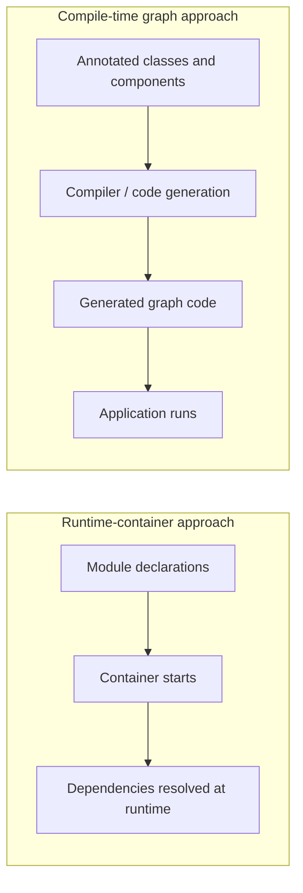
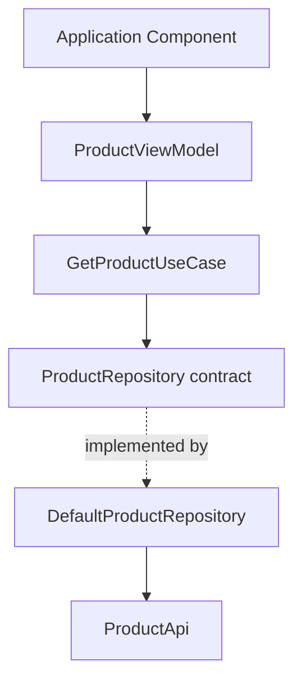
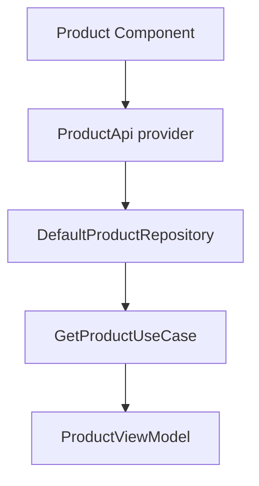
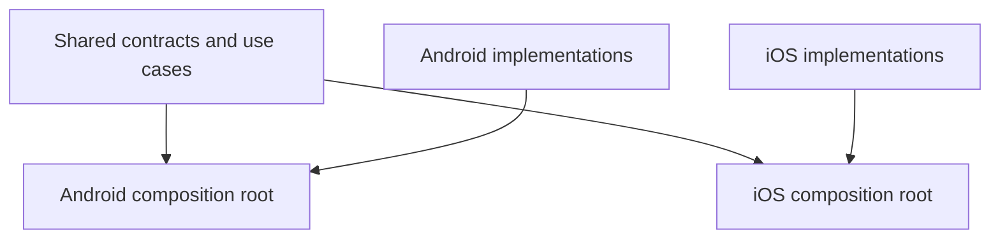
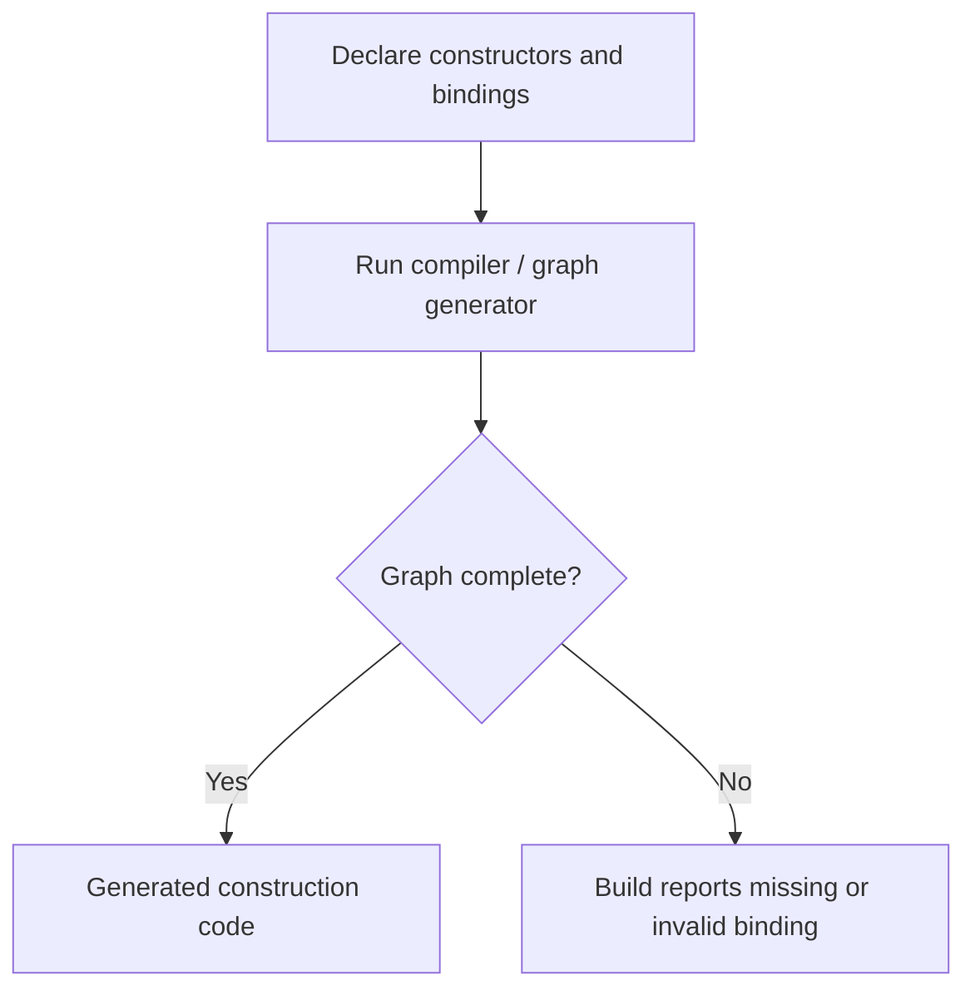

# Chapter 14 — Dependency Injection

## Part 3 — Kotlin Inject: Compile-Time Dependency Injection for Kotlin Multiplatform

> **Series:** Kotlin Multiplatform (KMP) Architecture  
> **Chapter:** 14  
> **Part:** 3  
> **Focus:** Kotlin Inject concepts, constructor-based graphs, components, scopes, platform boundaries, testing, and migration decisions

---

## Table of Contents

- [1. Understanding Kotlin Inject](#1-understanding-kotlin-inject)
- [2. Runtime DI and Compile-Time DI](#2-runtime-di-and-compile-time-di)
- [3. The Core Model](#3-the-core-model)
- [4. Project Setup and Version Awareness](#4-project-setup-and-version-awareness)
- [5. Constructor Injection](#5-constructor-injection)
- [6. Components and Dependency Graphs](#6-components-and-dependency-graphs)
- [7. Providing Dependencies](#7-providing-dependencies)
- [8. Interfaces and Bindings](#8-interfaces-and-bindings)
- [9. Scopes and Lifetimes](#9-scopes-and-lifetimes)
- [10. A Complete Feature Example](#10-a-complete-feature-example)
- [11. Kotlin Multiplatform Boundaries](#11-kotlin-multiplatform-boundaries)
- [12. Android Integration](#12-android-integration)
- [13. iOS Integration](#13-ios-integration)
- [14. Testing Without a Container at Runtime](#14-testing-without-a-container-at-runtime)
- [15. Compile-Time Graph Validation](#15-compile-time-graph-validation)
- [16. Common Pitfalls](#16-common-pitfalls)
- [17. Kotlin Inject Compared with Koin and Manual DI](#17-kotlin-inject-compared-with-koin-and-manual-di)
- [18. When Kotlin Inject Is a Good Fit](#18-when-kotlin-inject-is-a-good-fit)
- [19. Practical Checklist](#19-practical-checklist)
- [20. Summary](#20-summary)

---

# 1. Understanding Kotlin Inject

Kotlin Inject is a dependency injection library built around Kotlin and compile-time graph generation. Rather than relying on a general-purpose runtime container to look up objects whenever a dependency is requested, the library uses annotations and generated code to describe and construct object graphs.

Its design is attractive for Kotlin Multiplatform projects because dependency relationships can be expressed in Kotlin while platform-specific construction remains at the appropriate boundary.

Dependency injection is still the architectural technique. Kotlin Inject is an implementation choice.

A class can express its dependency through its constructor:

```kotlin
class GetProductUseCase(
    private val repository: ProductRepository
) {
    suspend operator fun invoke(id: String): Product {
        return repository.getProduct(id)
    }
}
```

The use case does not know how the repository is constructed. It depends on a contract and can be tested with a fake implementation.

A compile-time DI library helps describe how that dependency should be provided and how the larger graph should be assembled.

> **Version note:** Kotlin Inject's APIs, compiler setup, supported Kotlin versions, and platform support may vary by release or fork. Treat the examples in this chapter as explanations of its annotation-based model, and verify exact package names, annotations, Gradle plugins, and generated entry points against the official project documentation for the version you choose. Do not assume that an API from another DI library is interchangeable with Kotlin Inject.

---

# 2. Runtime DI and Compile-Time DI

A runtime DI container typically stores definitions and resolves them while the application is running. Compile-time DI instead uses the compiler or code-generation tooling to validate and generate parts of the dependency graph before the application executes.



The practical trade-offs are different.

| Concern | Runtime container | Compile-time graph |
|---|---|---|
| Object resolution | Often performed by a container at runtime | Construction code is generated ahead of runtime |
| Missing dependency | May surface during graph resolution at runtime | Can be detected during compilation when supported by the graph model |
| Flexibility | Convenient for runtime overrides and dynamic registration | Graph is more explicit and generally less dynamic |
| Startup behavior | Container initialization and resolution may have runtime cost | Generated construction can reduce reliance on runtime lookup |
| Learning curve | Understand module DSL and scopes | Understand annotations, components, graph rules, and generation |
| Best fit | Dynamic registration or convenient runtime configuration | Explicit graphs and compile-time validation |

Neither approach is automatically faster, safer, or simpler in every project. Results depend on graph size, code generation, platform, startup strategy, and how the application is structured.

Compile-time validation also has limits: it can validate only the graph and constraints represented to the compiler. It cannot prove that a backend is available, that a token is valid, or that business behavior is correct.

---

# 3. The Core Model

The central ideas are familiar from dependency injection generally:

- **Constructor injection:** required collaborators are visible in a class's constructor.
- **Providers:** a dependency can be created from a function when direct constructor construction is insufficient.
- **Components:** define a graph boundary and its available dependencies.
- **Scopes:** express intended reuse and lifetime where supported.
- **Bindings:** connect an abstraction to a concrete implementation.
- **Generated graph code:** lets tooling assemble dependencies before runtime.

Consider a simplified product feature:

```text
ProductViewModel
      |
      v
GetProductUseCase
      |
      v
ProductRepository
      |
      v
ProductApi
```

The domain layer defines what it needs. The data layer supplies an implementation. The composition boundary determines which implementation belongs in the graph.



The diagram represents dependency relationships, not a guarantee of specific annotation names or generated method names. Those details depend on the exact Kotlin Inject implementation and version.

---

# 4. Project Setup and Version Awareness

Before adding a compile-time DI library, verify that its release supports your project's Kotlin version, Gradle version, compiler configuration, and target platforms.

Consult the project's official source and documentation rather than copying an old Gradle snippet from a tutorial.

Official project reference: [Kotlin Inject on GitHub](https://github.com/evant/kotlin-inject)

For a Kotlin Multiplatform project, confirm all of the following before integration:

1. Which compiler or symbol-processing mechanism the selected release requires.
2. Whether the chosen release supports the Kotlin compiler version used by the project.
3. Which targets are supported, including Android and iOS.
4. Whether annotations are available in `commonMain`.
5. How generated sources are configured for each target.
6. Which annotation and component APIs are current.
7. Whether the project is active, maintained, or suitable for a new production system.

A version-catalog entry should use a real, compatible release:

```toml
[versions]
kotlinInject = "<verified-compatible-version>"
```

The placeholder is intentional. Replace it with a version verified from the official repository and its release notes. Do not paste a placeholder into a build.

Likewise, do not guess a plugin ID or processor coordinate. Annotation processors and compiler plugins are particularly sensitive to Kotlin and Gradle compatibility.

## Keep dependency-injection tooling isolated

Place DI-specific setup in the build configuration and composition layer. Avoid spreading compiler configuration assumptions through feature modules.

A useful project layout is:

```text
shared/
├── commonMain/
│   ├── domain/
│   ├── data/
│   ├── presentation/
│   └── di/
├── androidMain/
│   └── di/
└── iosMain/
    └── di/
```

This is an architectural example, not a requirement imposed by Kotlin Inject.

---

# 5. Constructor Injection

Constructor injection is the most important habit to preserve regardless of the DI framework.

```kotlin
data class Product(
    val id: String,
    val name: String,
    val price: Double
)

interface ProductRepository {
    suspend fun getProduct(id: String): Product
}

class GetProductUseCase(
    private val repository: ProductRepository
) {
    suspend operator fun invoke(id: String): Product {
        return repository.getProduct(id)
    }
}
```

The class declares its requirements explicitly. There is no global lookup and no hidden dependency on a DI container.

A data implementation can depend on another contract:

```kotlin
interface ProductApi {
    suspend fun getProduct(id: String): Product
}

class DefaultProductRepository(
    private val api: ProductApi
) : ProductRepository {
    override suspend fun getProduct(id: String): Product {
        return api.getProduct(id)
    }
}
```

This design provides three important benefits:

1. A class cannot be constructed correctly without its required dependencies.
2. Tests can supply fakes directly.
3. The class remains independent of the DI framework.

## Do not inject the container into every class

Avoid patterns like this:

```kotlin
class GetProductUseCase(
    private val container: SomeDependencyContainer
) {
    suspend operator fun invoke(id: String): Product {
        val repository =
            container.resolve<ProductRepository>()

        return repository.getProduct(id)
    }
}
```

This hides the use case's real dependency and turns the container into a service locator.

Prefer:

```kotlin
class GetProductUseCase(
    private val repository: ProductRepository
)
```

A DI framework should assemble the class, not become a dependency of the business logic.

---

# 6. Components and Dependency Graphs

Compile-time DI libraries commonly use a component or graph declaration to describe the root of object construction. Kotlin Inject versions and related implementations may use particular annotations and generated interfaces; verify the exact syntax before using it.

Conceptually, a component answers:

- Which dependencies are available to the graph?
- Which objects can the graph create?
- Which providers or modules contribute bindings?
- Which platform-specific values must be supplied?
- What is the lifetime of the component?

The following is conceptual pseudocode, not copy-and-paste Kotlin Inject syntax:

```kotlin
// Conceptual only — not a literal Kotlin Inject API declaration.

@Component
interface ProductComponent {
    val productViewModel: ProductViewModel
}
```

Do not use the declaration above as a buildable implementation without checking the annotation names and component rules of the selected version.

The graph might conceptually connect:



A well-designed component is a meaningful boundary. It should not become an enormous application-wide list of every internal class.

## Component boundaries

Possible boundaries include:

- application-level dependencies
- authenticated user session
- checkout flow
- feature-specific object graph
- test-specific graph

Only introduce a separate component when it provides a useful ownership, configuration, or lifetime boundary. Too many components can make the graph harder to reason about.

---

# 7. Providing Dependencies

Some dependencies can be constructed through their constructors. Others require configuration or platform APIs.

Examples include:

- an HTTP client configured with timeouts
- a database created from a platform-specific path
- an analytics adapter
- a clock abstraction
- a secure-storage implementation
- a logger configured for the current build variant

These dependencies generally need a provider or a binding mechanism.

Consider a platform-neutral clock contract:

```kotlin
interface Clock {
    fun nowEpochMillis(): Long
}
```

Business logic can depend on it:

```kotlin
class GetGreetingUseCase(
    private val clock: Clock
) {
    fun execute(): String {
        return "Generated at ${clock.nowEpochMillis()}"
    }
}
```

A production implementation may use the platform's clock API, while a test implementation returns a deterministic value.

```kotlin
class FakeClock(
    private val fixedTime: Long
) : Clock {
    override fun nowEpochMillis(): Long = fixedTime
}
```

The key design decision is independent of annotation syntax: make construction requirements explicit and supply configured objects at the composition boundary.

## Avoid hiding expensive setup in constructors

Constructors should usually establish an object's invariants and store collaborators. Expensive or failure-prone setup—such as database migration, network requests, or loading remote configuration—often belongs in explicit initialization or operational methods rather than a constructor.

A DI graph can construct an object. It cannot make asynchronous initialization, retries, or resource cleanup disappear.

---

# 8. Interfaces and Bindings

The domain layer should depend on a stable contract rather than a specific implementation.

```kotlin
interface ProductRepository {
    suspend fun getProduct(id: String): Product
}
```

The data layer supplies an implementation:

```kotlin
class DefaultProductRepository(
    private val api: ProductApi
) : ProductRepository {
    override suspend fun getProduct(id: String): Product {
        return api.getProduct(id)
    }
}
```

The DI graph must connect `ProductRepository` to `DefaultProductRepository`. The exact binding annotation or component declaration is library-specific and must be verified against the selected Kotlin Inject release.

This relationship allows the application to substitute another implementation:

```kotlin
class CachedProductRepository(
    private val remote: ProductRepository,
    private val cache: ProductCache
) : ProductRepository {
    override suspend fun getProduct(id: String): Product {
        return cache.get(id) ?: remote.getProduct(id)
            .also { product -> cache.save(product) }
    }
}
```

The example assumes `ProductCache` exposes `get` and `save` operations with compatible signatures.

A test can use a fake:

```kotlin
class FakeProductRepository(
    private val products: Map<String, Product>
) : ProductRepository {
    override suspend fun getProduct(id: String): Product {
        return requireNotNull(products[id]) {
            "No test product registered for id=$id"
        }
    }
}
```

Bindings should communicate intent. If two implementations have materially different responsibilities, separate interfaces may be clearer than a single interface with many ambiguous implementations.

---

# 9. Scopes and Lifetimes

Dependency lifetimes matter whether a project uses a runtime container, generated graph, or manual DI.

Typical lifetime categories include:

| Lifetime | Meaning | Possible example |
|---|---|---|
| Application | Shared for the application lifetime | Immutable configuration |
| Session | Shared while a user session is active | Session-specific coordinator |
| Feature | Shared while a flow is active | Checkout state holder |
| Transient | Created for a particular request or resolution | Lightweight operation object |

These are architectural categories, not guaranteed Kotlin Inject annotation names.

Before defining a scope, answer:

1. Who owns the object?
2. When is it created?
3. When should it become unreachable?
4. Does it hold mutable state?
5. Can it safely be shared between concurrent callers?
6. Does it own a resource that must be closed?

A class should not become a singleton simply because it is expensive to create. Singleton lifetime introduces shared-state and resource-ownership questions.

Similarly, a short-lived object should not retain a reference to an application-wide object that owns more state than it needs.

## KMP scope design

In a multiplatform app, platform lifecycle rules may differ. Android ViewModels, SwiftUI state holders, and shared domain services do not automatically share the same lifecycle.

Make lifetime ownership explicit at the boundary where the object is created. Do not assume that a component is screen-scoped merely because a screen uses it.

---

# 10. A Complete Feature Example

The following example shows the architecture independently of any particular annotation syntax. The classes are ordinary Kotlin and can be tested without initializing a DI framework.

## Domain model and contract

```kotlin
data class Product(
    val id: String,
    val name: String,
    val price: Double
)

interface ProductRepository {
    suspend fun getProduct(id: String): Product
}
```

## Use case

```kotlin
class GetProductUseCase(
    private val repository: ProductRepository
) {
    suspend operator fun invoke(id: String): Product {
        return repository.getProduct(id)
    }
}
```

## Repository implementation

```kotlin
interface ProductApi {
    suspend fun getProduct(id: String): Product
}

class DefaultProductRepository(
    private val api: ProductApi
) : ProductRepository {
    override suspend fun getProduct(id: String): Product {
        return api.getProduct(id)
    }
}
```

## Presentation state holder

```kotlin
sealed interface ProductUiState {
    data object Loading : ProductUiState
    data class Content(val product: Product) : ProductUiState
    data class Error(val message: String) : ProductUiState
}
```

A shared state holder can depend on the use case:

```kotlin
class ProductPresenter(
    private val getProduct: GetProductUseCase
) {
    suspend fun load(id: String): ProductUiState {
        return try {
            ProductUiState.Content(getProduct(id))
        } catch (error: Exception) {
            ProductUiState.Error(
                error.message ?: "Unable to load product"
            )
        }
    }
}
```

In a production coroutine-based presentation layer, handle cancellation deliberately. Avoid converting coroutine cancellation into a user-facing error:

```kotlin
class ProductPresenter(
    private val getProduct: GetProductUseCase
) {
    suspend fun load(id: String): ProductUiState {
        return try {
            ProductUiState.Content(getProduct(id))
        } catch (cancelled: kotlinx.coroutines.CancellationException) {
            throw cancelled
        } catch (error: Exception) {
            ProductUiState.Error(
                error.message ?: "Unable to load product"
            )
        }
    }
}
```

The graph's job is to connect the objects. The presenter should not know which DI tool assembled it.

---

# 11. Kotlin Multiplatform Boundaries

A KMP application should not make shared business logic depend on Android-only or iOS-only types.

A practical module arrangement might be:

```text
shared/
├── commonMain/
│   ├── domain/
│   │   ├── Product.kt
│   │   ├── ProductRepository.kt
│   │   └── GetProductUseCase.kt
│   ├── data/
│   │   └── DefaultProductRepository.kt
│   ├── presentation/
│   │   └── ProductPresenter.kt
│   └── di/
│       └── SharedGraph.kt
├── androidMain/
│   └── di/
│       └── AndroidGraph.kt
└── iosMain/
    └── di/
        └── IosGraph.kt
```

This layout is illustrative. Organize packages according to the actual project and avoid creating modules solely to satisfy a diagram.

The shared graph should express platform-neutral requirements. Platform-specific construction should supply capabilities that cannot or should not live in `commonMain`.

For example:

```kotlin
interface SecureStore {
    suspend fun read(key: String): String?
    suspend fun write(key: String, value: String)
}
```

Android and iOS can provide separate implementations behind this interface. The shared domain code remains unaware of platform APIs.



The compile-time graph must have access to the bindings required by each target. Confirm that the chosen Kotlin Inject release supports the target and source-set arrangement you intend to compile.

---

# 12. Android Integration

Android-specific classes should remain outside shared business code unless the project deliberately uses an Android-specific module.

Potential Android dependencies include:

- application context
- Android database builders
- platform-specific storage
- Android lifecycle objects
- platform logging or analytics adapters

Keep those dependencies near the Android composition root.

```kotlin
interface AppLogger {
    fun info(message: String)
    fun error(message: String, cause: Throwable? = null)
}
```

The shared layer depends on `AppLogger`, not on `android.util.Log`. Android can provide a logger backed by the Android logging system, while tests use a fake or recording implementation.

For Android ViewModels, lifecycle ownership still matters. Compile-time DI does not remove the requirement to create and retain ViewModels through a lifecycle-aware mechanism.

Before integrating Kotlin Inject with an Android application, verify:
- the selected version's Android and Kotlin compatibility
- the required compiler integration
- generated-source configuration
- how Android framework types are supplied
- how lifecycle-owned objects are created
- how test components override production bindings

Do not copy Hilt-specific annotations or Koin-specific DSL calls into Kotlin Inject declarations. The frameworks have different APIs and graph models.

---

# 13. iOS Integration

In a KMP application, shared Kotlin code may be called from SwiftUI. The DI graph should not force SwiftUI to understand internal dependency registration details.

A good boundary exposes a feature-level factory or state holder rather than the whole dependency container.

Conceptually:

```text
SwiftUI screen
    ↓
Feature factory / shared presenter
    ↓
Shared use case
    ↓
Repository contract
    ↓
Platform-compatible implementation
```

This is an architectural pattern, not a literal Kotlin Inject API.

For example, shared code can expose a simple factory interface:

```kotlin
interface ProductPresenterFactory {
    fun create(): ProductPresenter
}
```

The actual implementation is wired inside the Kotlin composition layer. SwiftUI can consume the resulting presenter through a deliberate interoperability boundary.

Consider carefully how Kotlin objects are retained by SwiftUI. A presenter or state holder should have a clear owner and lifetime, and its observable state must be bridged appropriately to the UI framework.

Do not expose a DI component's internal generated types as a public Swift API unless there is a strong reason. Generated implementation details can make the interop boundary fragile.

---

# 14. Testing Without a Container at Runtime

Constructor injection makes business logic easy to test regardless of the DI library.

```kotlin
class FakeProductRepository(
    private val product: Product
) : ProductRepository {
    override suspend fun getProduct(id: String): Product = product
}
```

A test can construct the use case directly:

```kotlin
@Test
fun `use case returns product from repository`() = runTest {
    val expected = Product(
        id = "P-1",
        name = "Keyboard",
        price = 49.99
    )

    val useCase = GetProductUseCase(
        repository = FakeProductRepository(expected)
    )

    val actual = useCase("P-1")

    assertEquals(expected, actual)
}
```

The test does not need to initialize a DI container because the test concerns use-case behavior, not graph generation.

## What should be tested at the DI boundary?

Where supported by the selected tooling, add graph-level or component-construction tests for concerns such as:

- required bindings are present
- a contract resolves to the intended implementation
- platform-specific graphs include their required providers
- test bindings can replace production implementations
- scope ownership matches the intended lifetime

The exact mechanics depend on Kotlin Inject's component-generation APIs. Keep the test intent stable even if the library's setup changes.

## Prefer behavior tests over framework tests

A test suite should not become a collection of assertions that the DI framework behaves as documented. Focus on your project's own wiring decisions and on business behavior.

---

# 15. Compile-Time Graph Validation

One advantage of compile-time DI is the opportunity to detect incomplete graphs before application execution.

For example, if `ProductPresenter` requires `GetProductUseCase`, which requires `ProductRepository`, but no valid repository binding is available to the graph, a compile-time graph generator may report the missing dependency.



This benefit depends on the graph actually being represented to the tool. Dynamic lookups, runtime configuration, reflection, external systems, and behavior beyond the graph may not be validated.

Compile-time DI also does not replace tests. A graph can be structurally valid while:
- a repository maps responses incorrectly
- an API endpoint is wrong
- a database migration fails
- a token has expired
- a feature has a race condition
- a platform resource leaks

Use compile-time validation to catch wiring errors earlier, then use unit, integration, and platform tests to validate behavior.

---

# 16. Common Pitfalls

## 16.1 Treating example annotations as universal API syntax

Kotlin Inject has version-specific setup and annotation rules. Snippets from Dagger, Hilt, Koin, or another compile-time DI tool may look similar but are not interchangeable.

**Better:** Verify annotation names, component declarations, providers, compiler integration, and generated entry points against the exact Kotlin Inject version.

## 16.2 Putting DI concerns into domain classes

Domain classes should not resolve dependencies from a container.

**Better:** Declare collaborators through constructors and keep graph assembly at the composition boundary.

## 16.3 Overcomplicating the graph

A compile-time graph can still be difficult to maintain if every small class has a separate component or provider.

**Better:** Use components to represent meaningful ownership and configuration boundaries.

## 16.4 Confusing compile-time validation with runtime correctness

A graph can compile and still be semantically wrong.

**Better:** Test implementation bindings and business behavior.

## 16.5 Ignoring platform-specific setup

KMP targets have different APIs and lifecycle constraints.

**Better:** Keep shared contracts platform-neutral and validate the generated graph for each target.

## 16.6 Using the wrong lifetime

A long-lived object may accidentally retain a feature-specific object, or a stateful object may be shared when it should be isolated.

**Better:** Model ownership explicitly and test important lifecycle behavior.

## 16.7 Hiding runtime inputs in DI

A product ID, search query, or user-entered value is usually an operation parameter, not an application dependency.

**Better:** Inject stable collaborators; pass business inputs to methods.

## 16.8 Overengineering before proving the graph

A small application may not need complex component hierarchies or custom providers for every object.

**Better:** Begin with constructor injection and a small graph. Add structure when a real ownership or configuration need appears.

---

# 17. Kotlin Inject Compared with Koin and Manual DI

Koin and Kotlin Inject both support dependency injection, but their approaches differ. Manual DI remains a useful baseline.

| Dimension | Manual DI | Koin | Kotlin Inject |
|---|---|---|---|
| Construction | Written directly in Kotlin | Declared in modules and resolved by a runtime container | Described through compile-time graph declarations and generated code |
| Graph validation | Compiler checks ordinary types, but the graph is hand-assembled | Some missing bindings may surface when definitions resolve | Can validate represented graph relationships during compilation |
| Runtime container | No general-purpose container required | Yes | Compile-time-oriented model; verify exact behavior for the selected implementation |
| Dynamic registration | Explicit branching and factories | Often convenient | Generally more constrained by the declared graph |
| Learning focus | Object ownership and construction | Module DSL, resolution, scopes | Annotations, graph declarations, compiler integration |
| KMP considerations | Platform roots are explicit | Shared and platform modules can be combined | Shared graph and target support must be validated for the chosen version |
| Best use | Small graphs or maximum explicitness | Flexible runtime DI and convenient module registration | Projects that value generated construction and compile-time graph checks |

## Choose based on constraints

Choose manual DI when the graph is small and explicit construction remains easy to maintain.

Choose Koin when runtime registration, modular configuration, and its Kotlin DSL fit the team's workflow.

Consider Kotlin Inject when compile-time graph generation aligns with the project's Kotlin version, supported targets, tooling constraints, and preference for explicit graph declarations.

Do not choose a DI library solely because it is fashionable or because a benchmark reports one narrow advantage. Consider build complexity, team familiarity, platform compatibility, debugging, testing, and maintenance.

---

# 18. When Kotlin Inject Is a Good Fit

Kotlin Inject may be a useful option when:

- the team prefers constructor-first Kotlin code
- compile-time graph validation is valuable
- the project has a clear composition boundary
- the selected version supports the required Kotlin and Gradle toolchain
- Android and iOS targets are supported for the project's actual configuration
- the team is comfortable maintaining generated-code tooling
- runtime registration is not a core requirement

It may be a poor fit when:
- the project depends on unsupported targets or compiler versions
- its maintenance status or compatibility does not meet project requirements
- runtime dynamic registration is essential
- the graph is so small that manual DI is clearer
- the team cannot justify the build-system complexity

For production adoption, review the repository's current maintenance status, release history, compatibility matrix, open issues, and examples. A library's architectural model may be appealing while its current toolchain support remains unsuitable for a specific project.

---

# 19. Practical Checklist

### Architecture
- [ ] Classes declare required dependencies in constructors.
- [ ] Domain classes do not resolve objects from a global container.
- [ ] Interfaces express meaningful boundaries.
- [ ] The composition root is easy to locate.

### Graph design
- [ ] Required bindings are available for each component.
- [ ] Providers are used for dependencies requiring configuration.
- [ ] Component boundaries represent real ownership or configuration needs.
- [ ] Lifetimes are explicit and intentional.

### Kotlin Multiplatform
- [ ] Common code avoids Android- and iOS-specific types.
- [ ] Platform implementations are supplied at platform boundaries.
- [ ] The selected Kotlin Inject version supports the required targets.
- [ ] Generated code is configured for every intended target.

### Testing
- [ ] Business logic is tested using direct constructor injection.
- [ ] Important graph bindings are tested.
- [ ] Platform graphs are validated independently where necessary.
- [ ] Tests do not rely on uncontrolled global DI state.

### Tooling
- [ ] Kotlin, Gradle, and compiler integration versions are compatible.
- [ ] Annotation and component APIs match the selected release.
- [ ] Generated-source configuration is checked into the build setup.
- [ ] The official repository and release notes have been reviewed.

---

# 20. Summary

Kotlin Inject offers a compile-time-oriented approach to dependency injection for Kotlin. Its core architectural value comes from explicit constructors, clear graph boundaries, and generated construction code—not from annotations alone.

Remember these principles:

1. **Keep constructor injection as the default.**
2. **Use the DI graph to assemble dependencies, not to hide them.**
3. **Represent abstractions and implementations deliberately.**
4. **Choose component boundaries and lifetimes based on ownership.**
5. **Keep KMP common code platform-neutral.**
6. **Validate compatibility and exact APIs against the selected Kotlin Inject release.**
7. **Test business behavior independently from graph construction.**
8. **Use compile-time checks as an additional safety net, not as a replacement for tests.**
9. **Compare Kotlin Inject with Koin and manual DI using project constraints rather than trends.**

The strongest DI design is the one that makes dependencies visible, construction predictable, and tests straightforward. The framework should support those goals without becoming the architecture itself.

---

<div align="center">

### Chapter 14 · Part 3

**Dependency Injection — Kotlin Inject**

*Make the graph explicit. Keep business logic independent.*

</div>
