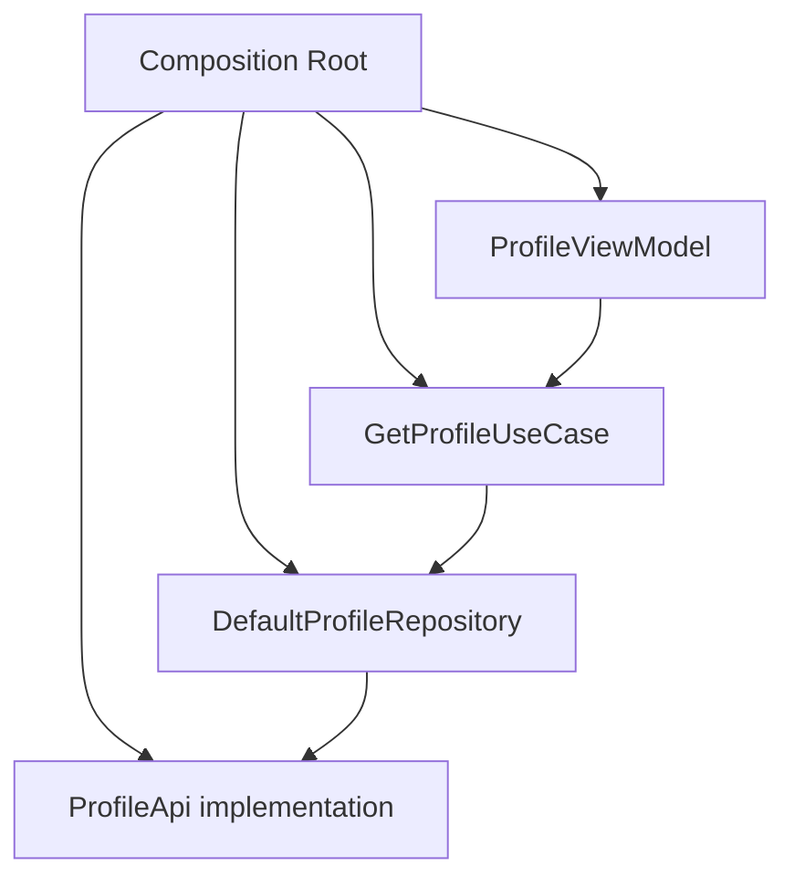
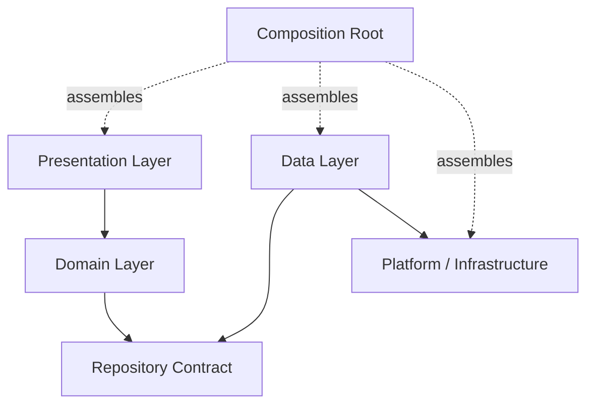
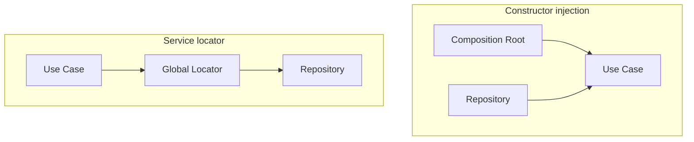

# Chapter 14 — Dependency Injection

## Part 5 — Manual DI: Building the Object Graph Yourself

> **Series:** Kotlin Multiplatform (KMP) Architecture  
> **Chapter:** 14  
> **Part:** 5  
> **Focus:** Constructor injection, composition roots, factories, scopes, platform boundaries, testing, and scalable manual dependency graphs

---

## Table of Contents

- [1. What Manual DI Means](#1-what-manual-di-means)
- [2. The Simplest Dependency Graph](#2-the-simplest-dependency-graph)
- [3. Constructor Injection Is the Foundation](#3-constructor-injection-is-the-foundation)
- [4. Build a Composition Root](#4-build-a-composition-root)
- [5. Separate Construction from Behavior](#5-separate-construction-from-behavior)
- [6. Manual DI Across Clean Architecture](#6-manual-di-across-clean-architecture)
- [7. Factories for Runtime Parameters](#7-factories-for-runtime-parameters)
- [8. Lifetimes, Ownership, and Scopes](#8-lifetimes-ownership-and-scopes)
- [9. Manual DI in Kotlin Multiplatform](#9-manual-di-in-kotlin-multiplatform)
- [10. Android Composition Root](#10-android-composition-root)
- [11. iOS Composition Root](#11-ios-composition-root)
- [12. Manual DI with MVVM and MVI](#12-manual-di-with-mvvm-and-mvi)
- [13. Testing with Fakes](#13-testing-with-fakes)
- [14. Avoiding Service Locator](#14-avoiding-service-locator)
- [15. Scaling Manual DI](#15-scaling-manual-di)
- [16. When to Introduce a DI Framework](#16-when-to-introduce-a-di-framework)
- [17. Common Mistakes](#17-common-mistakes)
- [18. Practical Checklist](#18-practical-checklist)
- [19. Summary](#19-summary)

---

# 1. What Manual DI Means

Manual dependency injection means creating objects explicitly and passing their required collaborators through constructors, functions, or factory methods. There is no general-purpose DI container resolving the graph for you.

The technique is simple, but its architectural impact is significant: dependencies remain visible, object construction is traceable, and tests can provide controlled implementations.

Consider a use case:

```kotlin
class GetProfileUseCase(
    private val repository: ProfileRepository
) {
    suspend operator fun invoke(userId: String): Profile {
        return repository.getProfile(userId)
    }
}
```

The use case does not create a repository, locate a global instance, or know which framework is used. The caller supplies the dependency.

Manual DI is not an inferior version of framework-based DI. For small and medium-sized graphs, it can be the clearest implementation. Even projects that use Koin, Hilt, Dagger, or Kotlin Inject still rely on the same underlying design principle: required collaborators should be explicit.

> **Core principle:** Classes describe what they need. A composition root decides how those needs are satisfied.

---

# 2. The Simplest Dependency Graph

Suppose a profile feature has these dependencies:

```text
ProfileViewModel
       ↓
GetProfileUseCase
       ↓
ProfileRepository
       ↓
ProfileApi
```

Start with contracts and implementations:

```kotlin
data class Profile(
    val id: String,
    val displayName: String
)

interface ProfileApi {
    suspend fun fetchProfile(userId: String): Profile
}

interface ProfileRepository {
    suspend fun getProfile(userId: String): Profile
}

class DefaultProfileRepository(
    private val api: ProfileApi
) : ProfileRepository {
    override suspend fun getProfile(userId: String): Profile {
        return api.fetchProfile(userId)
    }
}

class GetProfileUseCase(
    private val repository: ProfileRepository
) {
    suspend operator fun invoke(userId: String): Profile {
        return repository.getProfile(userId)
    }
}
```

Now assemble the objects directly:

```kotlin
val api: ProfileApi = RealProfileApi()
val repository: ProfileRepository =
    DefaultProfileRepository(api)
val useCase = GetProfileUseCase(repository)
```

Each line constructs one object and passes it to the next. The graph is visible in ordinary Kotlin code.



The diagram represents object relationships. The composition root creates and connects the objects; feature classes perform their own responsibilities.

---

# 3. Constructor Injection Is the Foundation

Constructor injection is the preferred default for required dependencies.

```kotlin
class LoadProfile(
    private val repository: ProfileRepository,
    private val clock: Clock
)
```

The constructor tells readers which collaborators are necessary for the object to work.

## Why constructor injection is useful

- A class cannot be instantiated correctly without its required collaborators.
- Dependencies are visible during code review.
- Tests can replace real collaborators with fakes.
- The class does not need to know how dependencies are created.
- Refactoring construction does not require changing the class's business behavior.

Compare that with hidden construction:

```kotlin
class LoadProfile {
    private val repository =
        DefaultProfileRepository(RealProfileApi())
}
```

This version hard-codes implementation choices. A test cannot substitute a repository without changing the class or introducing another mechanism.

Prefer:

```kotlin
class LoadProfile(
    private val repository: ProfileRepository
)
```

## Optional dependencies

Do not use nullable constructor parameters merely to avoid deciding how an optional capability should be supplied.

If a capability is genuinely optional, express that explicitly:

```kotlin
class ProfileFormatter(
    private val localeProvider: LocaleProvider?
)
```

Alternatively, define a no-op implementation or a narrower interface when that better represents the domain. Required dependencies should not be nullable just because some call sites find construction inconvenient.

---

# 4. Build a Composition Root

The **composition root** is the application boundary where concrete implementations are selected and connected. It is often located in application startup, a platform entry point, or a feature factory.

A composition root should be easy to locate and should contain construction logic—not business rules.

```kotlin
class ProfileFeatureFactory(
    private val profileApi: ProfileApi
) {
    fun create(): ProfileFeature {
        val repository =
            DefaultProfileRepository(profileApi)

        val getProfile =
            GetProfileUseCase(repository)

        val viewModel =
            ProfileViewModel(getProfile)

        return ProfileFeature(viewModel)
    }
}
```

The example assumes `ProfileFeature` is a simple holder for the ViewModel:

```kotlin
data class ProfileFeature(
    val viewModel: ProfileViewModel
)
```

This factory provides a named boundary for constructing the feature.

## A small application graph

```kotlin
class AppGraph(
    val profileApi: ProfileApi,
    val profileRepository: ProfileRepository,
    val getProfileUseCase: GetProfileUseCase
)

fun createAppGraph(): AppGraph {
    val api: ProfileApi = RealProfileApi()

    val repository: ProfileRepository =
        DefaultProfileRepository(api)

    val useCase = GetProfileUseCase(repository)

    return AppGraph(
        profileApi = api,
        profileRepository = repository,
        getProfileUseCase = useCase
    )
}
```

This graph is deliberately small. In a real application, avoid exposing every internal object as a public property. Expose only what the composition boundary needs to provide to its consumers.

## The composition root is not a service locator

A composition root creates objects and passes them to their owners. A service locator is an object that application classes query whenever they need dependencies.

The distinction is important:

```text
Preferred:
Composition root → construct object → inject dependencies

Avoid:
Feature class → global locator → look up dependencies
```

Manual DI should make dependencies explicit, not merely move a global lookup mechanism into a custom class.

---

# 5. Separate Construction from Behavior

Construction code and business code change for different reasons.

A repository may change because the API implementation changes. A use case may change because a business rule changes. Keeping object assembly separate prevents those changes from becoming unnecessarily coupled.

```kotlin
class SearchProfilesUseCase(
    private val repository: ProfileRepository
) {
    suspend operator fun invoke(query: String): List<Profile> {
        require(query.isNotBlank()) {
            "Search query must not be blank"
        }

        return repository.search(query)
    }
}
```

The use case owns the rule that a query must not be blank. The composition root should not decide whether a query is valid.

A composition root can choose between implementations:

```kotlin
val repository: ProfileRepository =
    DefaultProfileRepository(profileApi)
```

It should not contain feature logic such as:

```kotlin
// Avoid business rules in object assembly code.
if (searchQuery.isBlank()) {
    // Decide what the feature should display.
}
```

That belongs in the feature or domain layer, according to the rule's responsibility.

---

# 6. Manual DI Across Clean Architecture

Manual DI works naturally with layered architecture because each layer declares its required collaborators through interfaces and constructors.



A typical dependency direction:

- Presentation depends on use cases or presentation-facing contracts.
- Domain defines business rules and domain contracts.
- Data implements repository contracts.
- Infrastructure provides networking, persistence, logging, and platform capabilities.
- The composition root selects concrete implementations.

The composition root may import classes from several layers because its job is to assemble them. That does not mean the domain layer should import the composition root.

## Example graph by layer

```kotlin
class ProfileRepositoryImpl(
    private val api: ProfileApi,
    private val cache: ProfileCache
) : ProfileRepository {
    // Repository behavior belongs here.
}

class GetProfileUseCase(
    private val repository: ProfileRepository
) {
    suspend operator fun invoke(id: String): Profile =
        repository.getProfile(id)
}

class ProfileViewModel(
    private val getProfile: GetProfileUseCase
) {
    // Presentation state and actions belong here.
}
```

Then wire them at the boundary:

```kotlin
fun createProfileViewModel(
    api: ProfileApi,
    cache: ProfileCache
): ProfileViewModel {
    val repository =
        ProfileRepositoryImpl(api, cache)

    val useCase = GetProfileUseCase(repository)

    return ProfileViewModel(useCase)
}
```

This function is often enough. A larger framework is not required simply because the graph has three or four layers.

---

# 7. Factories for Runtime Parameters

Some objects need stable collaborators and changing values. Stable collaborators are dependencies; changing values are often operation parameters.

For example:

```kotlin
class GetProfileUseCase(
    private val repository: ProfileRepository
) {
    suspend operator fun invoke(userId: String): Profile {
        return repository.getProfile(userId)
    }
}
```

The repository is injected once. The `userId` is passed when the operation runs.

Do not build a new dependency graph every time the user enters a different ID.

However, some objects genuinely need runtime construction parameters, such as a screen controller tied to a particular document ID. Use a factory:

```kotlin
class DocumentController(
    val documentId: String,
    private val repository: DocumentRepository
)

class DocumentControllerFactory(
    private val repository: DocumentRepository
) {
    fun create(documentId: String): DocumentController {
        return DocumentController(
            documentId = documentId,
            repository = repository
        )
    }
}
```

Usage:

```kotlin
val controller =
    documentControllerFactory.create(documentId = "DOC-42")
```

The factory reuses the stable repository while constructing a controller with the requested ID.

## Factory responsibilities

A good factory:
- knows how to construct a particular family of objects
- receives stable dependencies through its own constructor
- accepts only the runtime values needed to create an instance
- returns a fully initialized object
- does not become a global registry for unrelated types

A factory that knows how to create every object in the application may simply become an oversized service locator. Split factories by feature or ownership boundary.

---

# 8. Lifetimes, Ownership, and Scopes

Manual DI does not remove the need to reason about lifetimes. It makes the decisions explicit in the code that creates objects.

| Lifetime | Example | Construction approach |
|---|---|---|
| Application | Configured HTTP client | Construct once in application graph |
| Session | Authenticated-session coordinator | Construct when session begins; release when it ends |
| Feature | Checkout coordinator | Create for a feature flow |
| Transient | Lightweight formatter | Create where needed or through a factory |

These are conceptual lifetime categories. Actual ownership depends on the application.

## Application-level dependencies

```kotlin
class AppGraph(
    val profileApi: ProfileApi,
    val logger: AppLogger
)
```

The application owns the graph, so its shared dependencies can remain alive for the application's lifetime.

## Feature-level dependencies

```kotlin
class CheckoutFeatureFactory(
    private val repository: CheckoutRepository
) {
    fun create(): CheckoutController {
        return CheckoutController(repository)
    }
}
```

Each call creates a new controller. If the feature requires a shared controller across multiple screens, the feature owner should retain and pass the same instance intentionally.

## Avoid accidental singleton state

An object is not automatically safe to share because it is created only once. Shared mutable state requires concurrency rules, clear ownership, and appropriate synchronization.

## Resource cleanup

Some objects own resources such as database handles, listeners, subscriptions, or platform callbacks. Manual DI makes it necessary to define who releases them.

```kotlin
interface CloseableFeature {
    fun close()
}
```

This is only a conceptual contract; use the project's appropriate resource-management API. The owner that creates a resource should generally be responsible for its cleanup, unless ownership is explicitly transferred.

---

# 9. Manual DI in Kotlin Multiplatform

Manual DI is especially straightforward in KMP because common Kotlin can define shared contracts and object construction while each platform supplies its own implementations.

```text
shared/
├── commonMain/
│   ├── domain/
│   ├── data/
│   ├── presentation/
│   └── di/
├── androidMain/
│   └── di/
└── iosMain/
    └── di/
```

This is one possible package layout, not a required project structure.

## Common contract

```kotlin
interface SecureStore {
    suspend fun read(key: String): String?
    suspend fun write(key: String, value: String)
}
```

The shared layer depends on the contract, not on Android preferences or an iOS-specific storage API.

```kotlin
class SaveSessionUseCase(
    private val secureStore: SecureStore
) {
    suspend operator fun invoke(token: String) {
        secureStore.write("session_token", token)
    }
}
```

Each platform can provide a suitable implementation of `SecureStore`. The shared composition code receives the implementation rather than importing platform types.

## Shared graph factory

```kotlin
class SharedGraph(
    secureStore: SecureStore,
    profileApi: ProfileApi
) {
    val saveSessionUseCase =
        SaveSessionUseCase(secureStore)

    val profileRepository: ProfileRepository =
        DefaultProfileRepository(profileApi)

    val getProfileUseCase =
        GetProfileUseCase(profileRepository)
}
```

This graph explicitly receives platform capabilities and exposes a small set of feature entry points.

For a larger application, group construction into smaller feature factories instead of creating one massive graph with dozens of properties.

---

# 10. Android Composition Root

Android provides the application lifecycle boundary where long-lived dependencies can be constructed.

A simplified example:

```kotlin
class AndroidAppGraph(
    context: Context
) {
    private val appContext = context.applicationContext

    val profileApi: ProfileApi =
        createProfileApi()

    val profileRepository: ProfileRepository =
        DefaultProfileRepository(profileApi)

    val getProfileUseCase =
        GetProfileUseCase(profileRepository)
}
```

The functions and types used to construct the API are project-specific. The key point is to use the application context where an application-level dependency needs a context, rather than accidentally retaining an Activity.

An Android application can own the graph:

```kotlin
class MyApplication : Application() {
    lateinit var appGraph: AndroidAppGraph
        private set

    override fun onCreate() {
        super.onCreate()
        appGraph = AndroidAppGraph(this)
    }
}
```

This example demonstrates ownership, not a requirement to expose the graph globally. Keep access controlled and prefer passing specific factories or dependencies to their owners.

## ViewModel creation

Android ViewModels have lifecycle ownership. Manual DI should use a ViewModel factory or the project's lifecycle integration to supply dependencies.

```kotlin
class ProfileViewModel(
    private val getProfile: GetProfileUseCase
) : ViewModel() {
    // State and coroutine work belong here.
}
```

A factory can construct the ViewModel:

```kotlin
class ProfileViewModelFactory(
    private val getProfile: GetProfileUseCase
) : ViewModelProvider.Factory {

    @Suppress("UNCHECKED_CAST")
    override fun <T : ViewModel> create(
        modelClass: Class<T>
    ): T {
        if (modelClass.isAssignableFrom(ProfileViewModel::class.java)) {
            return ProfileViewModel(getProfile) as T
        }

        throw IllegalArgumentException(
            "Unsupported ViewModel: ${modelClass.name}"
        )
    }
}
```

The factory keeps ViewModel construction explicit while allowing Android's lifecycle system to manage the instance.

---

# 11. iOS Composition Root

For iOS, create shared dependencies at a deliberate application or feature boundary. SwiftUI should receive the shared feature object it needs rather than reaching into a global object registry.

A simple Kotlin factory can expose a stable API:

```kotlin
class ProfileFeatureFactory(
    private val getProfile: GetProfileUseCase
) {
    fun createPresenter(): ProfilePresenter {
        return ProfilePresenter(getProfile)
    }
}
```

The iOS-facing boundary can obtain the factory from the shared graph and retain the resulting presenter for the appropriate feature lifetime.

Conceptually:

```text
SwiftUI View
    ↓
Observable adapter / feature owner
    ↓
Shared ProfilePresenter
    ↓
GetProfileUseCase
    ↓
ProfileRepository
```

The exact bridge for state observation depends on the project's approach to Kotlin/Native interop and SwiftUI. Manual DI does not prescribe how state is exposed to Swift.

## Keep the Swift-facing API narrow

Avoid exposing every internal repository and service to Swift. Public APIs become harder to evolve when implementation details cross the language boundary.

Prefer feature-level factories and operations that represent user-facing capabilities.

---

# 12. Manual DI with MVVM and MVI

Manual DI fits MVVM and MVI because both patterns benefit from explicit construction and predictable ownership.

## MVVM

```text
Screen
  ↓
ViewModel
  ↓
Use case
  ↓
Repository
```

A ViewModel receives its use case through its constructor. The use case receives its repository. The composition root wires the chain.

```kotlin
class ProfileViewModel(
    private val getProfile: GetProfileUseCase
)
```

The ViewModel should not create a repository or retrieve one from a global registry.

## MVI

MVI separates user intents, state transitions, and effects. DI supplies the collaborators required by the reducer or store.

```kotlin
class ProfileStore(
    private val getProfile: GetProfileUseCase,
    private val analytics: Analytics
) {
    // Handle intents, produce state, and coordinate effects.
}
```

Keep pure reducers independent of DI:

```kotlin
fun reduce(
    state: ProfileState,
    intent: ProfileIntent
): ProfileState {
    return when (intent) {
        ProfileIntent.Refresh -> state.copy(isLoading = true)
        is ProfileIntent.Loaded ->
            state.copy(isLoading = false, profile = intent.profile)
        is ProfileIntent.Failed ->
            state.copy(isLoading = false, error = intent.message)
    }
}
```

The reducer is a function. It does not need to be injected if it has no dependencies. Avoid adding construction complexity to pure code.

---

# 13. Testing with Fakes

Manual DI makes it easy to replace real dependencies with fakes.

```kotlin
class FakeProfileRepository(
    private val profiles: Map<String, Profile>
) : ProfileRepository {
    override suspend fun getProfile(userId: String): Profile {
        return requireNotNull(profiles[userId]) {
            "No profile configured for userId=$userId"
        }
    }
}
```

Test the use case directly:

```kotlin
@Test
fun `use case returns the requested profile`() = runTest {
    val expected = Profile(
        id = "U-1",
        displayName = "Asha"
    )

    val repository = FakeProfileRepository(
        profiles = mapOf("U-1" to expected)
    )

    val useCase = GetProfileUseCase(repository)

    val actual = useCase("U-1")

    assertEquals(expected, actual)
}
```

This test constructs only the objects it needs. It does not require an application graph, a runtime container, or platform startup.

## Test the composition root when it contains meaningful decisions

If the graph chooses between cached and remote repositories, or selects platform-specific implementations, test those wiring decisions where practical.

Do not write excessive tests that merely restate every constructor call. Focus on meaningful configuration, lifetimes, and implementation selection.

## Prefer deterministic collaborators

Inject clocks, ID generators, dispatchers, and external clients when the behavior depends on them. This makes tests more deterministic and reduces reliance on global state.

---

# 14. Avoiding Service Locator

Manual DI and service locator are often confused because both can involve a central object.

A service locator stores or resolves dependencies that callers request:

```kotlin
// Avoid this style.
object Services {
    lateinit var profileRepository: ProfileRepository
}

class GetProfileUseCase {
    suspend operator fun invoke(id: String): Profile {
        return Services.profileRepository.getProfile(id)
    }
}
```

The use case's dependency is hidden. It appears to have no constructor requirements, but it cannot work until global state has been initialized.

A manually assembled graph is different:

```kotlin
class GetProfileUseCase(
    private val repository: ProfileRepository
)
```

The composition root creates the use case and passes the repository directly.



A graph object can still be misused as a service locator if every feature reaches into it to retrieve arbitrary dependencies. Keep the graph at the composition boundary and pass narrow dependencies to their owners.

---

# 15. Scaling Manual DI

Manual DI remains maintainable when construction is organized around features and ownership boundaries.

## Start with direct construction

For a small graph, direct wiring is often the clearest option:

```kotlin
fun createProfileFeature(
    api: ProfileApi
): ProfileViewModel {
    val repository = DefaultProfileRepository(api)
    val useCase = GetProfileUseCase(repository)
    return ProfileViewModel(useCase)
}
```

## Extract a feature factory when wiring repeats

If several entry points need the same object graph, move repeated construction into a named factory.

```kotlin
class ProfileFeatureFactory(
    private val api: ProfileApi
) {
    fun createViewModel(): ProfileViewModel {
        val repository = DefaultProfileRepository(api)
        val useCase = GetProfileUseCase(repository)
        return ProfileViewModel(useCase)
    }
}
```

## Split graphs by meaningful responsibility

A growing project may use a few explicit containers:

```text
AppGraph
├── NetworkGraph
├── StorageGraph
├── ProfileFeatureFactory
└── CheckoutFeatureFactory
```

This is a conceptual arrangement. Avoid turning every folder into a graph or exposing internal construction details unnecessarily.

## Do not create a giant constructor

A graph with dozens of unrelated constructor parameters may indicate that it owns too many responsibilities.

Split the graph by feature, lifecycle, or platform boundary. Each graph should have a coherent purpose.

## Avoid unnecessary abstraction

Not every constructor chain needs a factory interface. Introduce interfaces where they provide meaningful substitution, module boundaries, or testing value—not just to wrap a single `new` operation.

---

# 16. When to Introduce a DI Framework

Manual DI is a strong default, but it is not a rule that every application must wire every object by hand forever.

A DI framework may become useful when:
- many features share complex object graphs
- multiple implementations are selected through configuration
- scope management becomes repetitive
- module registration is distributed across feature modules
- generated graph validation would reduce wiring mistakes
- manual construction becomes a maintenance burden

Before adopting a framework, identify the actual pain point. A large codebase alone does not prove that a container is necessary.

| Situation | Reasonable approach |
|---|---|
| Small graph, few shared dependencies | Direct manual DI |
| Repeated construction for one feature | Feature factory |
| Multiple feature graphs with clear boundaries | Separate graph/factory objects |
| Runtime module registration is important | Consider a runtime DI framework |
| Compile-time graph validation is important | Consider a compile-time DI framework |
| Platform-specific object creation | Platform composition root, with or without a framework |

Framework-based DI does not remove the need for constructor injection, lifecycle ownership, or good boundaries. It automates parts of graph construction.

---

# 17. Common Mistakes

## Creating dependencies inside consumers

**Problem:** Consumers choose concrete implementations and become difficult to test.

**Better:** Pass required collaborators through constructors.

## Using a global graph everywhere

**Problem:** Classes can resolve arbitrary objects, hiding their actual dependencies.

**Better:** Use the graph at the composition boundary and inject narrow collaborators.

## Constructing a new shared dependency repeatedly

**Problem:** Multiple repositories or clients may be created unintentionally, resulting in inconsistent caches, duplicate connections, or unnecessary resources.

**Better:** Decide which objects should be shared and let the owner retain them.

## Sharing mutable state without ownership rules

**Problem:** A shared object can introduce races and cross-feature state leakage.

**Better:** Define concurrency and lifetime rules explicitly.

## Building a giant `AppGraph`

**Problem:** Every feature becomes coupled to a huge object that exposes implementation details.

**Better:** Keep graph properties narrow and delegate feature construction to focused factories.

## Mixing business logic with construction

**Problem:** Configuration code becomes difficult to reason about and test.

**Better:** Keep business rules in domain or feature code.

## Forgetting cleanup

**Problem:** Listeners, jobs, database resources, or platform callbacks may outlive the feature.

**Better:** Make ownership and cleanup responsibilities explicit.

## Confusing manual DI with hard-coded dependencies

**Problem:** Direct construction inside a consumer is mistaken for manual DI.

**Better:** Manual DI means constructing dependencies externally and passing them into the consumer—not letting every class construct its own dependency chain.

---

# 18. Practical Checklist

### Construction
- [ ] Required dependencies are declared in constructors.
- [ ] Concrete implementations are selected at the composition boundary.
- [ ] Factories are used when construction is repeated or needs runtime parameters.
- [ ] Business rules are not embedded in graph assembly code.

### Architecture
- [ ] Domain logic does not depend on a DI framework or global locator.
- [ ] Interfaces represent meaningful boundaries.
- [ ] Feature factories have focused responsibilities.
- [ ] The application graph does not expose every internal object.

### Lifetimes
- [ ] Shared instances have clear owners.
- [ ] Feature instances are not accidentally retained for the app lifetime.
- [ ] Mutable shared state has concurrency rules.
- [ ] Resources have explicit cleanup ownership.

### Kotlin Multiplatform
- [ ] `commonMain` uses platform-neutral contracts.
- [ ] Android and iOS implementations are supplied at platform boundaries.
- [ ] Swift-facing APIs expose feature capabilities rather than internal graph details.
- [ ] Lifecycle-managed objects are created through appropriate platform mechanisms.

### Testing
- [ ] Business logic can be tested through direct constructor injection.
- [ ] Fakes make tests deterministic.
- [ ] Meaningful graph configuration decisions are tested.
- [ ] Tests avoid uncontrolled global state.

### Maintainability
- [ ] Repeated construction is extracted into focused factories.
- [ ] Graphs are split only where ownership or complexity justifies it.
- [ ] A framework is considered in response to real complexity—not fashion.
- [ ] The dependency graph is easy for another developer to trace.

---

# 19. Summary

Manual dependency injection is the practice of constructing objects explicitly and passing their collaborators into them. It is simple, transparent, and often sufficient for a substantial portion of an application's dependency graph.

The essential practices are:

1. **Use constructor injection for required dependencies.**
2. **Keep object construction in a clear composition root.**
3. **Use feature factories when repeated wiring deserves a name.**
4. **Separate stable collaborators from runtime operation parameters.**
5. **Make object lifetimes and resource ownership explicit.**
6. **Keep common KMP code platform-neutral.**
7. **Use direct construction and fakes for straightforward tests.**
8. **Avoid turning a graph into a global service locator.**
9. **Introduce a DI framework only when it solves a real maintenance problem.**

A dependency injection framework can automate graph construction, but it cannot replace clear ownership or good architecture. Manual DI makes those fundamentals visible.

> **The best dependency graph is not the one with the most tooling. It is the one whose construction, ownership, and dependencies are easiest to understand.**

---

<div align="center">

### Chapter 14 · Part 5

**Dependency Injection — Manual DI**

*Explicit construction. Clear ownership. Testable Kotlin.*

</div>
