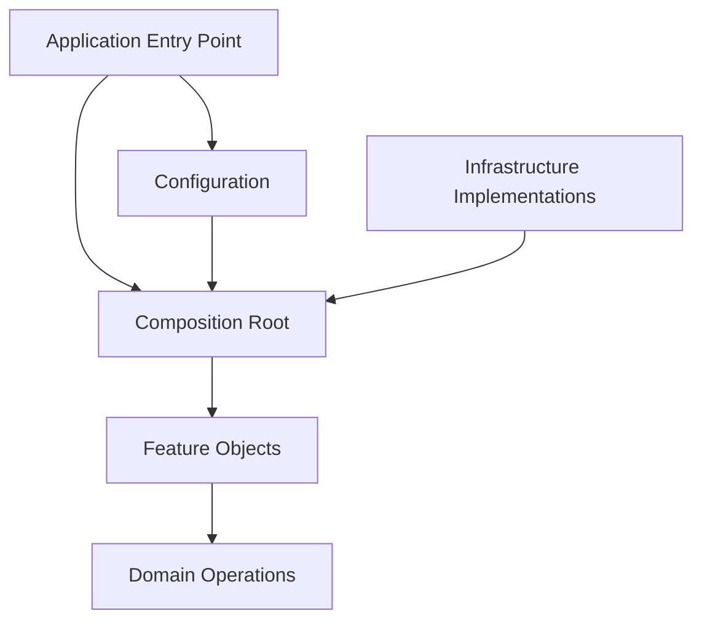
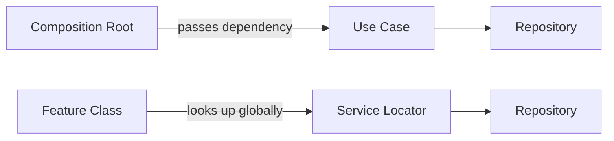
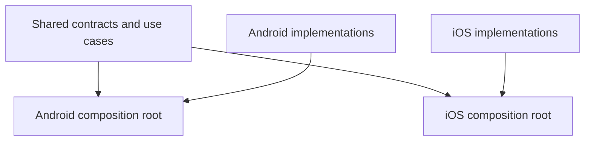

# Chapter 14 — Dependency Injection

## Part 6 — Best Practices for Production-Ready DI

> **Series:** Kotlin Multiplatform (KMP) Architecture  
> **Chapter:** 14  
> **Part:** 6  
> **Focus:** Dependency boundaries, constructor injection, lifetimes, modularity, testing, platform composition roots, and maintainable DI

---

## Table of Contents

- [1. Keep Dependencies Explicit](#1-keep-dependencies-explicit)
- [2. Prefer Constructor Injection](#2-prefer-constructor-injection)
- [3. Keep the Composition Root at the Boundary](#3-keep-the-composition-root-at-the-boundary)
- [4. Depend on Contracts Where They Add Value](#4-depend-on-contracts-where-they-add-value)
- [5. Choose Lifetimes Deliberately](#5-choose-lifetimes-deliberately)
- [6. Avoid Global Service Location](#6-avoid-global-service-location)
- [7. Keep Modules Focused](#7-keep-modules-focused)
- [8. Separate Configuration from Business Logic](#8-separate-configuration-from-business-logic)
- [9. Design for Testability](#9-design-for-testability)
- [10. Apply DI Correctly in Kotlin Multiplatform](#10-apply-di-correctly-in-kotlin-multiplatform)
- [11. Handle Android and iOS Lifecycles](#11-handle-android-and-ios-lifecycles)
- [12. Treat Concurrency and Resources as First-Class Concerns](#12-treat-concurrency-and-resources-as-first-class-concerns)
- [13. Avoid Overengineering](#13-avoid-overengineering)
- [14. Practical Patterns](#14-practical-patterns)
- [15. Anti-Patterns and Better Alternatives](#15-anti-patterns-and-better-alternatives)
- [16. Production Readiness Checklist](#16-production-readiness-checklist)
- [17. Summary](#17-summary)

---

# 1. Keep Dependencies Explicit

A class should make its important collaborators visible. Explicit dependencies improve readability, testing, and change isolation.

```kotlin
class RefreshCatalogUseCase(
    private val repository: CatalogRepository,
    private val analytics: Analytics
) {
    suspend operator fun invoke() {
        repository.refresh()
        analytics.track("catalog_refreshed")
    }
}
```

A reader can immediately see that the use case depends on a repository and an analytics abstraction.

Contrast this with hidden dependency lookup:

```kotlin
class RefreshCatalogUseCase {
    suspend operator fun invoke() {
        GlobalServices.catalogRepository.refresh()
        GlobalServices.analytics.track("catalog_refreshed")
    }
}
```

The second version hides the real requirements and introduces implicit global state.

## Best practice

- Declare required collaborators in constructors.
- Pass operation-specific data through method parameters.
- Avoid retrieving dependencies from global objects inside business logic.
- Keep dependency creation separate from dependency use.

A DI framework can automate object construction, but it should not make the application's dependencies harder to see.

---

# 2. Prefer Constructor Injection

Constructor injection should be the default for required dependencies.

```kotlin
class LoadOrderUseCase(
    private val repository: OrderRepository
)
```

This makes an invalid object harder to construct because the required repository must be supplied.

## Use method parameters for changing inputs

```kotlin
class LoadOrderUseCase(
    private val repository: OrderRepository
) {
    suspend operator fun invoke(orderId: String): Order {
        return repository.getOrder(orderId)
    }
}
```

The repository is a stable collaborator. `orderId` changes from one operation to another, so it is a method parameter rather than a DI registration.

## Avoid field injection for required dependencies

Field or property injection can allow an object to exist before its dependencies are assigned. That can make initialization order harder to understand and tests more fragile.

Prefer:

```kotlin
class OrderPresenter(
    private val loadOrder: LoadOrderUseCase
)
```

over an object whose required collaborator is assigned later.

## Keep constructors focused

A constructor with many unrelated dependencies may indicate that the class has too many responsibilities.

Do not solve that problem by hiding dependencies in a service locator. First review whether the class should be split, whether a cohesive collaborator can be introduced, or whether some dependencies belong in a narrower operation.

---

# 3. Keep the Composition Root at the Boundary

The composition root is where concrete implementations are selected and assembled. It belongs near an application entry point, feature factory, or platform boundary.



The composition root can know about concrete implementations because choosing implementations is its job. Domain classes should not need to know which composition root created them.

A small manual graph might look like this:

```kotlin
class AppGraph(
    api: OrderApi,
    cache: OrderCache,
    analytics: Analytics
) {
    private val repository: OrderRepository =
        DefaultOrderRepository(api, cache)

    val loadOrder = LoadOrderUseCase(repository)

    val refreshOrders = RefreshOrdersUseCase(
        repository = repository,
        analytics = analytics
    )
}
```

This is useful when the graph is small and explicit. A DI framework can replace some of this wiring later without requiring business classes to change.

## Avoid construction throughout the feature layer

If every ViewModel, presenter, or use case constructs its own repository, dependency configuration becomes distributed and inconsistent.

Create dependencies at a deliberate boundary and pass them to the objects that need them.

---

# 4. Depend on Contracts Where They Add Value

An interface is useful when it represents a meaningful boundary, such as a domain contract, platform capability, external service, or behavior that must be substituted in tests.

```kotlin
interface OrderRepository {
    suspend fun getOrder(id: String): Order
}

class DefaultOrderRepository(
    private val api: OrderApi,
    private val cache: OrderCache
) : OrderRepository {
    override suspend fun getOrder(id: String): Order {
        return cache.get(id) ?: api.getOrder(id)
            .also { cache.save(it) }
    }
}
```

The use case depends on the contract:

```kotlin
class LoadOrderUseCase(
    private val repository: OrderRepository
) {
    suspend operator fun invoke(id: String): Order =
        repository.getOrder(id)
}
```

This makes it possible to substitute a fake repository or a different implementation without changing the use case.

## Do not create interfaces mechanically

Not every class needs an interface. An interface that exists only to mirror one class, with no meaningful boundary or substitution requirement, can add indirection without improving the design.

Useful reasons to introduce an abstraction include:

- a domain layer must not depend on infrastructure
- Android and iOS require different implementations
- external systems need to be replaced in tests
- the implementation may vary by configuration
- the contract expresses a stable capability

The goal is meaningful decoupling, not the maximum possible number of interfaces.

---

# 5. Choose Lifetimes Deliberately

Dependency lifetime determines how long an object is reused and who owns it. Lifetime mistakes can create stale state, unexpected sharing, resource leaks, or unnecessary object creation.

| Lifetime | Typical example | Main concern |
|---|---|---|
| Application | Configured HTTP client | Safe sharing and application ownership |
| Session | Authenticated user context | Correct creation and cleanup at sign-in/sign-out |
| Feature | Checkout coordinator | Do not retain beyond the feature's lifetime |
| Transient | Lightweight formatter | Avoid needless recreation of expensive resources |

These categories are conceptual. A framework may express them using scopes or definitions, while manual DI expresses them through who creates, retains, and releases the objects.

## Share immutable infrastructure carefully

A configured HTTP client is often shared because it manages connections and common configuration. That does not imply every object involved in a request should be shared.

## Avoid application-wide mutable feature state

A singleton that stores the currently selected product or checkout form state can leak information between screens or users if ownership is not deliberate.

## Make session transitions explicit

When a user signs out, session-specific objects may need to be discarded. Do not keep references to them in an application-wide graph after the session ends.

## Ask these questions

1. Who owns this instance?
2. How long should it live?
3. Is it safe for concurrent use?
4. Does it retain user- or feature-specific state?
5. Does it own resources that need cleanup?

If these questions have no clear answers, the lifetime design is incomplete.

---

# 6. Avoid Global Service Location

A service locator lets application code ask a global registry for dependencies. It hides the actual requirements of each class.

```kotlin
// Avoid.
class LoadOrderUseCase {
    suspend operator fun invoke(id: String): Order {
        val repository =
            GlobalContainer.get<OrderRepository>()

        return repository.getOrder(id)
    }
}
```

Prefer explicit injection:

```kotlin
class LoadOrderUseCase(
    private val repository: OrderRepository
) {
    suspend operator fun invoke(id: String): Order {
        return repository.getOrder(id)
    }
}
```

The second version makes the dependency visible and enables direct construction in tests.



## Framework access belongs at the boundary

A framework-specific API may be appropriate in an application entry point, platform factory, or UI integration layer. It should not spread through domain logic.

Use the framework to assemble objects, not as an alternative way for every class to obtain its dependencies.

---

# 7. Keep Modules Focused

In a framework-based project, modules should group related definitions by responsibility. In a manually wired project, factories and graph objects should follow the same principle.

A reasonable grouping might be:

```text
di/
├── NetworkModule.kt
├── StorageModule.kt
├── RepositoryModule.kt
├── DomainModule.kt
└── FeatureModule.kt
```

This is a guide, not a mandate. Small projects may need only one or two modules.

## Good module boundaries

A module should make it easy to answer:
- What kind of dependencies does this module provide?
- Which implementation satisfies each contract?
- What configuration does it require?
- Which platform or feature owns it?

## Avoid both extremes

**One huge module:** difficult to review, test, and navigate.

**A module for every tiny class:** excessive fragmentation and more navigation than value.

Group declarations according to actual responsibility and change patterns.

## Keep platform modules explicit

A shared KMP module should register platform-neutral dependencies. Android and iOS composition roots should supply their respective implementations where necessary.

---

# 8. Separate Configuration from Business Logic

DI often carries configuration values into the object graph: base URLs, feature flags, timeouts, logging policies, or environment-specific endpoints.

Keep configuration explicit:

```kotlin
data class NetworkConfig(
    val baseUrl: String,
    val connectTimeoutMillis: Long,
    val readTimeoutMillis: Long
)
```

An infrastructure factory can consume that configuration:

```kotlin
class ApiClientFactory(
    private val config: NetworkConfig
) {
    fun create(): OrderApi {
        // Build and configure the actual HTTP client here.
        // The implementation depends on the networking library.
        return createConfiguredOrderApi(config)
    }
}
```

The final factory call is project-specific pseudocode: replace it with the real API construction for the selected networking stack.

## Do not bury environment choices inside repositories

A repository should not decide whether the app is running against production or staging by reading global build flags throughout its methods. Supply the configured API or endpoint through the composition boundary.

## Keep secrets out of source code

DI is not a secret-management system. API credentials, private keys, and user tokens need appropriate secure handling. Passing a secret through a constructor does not make it secure by itself.

---

# 9. Design for Testability

A good DI design lets tests replace external dependencies without rewriting the code under test.

```kotlin
interface OrderRepository {
    suspend fun getOrder(id: String): Order
}

class FakeOrderRepository(
    private val orders: Map<String, Order>
) : OrderRepository {
    override suspend fun getOrder(id: String): Order {
        return requireNotNull(orders[id]) {
            "No order configured for id=$id"
        }
    }
}
```

A use case can be tested directly:

```kotlin
@Test
fun `load order returns the requested order`() = runTest {
    val expected = Order(
        id = "ORD-7",
        status = "Shipped"
    )

    val useCase = LoadOrderUseCase(
        repository = FakeOrderRepository(
            orders = mapOf("ORD-7" to expected)
        )
    )

    assertEquals(expected, useCase("ORD-7"))
}
```

The model and test imports are omitted for brevity; use the test framework and coroutine-test version configured by the project.

## Test behavior and wiring separately

- **Unit tests** verify business rules using direct construction and fakes.
- **Graph tests** verify important dependency bindings and construction decisions.
- **Integration tests** verify that real adapters work together.
- **Platform tests** verify Android/iOS integration and lifecycle behavior.

Do not make every unit test start a DI container. That adds setup cost without improving tests of pure business behavior.

## Avoid global state in tests

Global containers and mutable singleton registries can leak configuration between tests. Prefer isolated graph construction, controlled test modules, and explicit cleanup.

---

# 10. Apply DI Correctly in Kotlin Multiplatform

KMP adds an important constraint: shared code must not accidentally depend on platform-only APIs.

```text
shared/
├── commonMain/
│   ├── domain/
│   ├── data/
│   ├── presentation/
│   └── di/
├── androidMain/
│   └── di/
└── iosMain/
    └── di/
```

The layout is illustrative; use the source-set structure that fits the project.

## Define common contracts

```kotlin
interface SecureStore {
    suspend fun read(key: String): String?
    suspend fun write(key: String, value: String)
}
```

Shared code depends on `SecureStore`, not Android preferences or an iOS Keychain API.

```kotlin
class SaveSessionUseCase(
    private val secureStore: SecureStore
) {
    suspend operator fun invoke(token: String) {
        secureStore.write("session_token", token)
    }
}
```

Each platform supplies the appropriate implementation at its composition boundary.

## Keep composition roots platform-aware



Do not force Android `Context`, Android lifecycle objects, or iOS framework types into `commonMain` simply to make dependency construction convenient.

## Keep the Swift-facing API narrow

When SwiftUI consumes shared Kotlin features, expose feature factories or stable shared APIs rather than the entire internal DI graph. This reduces coupling between Swift code and generated or internal Kotlin types.

---

# 11. Handle Android and iOS Lifecycles

Dependency lifetimes must match the lifecycle of the owner that uses them.

## Android

- Use the application context for application-level dependencies that require a context.
- Do not retain an Activity in a singleton.
- Create ViewModels through lifecycle-aware APIs or factories.
- Clear feature-specific state when its owner is finished.
- Ensure listeners, callbacks, and coroutine jobs are cancelled when appropriate.

## iOS

- Give shared presenters and state holders a clear owner.
- Ensure SwiftUI state observation is bridged using the project's chosen approach.
- Avoid retaining feature objects longer than the relevant flow or screen.
- Keep platform-specific resources in the platform layer.
- Avoid exposing internal DI implementation types as public Swift APIs unless necessary.

## Lifecycle and DI are related, but not identical

A DI graph can construct a ViewModel or presenter. It does not automatically determine when the UI framework should retain, clear, or cancel that object. Lifecycle ownership remains an explicit architectural responsibility.

---

# 12. Treat Concurrency and Resources as First-Class Concerns

A shared dependency may be accessed from several coroutines or threads. The fact that DI creates one instance does not make that instance thread-safe.

Consider a cache:

```kotlin
class InMemoryOrderCache {
    private val orders = mutableMapOf<String, Order>()

    fun get(id: String): Order? = orders[id]

    fun put(order: Order) {
        orders[order.id] = order
    }
}
```

This simple cache is not automatically safe for concurrent access. If it is shared across concurrent callers, choose a suitable synchronization strategy or use a concurrency-safe storage abstraction appropriate to the project.

## Do not confuse singleton with thread-safe

- A singleton is an instance-lifetime choice.
- Thread safety is a concurrency property.
- Resource ownership is a lifecycle responsibility.

They are separate concerns and should be reviewed separately.

## Resource cleanup

Dependencies may own sockets, database resources, subscriptions, callbacks, or long-running jobs. Define who creates them, who shares them, and who releases them.

Prefer lifecycle-aware APIs and explicit ownership. Do not assume that removing a reference from the DI graph automatically cancels every job or closes every external resource.

---

# 13. Avoid Overengineering

DI improves architecture when it clarifies dependencies and ownership. It becomes counterproductive when the graph is more complicated than the problem it solves.

## Avoid unnecessary interfaces

Create abstractions for real boundaries, not simply because every concrete class “must have an interface.”

## Avoid giant constructors

A class with many unrelated dependencies may have too many responsibilities. Split the responsibilities rather than hiding dependencies in a global locator.

## Avoid a giant application graph

A graph exposing every internal class creates broad coupling. Expose only the dependencies and factories that each boundary needs.

## Avoid injecting pure functions without a reason

A pure transformation with no external dependencies may not need a class or DI registration at all.

```kotlin
fun normalizeOrderId(raw: String): String =
    raw.trim().uppercase()
```

Simple, deterministic logic can remain a function.

## Avoid framework adoption by default

Manual DI is sufficient for many applications. A framework becomes valuable when it reduces meaningful graph-management complexity, supports required scoping or modular registration, or provides useful compile-time validation.

---

# 14. Practical Patterns

## Pattern A — Inject stable collaborators, pass changing values

```kotlin
class SearchOrdersUseCase(
    private val repository: OrderRepository
) {
    suspend operator fun invoke(query: String): List<Order> {
        return repository.search(query)
    }
}
```

The repository is injected. The query is passed to the operation.

## Pattern B — Use a factory for parameterized construction

```kotlin
class OrderDetailsController(
    val orderId: String,
    private val repository: OrderRepository
)

class OrderDetailsControllerFactory(
    private val repository: OrderRepository
) {
    fun create(orderId: String) =
        OrderDetailsController(orderId, repository)
}
```

## Pattern C — Keep platform construction outside common code

```kotlin
interface DeviceInfo {
    fun platformName(): String
}
```

The common layer defines the contract; each platform supplies an implementation.

## Pattern D — Reuse infrastructure intentionally

```kotlin
class AppGraph(
    val orderApi: OrderApi,
    val orderRepository: OrderRepository
)
```

The graph owns the instances it creates. Avoid constructing a new client for each feature unless that is intentional.

## Pattern E — Keep tests independent from the graph

```kotlin
val useCase = LoadOrderUseCase(
    repository = FakeOrderRepository(testOrders)
)
```

A direct constructor is often the simplest test setup.

---

# 15. Anti-Patterns and Better Alternatives

| Anti-pattern | Why it hurts | Better alternative |
|---|---|---|
| Constructing repositories inside ViewModels | Couples presentation to concrete data implementations | Inject a use case or repository contract |
| Global service locator | Hides dependencies and introduces global state | Constructor injection |
| Singleton for every dependency | Can cause state leakage and unnecessary sharing | Choose lifetime based on ownership |
| Interface for every class | Adds indirection without meaningful substitution | Create abstractions at real boundaries |
| Huge `AppGraph` with public internals | Couples features to implementation details | Expose focused feature factories |
| Business rules inside composition code | Mixes object assembly with behavior | Keep rules in domain or feature classes |
| DI container in domain code | Couples business logic to infrastructure | Keep container access at the composition root |
| Runtime inputs registered globally | Blurs dependency configuration and operation data | Pass inputs through method parameters |
| No cleanup policy | Can leak resources or retain feature state | Assign explicit lifecycle ownership |
| Testing every unit through the container | Adds overhead and obscures behavior | Construct unit-test dependencies directly |

---

# 16. Production Readiness Checklist

### Dependency design
- [ ] Required dependencies are explicit in constructors.
- [ ] Runtime business inputs are method parameters.
- [ ] Abstractions exist where they provide a meaningful boundary.
- [ ] Business logic does not retrieve objects globally.

### Graph and modules
- [ ] The composition root is easy to locate.
- [ ] Modules and factories have focused responsibilities.
- [ ] Concrete implementations are selected at the boundary.
- [ ] The graph does not expose unnecessary internal details.

### Lifetimes and resources
- [ ] Shared instances have a clear owner.
- [ ] Feature state does not leak across users or screens.
- [ ] Shared mutable dependencies have concurrency rules.
- [ ] Resources, subscriptions, and jobs have cleanup responsibilities.

### KMP boundaries
- [ ] `commonMain` avoids platform-only dependencies.
- [ ] Android and iOS implementations are supplied at platform boundaries.
- [ ] ViewModels and presenters respect platform lifecycle ownership.
- [ ] Swift-facing APIs expose stable feature-level capabilities.

### Testing
- [ ] Business logic is tested using direct construction and fakes.
- [ ] Important dependency bindings are verified.
- [ ] Integration tests cover real adapters.
- [ ] Tests do not depend on uncontrolled global DI state.

### Maintainability
- [ ] DI framework usage solves a real problem.
- [ ] The graph is no more complex than necessary.
- [ ] Team members can trace object creation and ownership.
- [ ] Framework and compiler versions are compatible with all KMP targets.

---

# 17. Summary

Production-ready dependency injection is less about the number of annotations or modules and more about the quality of the dependency boundaries.

The strongest practices are:

1. **Make dependencies visible.** Prefer constructor injection for required collaborators.
2. **Centralize construction.** Keep concrete implementation choices at the composition boundary.
3. **Choose lifetimes intentionally.** Sharing, thread safety, and resource ownership are separate concerns.
4. **Use abstractions purposefully.** Introduce contracts where they improve architecture, testing, or platform separation.
5. **Keep KMP code platform-neutral.** Supply platform-specific implementations from Android and iOS boundaries.
6. **Test behavior directly.** Use fakes for unit tests and graph tests for meaningful wiring decisions.
7. **Avoid service location.** A DI container should assemble objects, not hide dependencies throughout the application.
8. **Keep the graph understandable.** Add frameworks and structure when they solve real complexity.

Dependency injection is successful when the code makes it obvious what each object needs, who creates it, how long it lives, and how it can be tested.

> **Great DI is not invisible architecture. It is clear architecture with predictable construction.**

---

<div align="center">

### Chapter 14 · Part 6

**Dependency Injection — Best Practices**

*Explicit dependencies. Intentional lifetimes. Maintainable graphs.*

</div>
